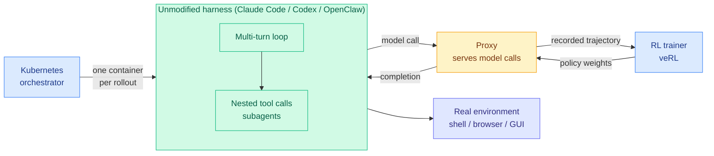

# OpenForgeRL: Train Agents Inside the Harness They Actually Run In

**TL;DR.** Open RL stacks (veRL, Slime) assume rollouts are single-turn generation or lightweight sandboxed tool calls that run locally in the trainer process. Real agents run inside stateful, multi-process inference harnesses like Claude Code, Codex, and OpenClaw, with nested tool calls, subagents, MCP servers, and long-horizon context. The mismatch forces researchers to reimplement a simplified harness for training, producing a **train-deploy mismatch**: the agent is optimized in a toy version of the loop it will be deployed in. OpenForgeRL (Microsoft Research + Columbia + Dartmouth, arXiv 2607.21557, ICLR 2026 submission) removes the mismatch with two pieces: a **lightweight proxy** that serves the harness's model calls while transparently recording them as training data for a standard RL codebase, and a **Kubernetes orchestrator** that runs each rollout in its own remote container. The harness is left completely untouched.

## The core idea

Decouple training from inference at the API boundary. The harness thinks it is talking to a model endpoint; the proxy is that endpoint, and it logs every call into the format a conventional RL codebase expects. Because the harness is never modified, **any** harness works, and the agent trains in exactly the scaffold it will be deployed with. The second constraint OpenForgeRL solves is resource shape: complex harnesses need CPU and memory and cannot be co-located on GPU-heavy training nodes, but most open RL frameworks assume rollouts happen locally. The Kubernetes orchestrator gives each rollout its own remote container.

## Results

Trained with only hundreds to a few thousand tasks:

- **OpenForgeClaw**: 31.7 pass^3 and 55.9 pass@3 on ClawEval, 33.7 on QwenClawBench.
- **OpenForgeGUI**: 37.7 on OSWorld-Verified, 63.0 on Online-Mind2Web, 72.3 on WebVoyager. In the GUI setting it matches or surpasses models several times larger.
- Both beat open baselines of similar size on nearly all benchmarks.

The analysis is more interesting than the scores. Harness choice materially changes learnability: **some harnesses are substantially harder to learn than others** (they compare ZeroClaw, OpenClaw, and Codex). And RL improves agentic reliability in specific, nameable ways: self-verification, tool coverage, and completing multi-step plans. The one thing it does not fix is **error recovery**, which remains weak.

## Gaps

Sample efficiency is reported in task count (hundreds to a few thousand) but the wall-clock and dollar cost of Kubernetes-orchestrated per-rollout containers at that scale is the number a practitioner needs and the abstract does not give. The harness-difficulty finding is an observation without a mechanism: nothing yet predicts which harness will be learnable before you spend the compute. And "error recovery remains weak" is the honest admission that the hardest agentic capability survived the treatment.

## Relation to prior wiki

- **Confirms** the harness-as-artifact thesis the wiki has been assembling. [DataFlow-Harness (07-22)](2026-07-22-agentdebugx-dataflow-harness-agent-tooling.md) showed typed grounded DAGs run 72.5% cheaper than vanilla Claude Code; [ReOPD (07-24)](../inference-efficiency/2026-07-24-reopd-multiturn-onpolicy-distillation.md) distilled multi-turn agents with zero live tool calls by replaying pre-collected teacher prefixes. OpenForgeRL is the third July datapoint arguing the harness is not a wrapper around the model but part of the trained object. The DAIR.AI formulation the wiki logged on 05-11 fits exactly: "harness wins look like model wins."
- **Contrasts sharply with ReOPD on the environment question.** ReOPD's whole contribution is *never touching the environment* during training (replay pre-collected teacher trajectories, 4x faster per rollout, zero tool calls). OpenForgeRL goes the opposite way: run every rollout in a real container against the real harness and real environment. Both claim the train-deploy gap as their motivation. That is a genuine unresolved tension, not a difference in emphasis, and the right resolution probably depends on whether the environment's *dynamics* or the harness's *statefulness* is the dominant source of mismatch for a given task.
- **Extends** the [agent-benchmarks](agent-benchmarks.md) measurement thread: if harness choice changes learnability, then any agent benchmark that fixes a harness is measuring a model-harness pair, not a model.
- **Complements** the [SemiAnalysis AMD piece (07-25)](../hardware/2026-07-25-semianalysis-amd-cuda-moat.md) from the training side: AMD's internal GPU shortage is worsening because agentic coding means each agent needs GPUs to test against. OpenForgeRL is the research-side version of that same demand, one container per rollout.

## Sources

- [OpenForgeRL: Train Harness-native Agents in Any Environment](https://arxiv.org/abs/2607.21557) (arXiv 2607.21557) · [HuggingFace](https://huggingface.co/papers/2607.21557)
- Authors: Xiao Yu, Baolin Peng (project lead), Ruize Xu, Hao Zou, Qianhui Wu, Hao Cheng, Wenlin Yao, Nikhil Singh, Zhou Yu, Jianfeng Gao (Microsoft Research / Columbia / Dartmouth)
- Raw: `raw/huggingface/2026-07-24-openforgerl-train-harness-native-agents-in-any-environ.md`; alphaxiv overview consulted
