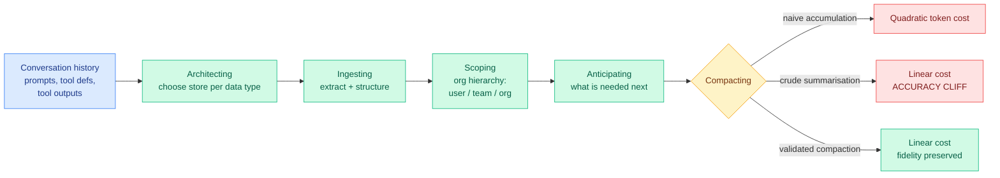

# Agentic Context Management: Context Is a Budget, Not a Database

**Source:** HuggingFace Daily Papers, 2026-07-27 | **arXiv:** [2607.21503](https://arxiv.org/abs/2607.21503) | **Raw:** [raw file](../../raw/huggingface/2026-07-27-agentic-context-management-solving-agent-memory-and-cost-by.md)

## TL;DR

The paper's claim is that production agents fail less because they reason badly and more because they cannot manage what sits in their reasoning context: conversation history, oversized prompts, tool definitions, and tool outputs that balloon. It argues the industry's framing of this as storage-and-retrieval is too narrow, and names the alternative Agentic Context Management (ACM), decomposed into five primitives: architecting, ingesting, scoping, anticipating, and compacting-and-consolidation. The economic argument is the sharpest part: naive accumulation grows token cost **quadratically** in conversation length, crude summarisation buys linear cost at the price of an accuracy cliff, and only *validated* compaction gets linear cost with fidelity preserved. A reference implementation, Maximem Synap, reports 92% on LongMemEval and 93.2% on LoCoMo.

## Diagram

## The one number worth keeping

**Quadratic.** Every turn re-sends the accumulated history, so cost over a conversation of length n goes as n². This is arithmetic rather than a finding, but stating it as the central economic fact is useful, because it explains why agent bills surprise people: the per-turn cost is not the cost. The claim that separates ACM from ordinary summarisation is that summarisation converts quadratic to linear but hits an accuracy cliff, and the fix is to *validate* the compaction rather than to trust it, which puts a checkable predicate between the compressor and the context.

## Relation to prior wiki state

- **This is the organisational-scope version of a thread the wiki has tracked at the algorithm level all year.** [Echo-Infinity (06-04)](../inference-efficiency/2026-06-04-echo-infinity-evolving-memory-video.md) replaced handcrafted KV schedules with a learned evolving memory state for infinite video at constant cost, and [Make Each Token Count (05-12)](../inference-efficiency/2026-05-12-make-each-token-count-kv-eviction.md) made KV eviction a learned policy rather than a heuristic. Both said: learn the compression policy, do not hand-tune it. ACM says something adjacent but distinct: *validate* the compression policy's output, and do it across an organisational scope hierarchy rather than for one user.
- **It contradicts today's other memory paper directly.** [PRO-LONG (07-27)](2026-07-27-pro-long-programmatic-memory.md), which appeared on both Kurate's weekly cs.AI leaderboard and DAIR.AI's weekly roundup, argues the opposite: keep the complete structured log, discard nothing, and let the agent search it with ordinary coding-agent tooling. ACM's whole frame is that you must decide what to forget. PRO-LONG's is that deciding what to forget is the mistake. See the [agent-memory concept page](agent-memory.md) for the standing state of this argument.
- **It inherits the staleness problem it does not address.** [STALE (05-15)](2026-05-15-agent-memory-cluster-stale-preping-evolvemem.md) found the best frontier model reaches only 55.2% at detecting implicit conflicts between remembered facts, and that the signal lives in propagation across related memories rather than in retrieval accuracy. ACM's "consolidating and forgetting while preserving provenance" is exactly where that failure would bite, and the paper reports LongMemEval and LoCoMo, neither of which is a staleness benchmark.

## Gaps

The headline numbers come from the authors' own commercial reference implementation, and the abstract explicitly qualifies them as holding "under the configuration detailed in Section 6," which is a caveat worth taking seriously on a 92% / 93.2% claim. The paper is closer to a position paper with a product attached than to a controlled comparison: the five primitives are a taxonomy, and taxonomies are not falsifiable. Most importantly, the paper itself concedes that existing benchmarks do not capture latency, token efficiency, or context-rot resistance, which are precisely the three dimensions its central economic argument turns on. So the quadratic-to-linear claim is asserted rather than measured against a baseline on a shared harness.

## Open questions

1. **What makes a compaction "validated"?** The distinction between validated and crude compaction is carrying the entire result and the abstract does not say what the validator checks. If the validator is an LLM judge reading a candidate summary, it is the exact configuration [the self-play judge paper (07-26)](../llms-foundation-models/2026-07-26-self-play-reward-hacking-llm-judges.md) showed produces a false-positive basin, where a judge conditioned on a candidate scores plausibility rather than correctness at a 0.719 false-positive rate.
2. **Does the accuracy cliff have a locatable threshold?** A compression-ratio-versus-accuracy curve would turn this from a qualitative warning into an engineering parameter.
3. **Does organisational scoping change the security surface?** Sharing consolidated context across a team or org is a cross-tenant information-flow problem, and the paper describes a multi-tenant service without discussing it.

## Related pages

- [Agent Memory](agent-memory.md) — concept page
- [PRO-LONG](2026-07-27-pro-long-programmatic-memory.md) — the opposing position, same day
- [KV Cache](../inference-efficiency/kv-cache.md) — the attention-internal sibling problem
- [STALE / Preping / EvolveMem cluster](2026-05-15-agent-memory-cluster-stale-preping-evolvemem.md)
