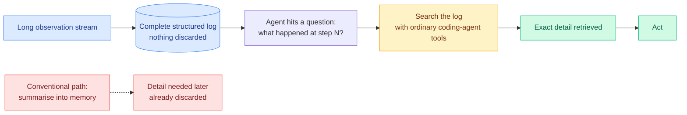

# PRO-LONG: Keep Everything, Then Grep It

**Source:** Cross-source confirmed. Kurate weekly cs.AI #17 (ai_rating 6.3/10) **and** DAIR.AI Top AI Papers of the Week via starred Gmail | **arXiv:** [2607.20064](https://arxiv.org/abs/2607.20064) | **Raw:** [Kurate](../../raw/kurate/2026-07-27-cs-ai.md) · [Gmail](../../raw/gmail/2026-07-27-starred.md)

## TL;DR

Long-horizon agents face a standard tradeoff: compress the observation history so it fits the context, and the specific detail you later need is exactly what the summary threw away. PRO-LONG refuses the tradeoff. It keeps a **complete, structured interaction log**, discards nothing up front, and lets the agent search that log on demand using the coding-agent tooling it already has. No bespoke memory harness. On the full ARC-AGI-3 public game set it improves on a base coding agent by an average of **18.0 points** across frontier models and reaches up to **76.1% pass@1**, matching or beating specialised state-of-the-art harnesses while using **4.2 to 5.8x fewer tokens**.

## Diagram

## Why the token number is the surprise

Keeping everything sounds like it should cost more tokens, not fewer. It costs 4.2 to 5.8x less because the log is **stored, not resident**. The agent pays for the slice it retrieves, when it retrieves it, instead of paying every turn to carry a summary of everything through its context window. That inverts the intuition behind most memory engineering, which assumes the job is to shrink what the agent holds. PRO-LONG's answer is that the job is to stop holding it at all.

This is the same economics that makes a filesystem beat an in-memory cache when working sets are sparse and access is unpredictable, which is the honest description of exploratory long-horizon tasks.

## The direct clash with today's other memory paper

[Agentic Context Management (07-27)](2026-07-27-agentic-context-management.md), which appeared on HuggingFace the same day, argues the opposite position with equal confidence. ACM's thesis is that managing what an agent holds in mind is a lifecycle spanning what to remember, what to forget, and how to compact to a budget, and that only *validated compaction* achieves linear cost with fidelity preserved. PRO-LONG's thesis is that deciding what to forget is the error, and that a searchable complete log beats elaborate memory engineering on **both** accuracy and cost.

They are not obviously reconcilable, and the conditions under which each wins are the interesting open question:

- PRO-LONG's evidence is **ARC-AGI-3**, exploratory game-playing where you cannot know in advance which observation matters. Sparse, unpredictable access. Search wins.
- ACM's evidence is **LongMemEval and LoCoMo**, conversational memory where recall is over a user's accumulated history and access is much more predictable. Anticipation should win.

The two are plausibly right about different workloads. Neither paper tests on the other's benchmark, which is the experiment that would settle it.

## Relation to prior wiki state

- **It is the strongest counter yet to the wiki's dominant memory thesis.** The [agent-memory concept page](agent-memory.md) has accumulated a long line of work on learned compression: [MemTrain (06-04)](2026-06-04-memtrain-self-supervised-context-memory.md) trains memory ability self-supervised on raw Wikipedia, [EvolveMem (05-15)](2026-05-15-agent-memory-cluster-stale-preping-evolvemem.md) co-evolves the retrieval configuration, [MemForest (05-26)](2026-05-26-memforest-hierarchical-temporal-agent-memory.md) builds hierarchical temporal structure. All of them assume the compression step is necessary and the research problem is doing it well. PRO-LONG says the baseline nobody bothered to run beats them.
- **It sidesteps the staleness problem rather than solving it.** [STALE (05-15)](2026-05-15-agent-memory-cluster-stale-preping-evolvemem.md) found the best model at 55.2% on detecting implicit conflicts between stored memories, with the difficulty in propagation across related memories. A complete append-only log has no consolidation step, so there is nothing to become stale, but it also means contradictory observations coexist in the log and the agent must resolve them at read time. Whether that is easier is untested.
- **It fits the harness-simplicity pattern from the July AI Engineer talks.** The recurring message in that batch was that elaborate scaffolding gets outrun by simpler designs as base models improve. PRO-LONG is that argument with a number on it.

## Gaps

ARC-AGI-3 is one benchmark family and an unusual one: exploratory games with programmatic state, which is the ideal case for a searchable structured log because the observations are already structured. Messy real-world agent traces, full of prose and screenshots and tool output, are not obviously greppable in the same way. Search quality is also doing invisible work here: the result depends on the agent formulating good queries against its own history, and the paper reports outcomes rather than search-hit rates, so there is no read on how often the agent fails to find something that is in fact in the log. And the token accounting favours PRO-LONG partly because ARC-AGI-3 episodes are bounded. A log that grows for weeks in a persistent assistant is a different regime, and there is no scaling curve.

## Related pages

- [Agent Memory](agent-memory.md) — concept page
- [Agentic Context Management](2026-07-27-agentic-context-management.md) — the opposing position, same day
- [Fable 5 memory engineering](2026-07-07-fable-5-memory-engineering.md)
- [Agent Benchmarks](agent-benchmarks.md)
