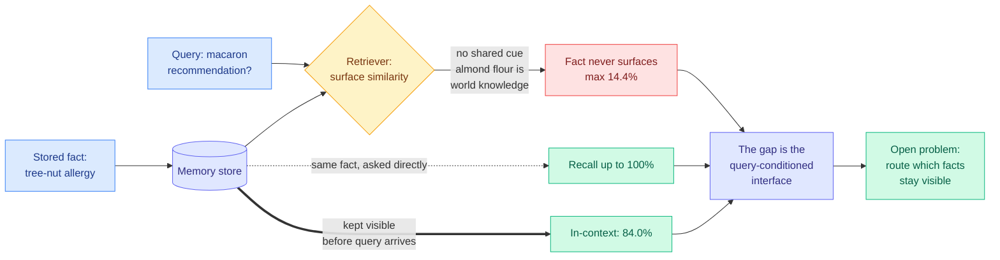

# Keep It InMind: Benchmarking the Implicit-Association Blind Spot in Agent Memory

**arxiv:** [2607.24368](https://arxiv.org/abs/2607.24368) · **Source:** [HuggingFace Daily Papers 2026-07-29](../../raw/huggingface/2026-07-29-keep-it-inmind-benchmarking-the-implicit-association-blind-s.md)

## TL;DR

Every long-term memory system for agents rests on an assumption so natural it is almost never written down: **a memory that is needed will look like the query that needs it.** Retrieval is similarity search, so if the stored fact and the incoming question share no surface cue, the fact never surfaces. World knowledge breaks this constantly. A stored tree-nut allergy should change the answer to a request for macarons, because macarons are made with almond flour, but the two texts share nothing a retriever can see. InMind names this the **implicit-association blind spot** and measures it with 125 expert-verified tasks across ten life domains, 113 of them grounded in citable public sources, with paired controls that separate three explanations existing evaluations conflate: the fact was never stored, the model lacks the bridging world knowledge, or the fact was stored and simply never surfaced.

The verdict is unusually clean for a benchmark paper. **With the decisive memory placed directly in context, the backbone answers 84.0% of indirect queries. When the same memory has to be retrieved, six vector, graph, and agentic memory systems reach at most 14.4%.** Those same systems recall the same facts at up to 100% when asked for them directly. Raising embedding dimensionality eightfold improves answer-blind target recall for every system and leaves the gap essentially intact. A minimal diagnostic probe that keeps memory visible *before* the query arrives recovers most of the gap.

That last result is what makes this a routing paper wearing a memory paper's clothes. The failure is not in storage, not in the embedding, and not in the model's world knowledge. It is in the **query-conditioned interface**, and the open problem the benchmark is built to score is stated explicitly as routing: deciding which facts must stay visible.

## Why the paired controls matter

Benchmarks in this area usually report one number and leave the diagnosis ambiguous: a low score could mean the memory system did not store the fact, or that the backbone could not make the inferential leap, or that retrieval failed. InMind's design isolates all three, and the isolation is what produces the finding. The 84.0% in-context number establishes the backbone *has* the bridging knowledge (it knows macarons involve almond flour). The up-to-100% direct-recall number establishes the store *has* the fact. The 14.4% ceiling is therefore attributable to the interface alone, with nothing else left to blame.

The embedding-dimensionality ablation closes the obvious escape hatch. If the problem were representational capacity, eight times the dimensions should help, and it does improve answer-blind target recall for every system. It does not close the gap. Better embeddings retrieve the right thing more often when you already know what you are looking for; they do not tell you that a macaron query should go looking for allergies.

## How this relates to prior wiki pages

**This is the third split of the memory problem the wiki has logged, and the most consequential.** [agent-memory](agent-memory.md) has tracked two already. The 05-15 cluster established that recall itself is the bottleneck (STALE capped frontier models at 55.2% on implicit-conflict detection over 150K-token contexts; MemLens capped multi-session reasoning below 30%). Then [TRACE (06-13)](2026-06-13-trace-compiling-user-corrections.md) split off compliance: with Mem0 memory in place, 57.5% of applicable user-preference checks were *still violated*, because an agent can recall a rule and ignore it. TRACE's line was "preference access is not preference compliance," and its fix was to compile corrections into runtime gates rather than trusting retrieval. InMind adds a third and prior failure: **access is not triggering.** TRACE assumed the fact reaches the model and asked whether it changes behaviour. InMind shows that for implicit associations the fact does not reach the model at all, even when the store holds it and the model would use it correctly if handed it. Ordered by pipeline position: triggering (InMind) precedes access precedes compliance (TRACE), and only the last two had names.

**The diagnostic probe is a direct hit on [MRAgent (06-15)](2026-06-15-mragent-graph-memory-reconstruction.md)'s thesis, and partly vindicates it.** MRAgent argued that "memory is reconstructed, not retrieved," replacing one-shot top-k lookup with a reasoning loop that expands and prunes retrieval paths as evidence accumulates, for up to +23% on LoCoMo and LongMemEval at lower token cost. That is exactly the shape of fix InMind's result calls for, because a reasoning-driven loop can in principle bridge from macarons to almond flour to allergies. But InMind's six evaluated systems include agentic memory and they still cap at 14.4%, which says the reconstruction loop as currently built does not bridge implicit associations either. The probe that works is cruder and more expensive: keep memory visible *before* the query arrives, which is not retrieval at all.

**Naming routing as the open problem puts this on the [llm-routing](../ai-routing/llm-routing.md) page's territory, and it is a new axis there.** That page's routing decisions are about *which model* answers ([TRACER](../ai-routing/2026-04-17-tracer-llm-routing.md), [CaRE](../ai-routing/2026-05-11-care-bi-level-routing-moe-continual-learning.md)), *which expert or head* fires ([BEAM](../ai-routing/2026-05-16-beam-binary-expert-activation-masking-moe.md), [MISA](../inference-efficiency/2026-05-11-misa-mixture-of-indexer-sparse-attention.md)), or *which phase goes where* ([Kilo plan/implement](../ai-routing/2026-06-16-kilo-plan-implement-model-split.md)). InMind proposes routing over **which facts occupy context**, decided before the query is known. That is a scheduling problem against a fixed context budget, which makes it structurally the same problem as KV cache admission rather than model selection, and it connects to the [07-28 Looking Ahead prediction](../daily-digest/2026-07/2026-07-28.md) that someone would build a "route to memory before routing to a model" tier within 90 days. InMind is not that system, but it is the benchmark that would score it.

## Gaps

125 tasks is small, and ten life domains is a deliberately everyday-knowledge slice, so nothing here tells you whether the blind spot behaves the same for technical or enterprise domains where the bridging knowledge is rarer and the model may genuinely lack it. The working probe (keep memory visible before the query) is a diagnostic, not a proposal: it does not scale, because the whole point of an external store is that it exceeds the context window, and the paper does not measure how visibility degrades as the resident set grows. And "at most 14.4%" aggregates six heterogeneous systems, so the per-system spread, which would tell you whether graph memory does structurally better than vector memory here, is not visible in the abstract.

## Related

- [agent-memory](agent-memory.md) (concept page)
- [llm-routing](../ai-routing/llm-routing.md) (concept page)
- [TRACE (06-13)](2026-06-13-trace-compiling-user-corrections.md)
- [MRAgent (06-15)](2026-06-15-mragent-graph-memory-reconstruction.md)
- [Sparse Event-KV memory contract (07-29)](../inference-efficiency/2026-07-29-sparse-event-kv-memory-contract.md)
- [Daily digest 2026-07-29](../daily-digest/2026-07/2026-07-29.md)
