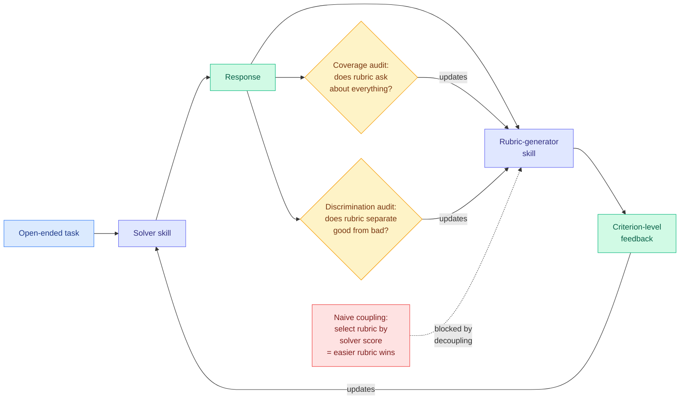

# DecoEvo: Score-Decoupled Co-Evolution of Solver and Rubric-Generator Skills in Text Space

**arxiv:** [2607.25675](https://arxiv.org/abs/2607.25675) · **Source:** [HuggingFace Daily Papers 2026-07-30](../../raw/huggingface/2026-07-30-decoevo-score-decoupled-co-evolution-of-solver-and-rubric-ge.md)

## TL;DR

Text-space optimization improves an LLM by editing external natural-language artifacts (prompts, skills, rubrics) instead of weights, which keeps everything inspectable and treats the model as a black box. Nearly all of these methods hold the **evaluator** fixed, and on open-ended tasks that becomes the ceiling: once the solver satisfies the criteria the rubric measures, every dimension the rubric omitted stays permanently invisible to the optimizer. The naive fix, evolving the rubric too, has a well-known failure: if rubric updates are selected by the current solver's score, the optimizer discovers that making the rubric *easier* raises the score. That is reward hacking with extra steps. DecoEvo co-evolves a solver skill and a rubric-generator skill under **decoupled objectives**, using no gold rubrics at any point. The solver is updated from criterion-level feedback. The rubric generator is revised through audits of two properties that are independent of the aggregate solver score: **requirement coverage** (does the rubric ask about everything the task requires) and **response discrimination** (does it separate good responses from bad ones).

## Decoupling as an anti-gaming mechanism

The interesting thing about DecoEvo is that its central design choice is defensive. Both audits are constructed specifically so that they cannot be satisfied by lowering the bar. A rubric that drops a hard criterion loses coverage. A rubric that asks only easy questions loses discrimination, because good and bad responses both pass. Neither audit ever looks at the aggregate solver score, so the gradient that would push toward an easier rubric does not exist.

The stated consequence is that generator updates concentrate on **newly exposed solver weaknesses** rather than re-emphasizing criteria the solver already satisfies, which is the co-evolutionary property you actually want: the evaluator stays one step ahead.

## Key results

- Outperforms all compared methods on **five benchmarks across three LLM backbones** under each benchmark's own official evaluation, which is the right protocol because it means the gains are not measured by DecoEvo's self-generated rubrics.
- **2.8 to 5.0% relative** improvement over SkillOpt on the five-benchmark average.
- No gold rubrics used during optimization.

## Relation to prior wiki state

Evaluating under each benchmark's official metric rather than the evolved rubric is the methodological point, and it is a direct response to a concern this wiki has raised repeatedly. The [07-26 digest](../daily-digest/2026-07/2026-07-26.md) documented a **false-positive basin** in LLM judges that transfers across judge families and scales, and predicted someone would run a hidden-anchor audit on a published self-rewarding result within 60 days and find part of the gain does not survive. The [07-27 digest](../daily-digest/2026-07/2026-07-27.md) extended that prediction to four self-evolution papers by name. DecoEvo is the first paper in this cluster to pre-empt the audit by construction: its headline number comes from an external metric, so the self-rewarding loop cannot have inflated it. That does not prove the loop is clean, but it moves DecoEvo out of the exposed set.

Within the skills cluster: [SkillOpt (2026-06-18)](2026-06-18-skillopt-trainable-skills.md) established the trainable-text-skill frame and is DecoEvo's explicit baseline. [Skill Self-Play (2026-07-27)](2026-07-27-skill-self-play-co-evolving-skills.md) co-evolved skills against generated scenarios, and the [07-27 digest](../daily-digest/2026-07/2026-07-27.md) predicted it would survive an audit best because verification happens inside a skill's own scenario. DecoEvo co-evolves against a generated *evaluator* rather than a generated *scenario*, which is the harder direction because the evaluator is the thing being scored against. Same-day [SkillRise (2026-07-30)](2026-07-30-skillrise-cross-task-skill-evolution.md) is the RL-native sibling, making skill curation a gradient-carrying action rather than a text-search step.

There is a real convergence to name here across topic boundaries. DecoEvo decouples the rubric-generator's objective from the solver's score; today's [CoRT (2026-07-30)](../inference-efficiency/2026-07-30-cort-counterfactual-replay-token-credit.md) redistributes rubric-derived credit across tokens without training an auxiliary scorer. **Three papers in one day treat the rubric as the object of engineering rather than as fixed input**, counting DecoEvo, CoRT, and CAST's use of solver value as a graded external signal. Rubric design has stopped being a data-collection detail and become an optimization target.

## Gaps

Everything rests on the two audits, and the abstract does not say who runs them. If coverage and discrimination are themselves judged by an LLM, the anti-gaming argument weakens considerably, because the generator can then learn to satisfy the auditor rather than the property, which is the same failure one level up. That is the single most important missing detail. The 2.8 to 5.0% relative margin over SkillOpt is modest, and relative rather than absolute framing makes it look larger than it is. No cost accounting: co-evolving two skills with two audits per round is several times the LLM calls of single-skill optimization, and the paper reports no compute-matched comparison, so some of the gain may simply be more search. Nothing shows how many rounds it takes to converge or whether it eventually stalls.

## Industrial implication

For teams running LLM-as-judge evaluation in production, the transferable idea is not the co-evolution loop, it is the pair of audits. Coverage and discrimination are cheap, measurable properties of any rubric, and most production rubrics are written once and never checked against either. Running the two audits against an existing eval rubric is a half-day of work that will find omitted dimensions in almost any mature evaluation suite.

## Related

- [Self-Evolving Agents](self-evolving-agents.md)
- [SkillRise](2026-07-30-skillrise-cross-task-skill-evolution.md)
- [Skill Self-Play](2026-07-27-skill-self-play-co-evolving-skills.md)
- [Daily digest 2026-07-30](../daily-digest/2026-07/2026-07-30.md)
