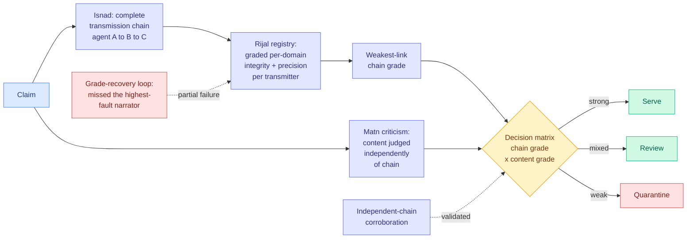

# Grading the Narrators: An Isnad-Rijal Framework for Claim-Level Provenance in Multi-Agent Knowledge Systems

**arxiv:** [2607.24117](https://arxiv.org/abs/2607.24117) · **Source:** [HuggingFace Daily Papers 2026-07-30](../../raw/huggingface/2026-07-30-grading-the-narrators-an-isnad-rijal-framework-for-claim-lev.md)

## TL;DR

Multi-agent systems increasingly build knowledge through chains of autonomous transformations rather than by retrieving it. Existing provenance tooling records **what happened** (execution traces, tool calls, evidence links), and source-reliability estimation via truth discovery and reputation systems is decades old. Neither gives you graded, per-domain reliability for each *transmitter* attached to each *claim's transmission chain*. This paper borrows the methodology from classical Islamic hadith science, which solved a structurally identical problem over centuries: deciding whether knowledge transmitted through chains of human narrators should be accepted. The transferred apparatus is four ideas. **Isnad**: every claim carries a complete transmission chain. **Rijal**: each transmitter is graded on integrity and precision, per domain. **Weakest-link evaluation**: a chain is only as good as its worst narrator. **Matn criticism**: content is evaluated *independently* of chain quality. Output routing is three-way: serve, review, or quarantine. Evaluated on 20,000 claims from real physics textbooks.

## The honest-reporting is the reason to read it

Most benchmark papers report what worked. This one reports a decision matrix, then states plainly that the evaluation **validates** weakest-link quarantine and independent-chain corroboration, **partially fails** on the grade-recovery loop (which missed the highest-fault narrator, the single most important case it exists to catch), and returns **two inconclusive analyses**, including a matched-coverage comparison the framework could not reach against the reference content critic. The abstract says it is "explicit throughout about which claims the evidence does and does not yet support."

That failure disclosure is the most useful sentence in the paper. A reputation system that cannot identify its worst actor is not a working reputation system, and the authors say so rather than reporting the two components that did work and calling it a validated framework. On a day when [Kurate's cs.AI #1](http://arxiv.org/abs/2607.22368) is a paper arguing agent benchmarks have a protocol-validity problem and **#2** is [What AI Red-Team Evaluations Can and Cannot Prove](http://arxiv.org/abs/2607.21735), arguing red-team evaluations establish existence and almost never absence, this is what the requested epistemic hygiene actually looks like in a results section.

## Two ideas worth stealing regardless of the framing

The hadith-science framing will strike some readers as ornamental. The two mechanisms underneath are not, and neither is standard practice in agent systems today.

**Per-domain grading.** Reliability is not a scalar property of an agent. A retrieval agent that is precise about citations and sloppy about numbers has two different grades, and a single reputation score averages away exactly the distinction you need at decision time.

**Decoupling content criticism from chain quality.** Current agent pipelines conflate these constantly: a claim from a trusted agent gets waved through, and a claim from an untrusted one gets scrutinized. Judging the content on its own terms and *then* combining with chain grade gives you a two-dimensional decision surface, which is what makes a three-way serve/review/quarantine routing possible instead of a binary accept/reject.

## Relation to prior wiki state

The wiki's failure-attribution thread has been converging on the same structural insight from the debugging side. [AgentDebugX (2026-07-22)](2026-07-22-agentdebugx-dataflow-harness-agent-tooling.md) organizes debugging as Detect → Attribute → Recover → Rerun on the premise the thread keeps confirming: **the step where an error surfaces is usually not the step that caused it.** That is weakest-link reasoning applied to execution traces. AgentDebugX posts 28.8% strict attribution (exact agent and step) on the "Who and When" benchmark, which is the honest ceiling on this problem, and Grading the Narrators' grade-recovery failure to find the highest-fault narrator is plausibly the same ceiling seen from the provenance side. Two independent formalisms, one hard problem: assigning blame along a chain is unsolved at roughly the same accuracy.

The quarantine routing connects to [XCientist (2026-06-18)](2026-06-18-xcientist-research-harness-claim-drift.md), which documented **claim drift**, where a research harness's stated finding gradually detaches from what its own runs support. Claim-level provenance with weakest-link evaluation is a direct structural defence against drift, and the validated corroboration component is the relevant one: a claim supported by independent chains is much harder to drift.

## Gaps

Physics textbooks are the easiest possible evaluation domain for this. Claims are atomic, largely verifiable, mostly non-contradictory, and have a ground truth, which is not what a multi-agent knowledge system encounters in practice. The framework's value shows up under disagreement, ambiguity, and adversarial transmitters, and none of those are present here. The grade-recovery failure is not diagnosed, only reported, so it is unknown whether the loop is fixable or whether identifying the worst narrator is fundamentally hard. Two of the analyses are inconclusive, meaning roughly half the claimed contributions are unvalidated. No cost accounting for maintaining a graded narrator registry at scale, which is the practical objection.

## Industrial implication

Any production RAG or multi-agent pipeline already logs the chain and throws away everything except the final answer. The cheap version of this paper is: keep per-agent, per-domain accuracy statistics, apply the worst grade in the chain rather than the average, and add a quarantine tier instead of serving everything above a threshold. That is a schema change and a routing rule, and it is worth doing without adopting the rest of the framework.

## Related

- [Multi-Agent Systems](multi-agent-systems.md)
- [AgentDebugX: failure attribution and repair](2026-07-22-agentdebugx-dataflow-harness-agent-tooling.md)
- [XCientist: research harness claim drift](2026-06-18-xcientist-research-harness-claim-drift.md)
- [Daily digest 2026-07-30](../daily-digest/2026-07/2026-07-30.md)
