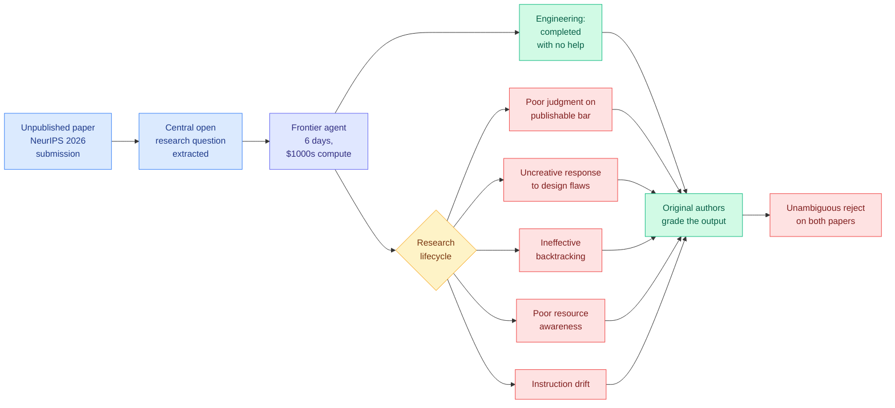

# Can AI Agents Conduct Open-Ended AI Research? Early Evidence from Two Case Studies

**arxiv:** [2607.27191](https://arxiv.org/abs/2607.27191) · **Source:** [HuggingFace Daily Papers 2026-07-30](../../raw/huggingface/2026-07-30-can-ai-agents-conduct-open-ended-ai-research-early-evidence.md)

## TL;DR

The whole forecast of explosive AI progress rests on one assumption: that AI agents will soon automate AI research itself. Nobody has measured it properly, because the two available protocols both fail. Narrow verifiable tasks (implement this function, hit this accuracy) exclude the open-ended part that actually constitutes research. Submitting AI-generated papers to blind peer review inherits everything wrong with peer review: overstretched reviewers, high variance, poor quality. This paper introduces a third protocol it calls a **shadow evaluation**. Take a high-quality *unpublished* paper, hand the agent its central open research question, and have the paper's own authors grade the agent's output. The authors know exactly what a good answer looks like because they spent months finding one, and the paper being unpublished removes contamination. Two shadow evaluations were run on unpublished NeurIPS 2026 submissions, with frontier agents given six days and thousands of dollars of compute each. **The agents completed all of the engineering with no human help. Both outputs were unambiguously rejected by the original authors.**

## Why the protocol is the contribution

The result is memorable but the method is what will last. Every existing evaluation of research agents grades against something the agent could in principle have found in its training data or reconstructed from the literature. A shadow evaluation grades against a question whose answer *does not exist publicly yet*, and it grades using the only people on earth who have actually solved it. That is an unusually clean setup: no contamination, no proxy metric, no LLM judge, and a grader whose standard is calibrated to what a real submission has to clear.

The cost is scale. Two evaluations is two data points, and each consumed six days and thousands of dollars of compute plus expert reviewer time. This protocol cannot be run as a leaderboard, which is exactly why nobody had run it.

## The five failure modes, and why they cluster

The paper names five recurring failures, reproduced in a robustness check with a second model and a second scaffold:

1. **Poor judgment about the bar for publishable research.** The agent does not know when its result is not yet good enough.
2. **Uncreative responses to shortcomings in the research design.** When the initial design has a flaw, the agent patches rather than reframes.
3. **Ineffective backtracking from dead ends.** It keeps going down paths a researcher would abandon.
4. **Poor resource awareness.** It spends compute and days badly relative to the value of what it is chasing.
5. **Instruction drift.** Over a six-day horizon the agent loses the shape of what it was asked.

Four of these five are not knowledge failures and not engineering failures. They are **judgment about what to do next given an incomplete picture**, which is precisely the capacity the engineering half does not exercise. The clean split the paper reports (all engineering done, no research progress made) says the two layers are separable and only one of them is solved.

## Relation to prior wiki state

This is the strongest evidence yet for a two-layer thesis the wiki has been building since [ForeSci (2026-06-07)](2026-06-07-foresci-research-judgment-benchmark.md), which found an *evidence-decision decoupling*: research agents cite the relevant evidence and still forecast the wrong research object, so retrieval quality does not become decision quality. ForeSci measured judgment on a forward-looking multiple-choice surface. Shadow evaluations measure it on the real task, with real experts, and get the same answer with far less room to argue.

It also lands directly on the self-improving-research cluster. [AREX (2026-07-25)](2026-07-25-arex-recursively-self-improving-deep-research.md), a recursively self-improving deep-research agent that rewrites its own research procedure, and [XCientist (2026-06-18)](2026-06-18-xcientist-research-harness-claim-drift.md), which documented claim drift where a research harness's stated finding gradually detaches from what its own runs support, both optimize inside the loop that this paper says is not the binding constraint. Every one of those systems would have completed the engineering here too.

The instruction-drift finding connects to the agent-memory line. [PRO-LONG (2026-07-27)](2026-07-27-pro-long-programmatic-memory.md), which argued for keeping a complete searchable log rather than compacting memory, and [Agentic Context Management (2026-07-27)](2026-07-27-agentic-context-management.md), which argued the opposite, are both proposals about surviving long horizons. Six days is longer than anything either was tested on.

The failure to backtrack is the same shape as [MAP / Map-then-Act (2026-05-14)](2026-05-14-map-then-act-paradigm.md), which found frontier models beat near-zero ARC-AGI-3 baselines in 22 of 25 environments when forced to build an environment model *before* acting. Research is the extreme case of a domain where the map has to be built, and nobody has tried map-then-act at a six-day horizon.

## Gaps

Two papers, one field, one conference. Both come from a domain where the agents were themselves trained heavily, which if anything biases toward success, so the negative result is robust in the direction that matters. But n=2 cannot tell you whether the ceiling is uniform or whether some research questions are already in reach. The compute budget is also a confound in the other direction: six days and a few thousand dollars is a fraction of what a human author spent, so the paper is measuring a specific point on a curve it does not plot.

The grading is by the original authors, which is the protocol's strength and also a bias surface. Authors grading an agent's attempt at their own question are not neutral. The paper releases the reviews and survey responses, which is the right mitigation, but the number of graders is small.

## Industrial implication

The engineering half being solved is not a small finding, and it is the half most labs are actually buying. Research-agent products should be sold and staffed as extremely capable execution layers under human direction, not as autonomous researchers, and the gap the paper identifies is not the kind that closes with a bigger model or a longer context. It closes with something that looks like taste, and no current training objective targets it.

## Related

- [Agent Evaluation & Benchmarks](agent-benchmarks.md)
- [Self-Evolving Agents](self-evolving-agents.md)
- [AREX: Recursively Self-Improving Deep Research](2026-07-25-arex-recursively-self-improving-deep-research.md)
- [Daily digest 2026-07-30](../daily-digest/2026-07/2026-07-30.md)
