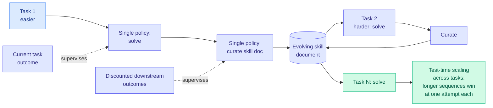

# SkillRise: Agentic Reinforcement Learning for Cross-Task Skill Evolution

**arxiv:** [2607.26784](https://arxiv.org/abs/2607.26784) · **Source:** [HuggingFace Daily Papers 2026-07-30](../../raw/huggingface/2026-07-30-skillrise-agentic-reinforcement-learning-for-cross-task-skil.md)

## TL;DR

Standard agentic RL treats every task as an independent episode: the agent solves it, gets a reward, and forgets. That is wasteful when tasks are related, which in practice they always are. Existing skill-learning approaches fix half of this and add machinery, either by focusing on repeated attempts at one task or by building multi-stage pipelines where extraction, retrieval, and execution are separate components that have to be kept consistent. SkillRise collapses all of it into **one policy** that alternates between two things: solving the current task, and curating an evolving skill document that gets passed directly to the next task. Tasks are organized into progressively harder sequences. Credit assignment is decoupled, so solving is supervised by the current task's outcome while **curation is supervised by discounted downstream outcomes**, which is what forces the document to be written for a future reader rather than as a summary of what just happened.

## The decoupled credit assignment is the mechanism

If you supervise curation with the current task's reward, the policy learns to write a good post-hoc summary of a solved problem, which is not what a skill document is for. Supervising it with *discounted downstream* outcomes means a written skill only earns credit if a later task benefits from it. That is the difference between a log and a skill, and it is implemented as a credit-assignment choice rather than as a separate module.

The result that carries the claim is not the headline accuracy, it is the scaling behaviour: performance improves with longer sequences of related tasks **even when each task is attempted only once**. That controls for the obvious confound. If gains came from repeated sampling of the same problem, the one-attempt-per-task condition would kill them. It does not, so something transferable is genuinely accumulating in the document.

## Key results

- Strongest Pass@1 among compared methods on ALFWorld, WebShop, and ScienceWorld, with gains over the strongest baseline of **2.3 to 8.5 percentage points**.
- Test-time scaling *across* tasks, at one attempt per task.
- The curation policy trained across distinct tasks remains effective for repeated attempts at a single task, so the cross-task objective did not cost the within-task capability.
- Substantially lower runtime overhead than multi-stage skill pipelines, because there is only one policy and no retrieval stage.

## Relation to prior wiki state

The self-evolving-skills cluster now has enough members to characterize its shape. [SkillOpt (2026-06-18)](2026-06-18-skillopt-trainable-skills.md) established the frame that a skill is a trainable, inspectable text artifact rather than a weight update. [Skill Self-Play (2026-07-27)](2026-07-27-skill-self-play-co-evolving-skills.md) co-evolved skills against generated scenarios. Today's [DecoEvo (2026-07-30)](2026-07-30-decoevo-solver-rubric-coevolution.md) co-evolves a solver skill against a rubric-generator skill under deliberately decoupled objectives, beating SkillOpt by 2.8 to 5.0% relative across five benchmarks. SkillRise is the RL-native member: the others optimize text artifacts through search or LLM-driven editing, SkillRise makes curation an **action the policy takes and gets gradient for**.

Read against the wiki's memory debate, SkillRise is a third position. [PRO-LONG (2026-07-27)](2026-07-27-pro-long-programmatic-memory.md) argued for keeping a complete searchable log and never compacting. [Agentic Context Management (2026-07-27)](2026-07-27-agentic-context-management.md) argued for aggressive compaction. Both treat the memory policy as designed. SkillRise **learns** what to keep, supervised by whether keeping it helped later, which is the version of the question neither paper posed. The [07-27 digest](../daily-digest/2026-07/2026-07-27.md) predicted the keep-everything baseline would get run against a compression system on shared ground within 90 days; SkillRise does not run that comparison but it reframes what the comparison should measure.

The obvious tension with today's other agentic result is worth stating plainly. [Shadow evaluations (2026-07-30)](2026-07-30-shadow-evaluations-ai-research-agents.md) found frontier agents suffering **instruction drift** over a six-day horizon and failing to backtrack from dead ends. SkillRise's document is a mechanism for carrying intent across episodes, which is exactly the missing capability, but it was validated on ALFWorld and WebShop episodes measured in dozens of steps, not days. Whether learned curation survives at the horizon where drift actually appears is untested and is the experiment that would matter most.

## Gaps

Three benchmarks, all household or shopping simulators with short episodes and clean reward signals, which is the friendliest possible ground for "related tasks share reusable patterns." The 2.3 to 8.5 point range is wide and unexplained, and the low end is within the noise band typical of these environments. Progressively harder task *sequences* are constructed by the authors, and nothing shows what happens when task order is random or when unrelated tasks are interleaved, which is the realistic deployment condition. Nothing is reported about skill-document growth: an evolving document that is never pruned eventually becomes a context-length problem, and the discounted-downstream objective gives no explicit pressure to delete.

## Industrial implication

The practical appeal is the runtime overhead result. Multi-stage skill pipelines are expensive to run and expensive to keep coherent, and a single policy that curates as an action removes an entire retrieval component from the serving path. For anyone running a fleet of agents over a stream of related tickets, the deployable version of this is a per-customer or per-repository skill document that improves over the queue, and the credit-assignment recipe is the part to copy even if the RL training is not.

## Related

- [Self-Evolving Agents](self-evolving-agents.md)
- [Agent Memory](agent-memory.md)
- [DecoEvo: decoupled solver and rubric co-evolution](2026-07-30-decoevo-solver-rubric-coevolution.md)
- [SkillOpt: trainable skills](2026-06-18-skillopt-trainable-skills.md)
- [Daily digest 2026-07-30](../daily-digest/2026-07/2026-07-30.md)
