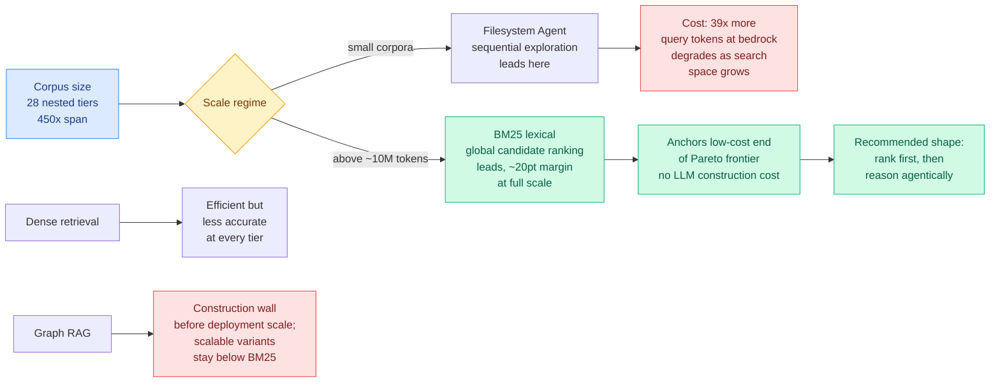

# BM25 Wins at Scale: A Scaling Study of Retrieval-Augmented Generation Paradigms

**Source:** HuggingFace Daily Papers, 2026-07-31 · [arXiv 2607.26497](https://arxiv.org/abs/2607.26497) · [raw](../../raw/huggingface/2026-07-31-bm25-wins-at-scale-a-scaling-study-of-retrieval-augmented-ge.md)

## TL;DR

Retrieval-augmented generation now spans four paradigms that are almost never compared under controlled conditions: lexical search (BM25, a 1994 term-frequency ranking function), dense embedding retrieval, graph-based indexing, and agentic search where an LLM explores a filesystem. Each gets benchmarked on its own corpus at its own scale, so the accuracy-versus-cost picture is unknown. This study fixes the questions, fixes the reader model, fixes the judge, and fixes a bedrock set of relevant and adversarial documents, then varies only corpus size across **28 strictly nested tiers spanning roughly 450-fold**. The result is a **crossover, not a winner**. The filesystem agent leads at the smallest shared tiers. At around **10 million corpus tokens BM25 overtakes it and leads at every larger tier, with the margin approaching 20 points at full scale.**

## What it actually does

The experimental design is the paper. Twenty-eight **strictly nested** corpus tiers means every smaller tier is a subset of every larger one, so the relevant documents and the adversarial distractors are physically identical across scales and only the haystack grows. One reader model and one judging protocol across every condition. The measurements are official accuracy, construction tokens, query tokens, and latency, which means construction cost (the LLM calls a graph index needs before it can answer anything) is counted rather than treated as a free preprocessing step.

That accounting is what kills graph RAG. The paper reports that graph-based indexing **hits construction walls before reaching deployment scale**, and the variants engineered to scale stay below BM25 at every shared tier. A method whose index cannot be built at the corpus size you actually have is not a slower method, it is an unavailable one.

## Key findings

- **Crossover at roughly 10 million corpus tokens.** Below it, the filesystem agent leads. Above it, BM25 leads at every shared tier, with the gap widening to nearly 20 points at full scale.
- **The filesystem agent costs 39x more query tokens at the bedrock tier** and gets less effective as the search space grows, because sequential exploration has to visit what a ranker can score globally.
- **BM25 anchors the low-cost end of the Pareto frontier** and needs no LLM-based construction at all. It is both the cheapest and, past the crossover, the most accurate.
- **Dense retrieval stays efficient but less accurate** than BM25 throughout, which is the finding most likely to annoy people.
- The paper's own synthesis: corpus growth increasingly favours **global candidate ranking**. Agentic reasoning works best **after** ranked discovery, not instead of it.

## How this relates to prior wiki pages

**This puts a scale boundary on the agentic-search direction, and it lands on the same day as a paper testing the same medium from the inside.** Today's [Filesystem-Based Memory for LLM Agents](2026-07-31-filesystem-based-memory.md) studies the directory-of-markdown-files memory that deployed agents actually use, and finds that what organization reliably buys is **search economy**, roughly halving retrieval cost where material is large, while no agent it measured converted organization into better answers. Read together the two papers say the same thing about the same artifact from opposite directions: the filesystem is a fine place to *keep* things and a bad place to *search* at scale. BM25 Wins at Scale gives the crossover point; Filesystem-Based Memory gives the mechanism, which is that the management agent's organization erodes as the store grows for all but the strongest model.

**It is also a direct check on [tool-calling](tool-calling.md) and the wiki's deep-research thread.** Today's [Is Deep Research Reliable?](../responsible-ai/2026-07-31-deep-research-misleading-knowledge.md) shows deep-research agents adopt misleading retrieved knowledge as false conclusions even when a verifier flags the same instances in isolation. Both papers point at retrieval-side engineering rather than agent-side reasoning as the lever. If ranked discovery outperforms exploration at scale, and the failure mode of exploration is adopting whatever it happens to find, then the argument for putting a cheap global ranker in front of the agent is now both an efficiency argument and a reliability one.

**Against the [agent-benchmarks](agent-benchmarks.md) page's running measurement-crisis thread, this is the constructive version.** The page has been accumulating papers arguing agent evaluations do not measure what they claim (Kurate's cs.AI #1 on 07-29, "Do Agent Benchmarks Measure Capability?", argued the problem is protocol validity rather than task difficulty). This paper does not argue about validity; it holds every confound fixed and varies one axis. The finding that the ranking of four paradigms **reverses** with corpus size is the concrete demonstration of why single-scale benchmarking produces unreliable conclusions.

## Gaps

One reader model and one judge protocol is the price of the controlled design, and it means the crossover point is a property of this configuration rather than a universal constant. A stronger reader that can exploit a graph's structure, or a weaker one that cannot filter BM25's noisier candidate set, could move the 10M number in either direction. The corpora are also nested subsets of a single collection, so the crossover may depend on how the relevant documents' lexical overlap with the query distribution scales, which is exactly the property BM25 lives or dies on. Domains where the query and the answer share no vocabulary (the [InMind](2026-07-29-inmind-implicit-association-blind-spot.md) implicit-association setting, where a stored nut allergy should change the answer to a macaron question) are where lexical retrieval should be worst, and they are not tested here.

## Industrial read

The uncomfortable version for anyone who built a graph RAG pipeline in the last eighteen months: construction cost is not amortizable if the index cannot be built at your corpus size, and the scalable variants underperform a ranking function older than most of the people deploying them. The defensible architecture the paper points at is a two-stage one, cheap global lexical ranking first, agentic reasoning over the ranked candidates second, which is also the cheapest thing to build.

## Related

- [Filesystem-Based Memory for LLM Agents](2026-07-31-filesystem-based-memory.md)
- [Is Deep Research Reliable?](../responsible-ai/2026-07-31-deep-research-misleading-knowledge.md)
- [agent-benchmarks.md](agent-benchmarks.md)
- [agent-memory.md](agent-memory.md)
