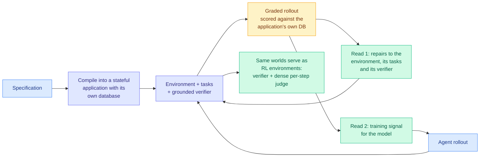

# Echoverse: Deep, Evolving Environments for Training Computer-Use Agents at Scale

**Source:** HuggingFace Daily Papers, 2026-07-31 · [arXiv 2607.28074](https://arxiv.org/abs/2607.28074) · [code](https://aka.ms/echoverse) · [raw](../../raw/huggingface/2026-07-31-echoverse-deep-evolving-environments-for-training-computer-u.md)

## TL;DR

Computer-use agents learn from what their actions change, so training one needs applications it can act on, break and reset. The applications that matter are login-gated and stateful, so synthetic environments stand in. Recent pipelines can already generate those in bulk, which moved the bottleneck from **how many exist** to **what is inside each one**. Echoverse identifies three properties that determine returns and builds a system around them: how much **behavioural depth** an environment carries, whether it targets the interaction the agent **actually fails**, and whether it **improves alongside the model**. Trained on twelve such environments, a **9B model goes from 36.5% to 67.1%** across fourteen evaluation splits, within fourteen points of the much larger frontier model that taught it.

## The design

Two pieces. **Compilation**: specifications become stateful applications whose tasks are graded against the application's own database, so the verifier is grounded in real state rather than in a text rubric. **A co-evolution loop**: every graded rollout is read twice, once as repairs to the environment, its tasks and its verifier, and once as training signal for the model. That double read is the mechanism that makes environments improve rather than stay fixed.

## Key results

- **9B model: 36.5% → 67.1%** across fourteen evaluation splits, trained on twelve environments, landing within fourteen points of the much larger frontier teacher.
- **Depth is the variable, not count.** On the same domains, shallow environments *push live-site accuracy below the base model* (80.0 → 75.0) while deep ones raise it (80.0 → 85.0, and 48.0 → 65.0). Training on a bad environment is worse than not training.
- **Targeted drilling transfers.** Drilling one interface control across many renderings transfers to held-out widget families and to the open web.
- **Repair is high-leverage.** Repairing a single environment lifts the model trained on it from **16.2% to 38.5%**.
- The same worlds work as RL environments: combining the grounded verifier with a dense per-step judge raises held-out score from **58.8% to 68.0%**.
- Four environments released as a benchmark, with applications, seed data and grounded graders.

## Gaps

Twelve environments is a small base for a claim about what environment properties generalize, and "deep" versus "shallow" is defined by construction rather than by an independent measure, so the depth result partly restates the authors' own design choice. The 36.5 → 67.1 headline is distillation from a frontier teacher, so it does not separate environment quality from teacher quality; the shallow-versus-deep contrast is the cleaner evidence. Live-site accuracy dropping from 80.0 to 75.0 under shallow training is the most transferable warning here and is reported on one comparison.

## Relation to prior wiki state

**Third independent arrival of the environments-are-the-product thesis in three days.** [Morgan Stanley's AlphaLab talk (07-29)](../../raw/youtube-ai-tech/2026-07-29-Morgan-Stanley-AlphaLab-Auto-Research-Environments.md) concluded from production that general auto-research is becoming a commodity so enterprise value lives in building environments and evals, and moved to meta-harness optimization plus on-policy distillation against those environments. [Frontis-MA1 (same day)](2026-07-31-frontis-ma1-ai4ai-recursive-self-improvement.md) releases OpenMLE-Gym as the load-bearing artifact alongside a 35B checkpoint. Echoverse supplies the measurement the other two assert: **environment depth changes sign, not just magnitude**, since shallow environments actively degrade the base model. Three sources, one claim, which crosses the wiki's pattern threshold.

**Sharpens the harness thread.** [GTA-2 (04-20)](2026-04-20-gta-2-tool-agent-benchmark.md) found harness design mattered more than model capability, and the [OpenAI agent-harness talk (07-29)](../../raw/youtube-ai-tech/2026-07-29-OpenAI-Agent-Harness-Failure-Modes.md) argued failures attributed to models are usually harness failures. Echoverse extends that upstream: the harness is not just how you run the agent, it is what you trained it in, and a bad training environment leaves damage a good serving harness cannot undo.

**Connects to [self-evolving-agents.md](self-evolving-agents.md).** The 06-05 cluster found naive self-evolution collapses unless the internalized signal is principle-level. Echoverse evolves the *environment* rather than the agent's own experience store, which sidesteps that failure mode by keeping the thing being evolved externally verifiable against a database.

## Links

- [self-evolving-agents.md](self-evolving-agents.md)
- [Frontis-MA1](2026-07-31-frontis-ma1-ai4ai-recursive-self-improvement.md)
- [Daily digest 2026-07-31](../daily-digest/2026-07/2026-07-31.md)
