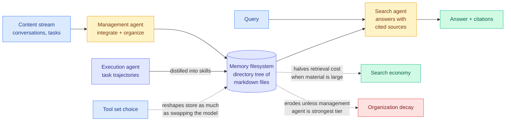

# Filesystem-Based Memory for LLM Agents: Organization, Evolution, and Sustainability

**arxiv:** [2607.26637](https://arxiv.org/abs/2607.26637) · **Source:** [HuggingFace Daily Papers 2026-07-31](../../raw/huggingface/2026-07-31-filesystem-based-memory-for-llm-agents-organization-evolutio.md) (6 upvotes) · **Authors:** Sizhe Zhou, Sheldon Yu, Hui Wei (equal contribution), Siru Ouyang, Yizhu Jiao, Junda Wu, Tong Yu, Yu Zhang, Shijia Pan, Julian McAuley, Jiawei Han (UIUC, UC San Diego, UC Merced, Adobe Research, Texas A&M)

## TL;DR

Every deployed coding agent already solved agent memory the boring way: a directory of markdown files the agent reads, writes, and reorganises with ordinary file tools. No vector store, no knowledge graph, no bespoke retrieval layer. Research skipped past this because it is not a *method*, and in doing so left the industry default's two working assumptions completely untested. Assumption one: an agent can keep a growing store organised as memories accumulate, conflict, and go stale. Assumption two: that organisation pays for itself.

This is the first systematic study, and it splits the verdict. **What organisation reliably buys is search economy: organised stores roughly halve retrieval cost once the material is large.** What it does not buy is better answers. **No agent measured converts organisation into higher answer quality**, and in the growth study **organisation erodes for every management agent except the strongest one.** The finding with the most uncomfortable implication for anyone building this: **changing the tool set alone reshapes the store as strongly as swapping the model does.**

## The formalisation is the reusable part

The paper models the setting as **three roles around one memory filesystem**, and this is worth adopting regardless of what you think of the results:

1. A **management agent** integrates incoming content and organises it.
2. A **search agent** answers queries with cited sources.
3. An **execution agent** supplies task trajectories that get distilled into skills.

The important structural move is that **declarative memory and skills live in the same store**. Every prior system on the [agent-memory](agent-memory.md) page keeps facts and procedures apart: facts in a vector index, skills in a separate playbook or library. A filesystem does not care about the distinction, so a directory tree can hold "the user is allergic to tree nuts" and "here is how to run the deploy script" in adjacent files. Whether unifying them is an advantage is not settled by this paper, but it is the design the industry already shipped.

The study then varies five axes independently, which is what makes it a study rather than a system paper: memory **shape** (agent-organised hierarchy versus verbatim dump versus chunk retrieval), **stream scale**, **tool harness** (sandboxed shell versus memory-tool-style functions versus varied search tooling), and the **strength** of the management and search agents separately. It tracks answer quality, cost, and **store health** as memory grows.

## Key results

- **Organisation buys search economy, not accuracy.** Organised stores roughly **halve retrieval cost** where the material is large. That is the one reliable payoff.
- **No measured agent converts organisation into better answers.** The quality axis is flat. This is the negative result that matters most, because "organise your memory and the agent will answer better" is the implicit promise of the entire hierarchical-memory line.
- **Organisation erodes under growth for all but the strongest management agent.** Incremental agent writes degrade the store over time. Weaker models actively make it worse as it grows.
- **The tool set is as strong a lever as the model.** Swapping only the tools available to the management agent reshapes the resulting store as much as swapping the model does.
- Evaluated across **long-conversation benchmarks and embodied tasks**, so the finding is not confined to one workload shape.

## How this relates to prior wiki pages

**This is a direct, partial adjudication of the [07-27 disagreement](agent-memory.md) that the agent-memory page called its most important open question.** That day, two papers took opposite sides on whether history must be compressed at all. [PRO-LONG (07-27)](2026-07-27-pro-long-programmatic-memory.md) said no: keep the complete structured interaction log, discard nothing, search it with ordinary coding-agent tooling, and it beat a base coding agent by **18.0 points** on ARC-AGI-3 with **4.2 to 5.8x fewer tokens**, because the log is stored rather than resident. [Agentic Context Management (07-27)](2026-07-27-agentic-context-management.md) said yes: naive accumulation is **quadratic** in conversation length, crude summarisation buys linear cost at an accuracy cliff, and only *validated* compaction gets linear cost with fidelity intact.

Filesystem-Based Memory runs the experiment closest to the middle of that argument, because a markdown directory tree is neither a raw log nor a compacted summary. It is a *curated* store, and the paper tests exactly the curation step both prior papers assumed away. The verdict cuts against ACM's premise more than PRO-LONG's: curation earns its keep on **cost**, which is ACM's own stated axis, but not on **fidelity or accuracy**, which is what ACM's validated-compaction claim rests on. And it supplies the missing datum on ACM's open problem, the one the wiki flagged as unspecified: *what is a validated compaction?* This paper shows that when the validator is the agent itself, the store degrades as it grows unless the agent is the strongest tier available. That is the failure mode [More Convincing, Not More Correct (07-26)](../llms-foundation-models/2026-07-26-self-play-reward-hacking-llm-judges.md) predicted, where an LLM judging its own output scores plausibility over correctness at a **0.719** false-positive rate.

**It reframes PRO-LONG's win.** PRO-LONG attributed its result to keeping everything and searching on demand. This paper suggests a second mechanism was also in play: PRO-LONG never asked an agent to curate, so it never paid the erosion cost. The append-only design is not just cheaper, it is *immune to the failure this paper measures.* That is a stronger argument for PRO-LONG than PRO-LONG made for itself.

**The tool-set finding is the genuinely new axis, and it belongs on [tool-calling](tool-calling.md) as much as here.** The [agent-memory](agent-memory.md) page's architectural axes list storage substrate, retrieval mechanism, write-time policy, staleness handling, and visual fidelity. None of them is "the tool interface the agent writes through." This paper shows that axis is as load-bearing as model choice, which means every memory result on this page that did not hold the harness fixed has an uncontrolled variable. That is a methodological problem, not a small one.

**It gives [InMind (07-29)](2026-07-29-inmind-implicit-association-blind-spot.md) a partial escape and a partial confirmation.** InMind showed retrieval-based memory answers at most **14.4%** of indirect questions whose facts it demonstrably stores, against **84.0%** when the same facts sit in context, because retrieval only fires when the memory resembles the query. A hierarchical filesystem is a plausible fix, since a taxonomy can bridge macarons to almond flour to allergies through directory structure rather than embedding similarity. This paper says the bridge does not materialise: organisation does not improve answers. The 70-point headroom InMind measured is still there.

## Gaps

- **No comparison against a complete searchable log on the same benchmarks.** This is the third paper in a row to skip that control condition, and it is now the cheapest available experiment in agent memory.
- **"Store health" is not fully operationalised in the abstract.** The erosion claim is the paper's most consequential, and it depends entirely on how health is measured. If health is scored by an LLM, the measurement inherits the same judge problem as the curation it is measuring.
- **Strongest-management-agent is a moving target.** "Organisation erodes for all but the strongest" is a statement about today's model tier. It could be a transient result that dissolves at the next capability step, or a structural one about self-curation. The paper cannot distinguish these.
- **Cost is measured in retrieval tokens, not end to end.** Halving retrieval cost is worth less if the management agent's continuous reorganisation spends more than it saves, and the abstract does not net them out.

## Industrial implication

The practical guidance is unusually clean and slightly deflationary. If you are running a filesystem memory today, **stop expecting organisation to improve answers and start budgeting it as a retrieval-cost optimisation**, which is what it demonstrably is. Assign your strongest model to the management role rather than the search role, because the study says the management side is where weak models cause compounding damage. And treat the tool harness as a first-class design decision with the same review weight as model selection, which almost nobody currently does.

The broader signal: this is research catching up to a deployed default and finding it half-works. That pattern usually precedes a wave of papers that beat the default now that someone has finally specified the design space. Expect a filesystem-memory benchmark within a quarter.

## Related pages

- [Agent Memory](agent-memory.md) — the concept page this adjudicates
- [PRO-LONG (07-27)](2026-07-27-pro-long-programmatic-memory.md) · [Agentic Context Management (07-27)](2026-07-27-agentic-context-management.md) — the two sides
- [InMind (07-29)](2026-07-29-inmind-implicit-association-blind-spot.md) — the triggering failure organisation does not fix
- [Metis (07-31)](2026-07-31-metis-memory-foundation-model.md) — the maximally internal counter-position, same day
- [Tool Calling](tool-calling.md) — where the harness-as-lever finding also belongs
- [Daily digest 2026-07-31](../daily-digest/2026-07/2026-07-31.md)
