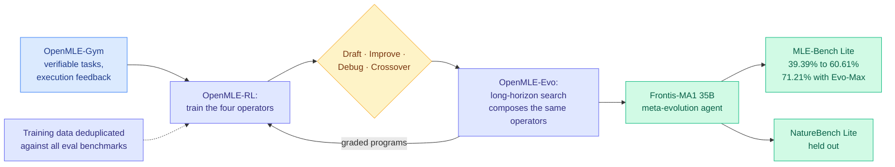

# Frontis-MA1: Training an AI4AI Model towards Recursive Self-Improvement in Machine Learning Engineering

**Source:** HuggingFace Daily Papers, 2026-07-31 · [arXiv 2607.28568](https://arxiv.org/abs/2607.28568) · [code](https://github.com/FrontisAI/OpenRSI) · [raw](../../raw/huggingface/2026-07-31-frontis-ma1-training-an-ai4ai-model-towards-recursive-self-i.md)

## TL;DR

Recursive self-improvement is usually argued about rather than measured. Frontis-MA1 makes it executable by picking machine-learning engineering as the testbed, where every candidate improvement can be run and scored. The release is a full open stack, **OpenMLE**: verifiable task environments with execution feedback (OpenMLE-Gym), operator learning (OpenMLE-RL), and long-horizon search (OpenMLE-Evo). The design choice that matters is that post-training and inference are aligned around the **same four atomic program-evolution operators, Draft, Improve, Debug and Crossover**. Those operators are trained by execution-grounded supervised fine-tuning and RL, then composed into long-horizon evolutionary search, so learning and evolution run in one loop instead of two disconnected stages.

## Key results

- On **MLE-Bench Lite** under a 12-hour per-task budget on **one RTX 4090 capped at 12 GB VRAM**, Frontis-MA1 (35B) raises Medal Average from **39.39% to 60.61%** over its base model with OpenMLE-Evo, and to **71.21%** with OpenMLE-Evo-Max (benchmark-independent experience priors plus asynchronous search).
- That **exceeds GPT-5.5 + Codex** and **approaches GPT-5.6 Sol and the 2.8T Kimi K3**, from a 35B open-weight model on one consumer GPU.
- **Both components transfer independently** on held-out NatureBench Lite. Holding the framework fixed and swapping in the trained model raises Match-SOTA from **50% to 70%**. Holding the model fixed and swapping in OpenMLE-Evo raises it from **20% to 50%**.
- Training data is **deduplicated against all evaluation benchmarks**, and weights plus the full stack are released.

## Gaps

MLE-Bench tasks are Kaggle-shaped: a fixed dataset, a fixed metric, a submission. That is the friendliest possible slice of machine-learning engineering and it deliberately excludes the part where you decide what problem to work on. "Recursive self-improvement" is doing heavy lifting for a system that improves *programs* through search, not one that improves *itself*: the four operators are trained once and then composed, so the recursion is in the search loop, not in the model's own weights. The 12-hour-per-task budget is also generous enough that a large fraction of the gain may be search compute rather than operator quality, and there is no compute-matched comparison against the base model given the same budget.

## Relation to prior wiki state

**This is the direct counterweight to yesterday's headline result and the two do not conflict.** [Can AI Agents Conduct Open-Ended AI Research? (07-30)](2026-07-30-shadow-evaluations-ai-research-agents.md) handed frontier agents the central open question from two unpublished NeurIPS 2026 papers, gave them six days and thousands of dollars of compute each, and had the original authors grade the output. Both were unambiguously rejected. The critical detail in that paper is that **the agents completed all of the engineering with no human help**, and the five failure modes were judgment failures: no sense of the publishable bar, uncreative responses to design flaws, ineffective backtracking, poor resource awareness, instruction drift. Frontis-MA1 operates entirely on the side of that split where agents already work. Its 39.39 → 71.21 jump is a strong result about **execution under a fixed, verifiable objective**, and it says nothing about the judgment gap, because MLE-Bench supplies the objective.

Read together, the two papers give the cleanest available statement of where the line sits: **give an agent a scored target and it will search hard and well; ask it to decide what target is worth scoring and it will not.** Anyone quoting Frontis-MA1 as evidence for near-term autonomous AI research is quoting the wrong half.

**Third entry in the environments-are-the-product thread.** [Morgan Stanley's AlphaLab](../../raw/youtube-ai-tech/2026-07-29-Morgan-Stanley-AlphaLab-Auto-Research-Environments.md) (07-29 talk) reached the same conclusion from production: general auto-research is becoming a commodity, so enterprise value lives in building environments and evals, and they moved to meta-harness optimization plus GRPO and on-policy distillation against those environments. [Echoverse (same day)](2026-07-31-echoverse-evolving-environments.md) argues the returns come from environment depth and co-evolution rather than environment count. Frontis-MA1 is the open-source instance of the same bet: the release that matters is OpenMLE-Gym, not the 35B checkpoint.

**Connects to [self-evolving-agents.md](self-evolving-agents.md).** The 06-05 cluster's keystone finding was that naive iterative self-evolution *collapses* unless experience is principle-level, step-wise-injected and off-policy-internalized. Frontis-MA1's four fixed atomic operators are a principle-level abstraction by construction, which is a plausible reason it does not collapse over long-horizon search where free-form self-modification does.

## Links

- [self-evolving-agents.md](self-evolving-agents.md)
- [Shadow evaluations of AI research agents (07-30)](2026-07-30-shadow-evaluations-ai-research-agents.md)
- [Daily digest 2026-07-31](../daily-digest/2026-07/2026-07-31.md)
