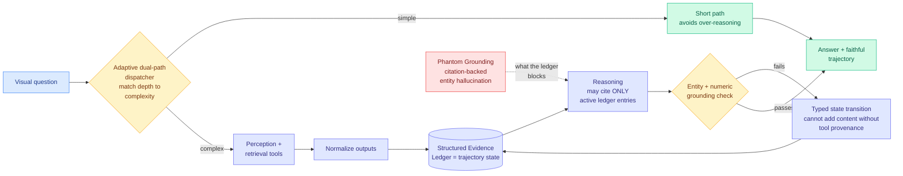

# LEDGERMIND: Provenance-Constrained Multimodal Agentic Reasoning with a Structured Evidence Ledger

**arxiv:** [2607.28374](https://arxiv.org/abs/2607.28374) · **Source:** [HuggingFace Daily Papers 2026-07-31](../../raw/huggingface/2026-07-31-ledgermind-provenance-constrained-multimodal-agentic-reasoni.md) (9 upvotes)

## TL;DR

A multimodal agent answering a visual question now runs a multi-step trajectory interleaving perception, retrieval, and reasoning, and we still grade it on whether the final answer is right. LEDGERMIND opens with the observation that makes that grading useless: **a correct final answer cannot be distinguished from a correct answer reached through language priors, or from one reached by two errors cancelling.** The aggregate signal is blind to its own mechanism.

The fix is architectural, and it is stated crisply enough to be adopted independently of the system: **treat the agent trajectory as a provenance-constrained state machine.** Every tool output is normalised into a **Structured Evidence Ledger**, and that ledger *is* the trajectory state, not a log beside it. Downstream reasoning and decision claims **may cite only active ledger entries**. Grounding is checked at the **entity and numeric** level rather than at the level of textual plausibility. Repair is implemented as **typed state transitions that cannot introduce content without tool-produced provenance**, which the paper backs with a formal **provenance non-amplification guarantee**. Around that core sit a Three-Layer Grounding Protocol, an **Adaptive Dual-Path Dispatcher** matching reasoning depth to question complexity, and an Event-Triggered Verification-and-Repair engine. Across multiple multimodal reasoning benchmarks and backbone MLLMs it improves both **answer accuracy and trajectory-level faithfulness**.

## The four named failure patterns are the paper's most reusable output

LEDGERMIND names four failures that final-answer accuracy obscures, and the naming is worth more than the system, because each one is now a thing you can look for in your own traces:

1. **Unsupported intermediate reasoning.** A step in the chain asserts something no tool produced. The answer may still be right.
2. **Phantom Grounding.** Citation-backed entity hallucination: the claim carries a citation, the citation is real, and the entity in the claim is not in the cited evidence. This is the most dangerous pattern in the list precisely because a citation is what a human reviewer uses as a shortcut for having checked.
3. **Over-reasoning on simple queries.** Burning multi-step trajectory on something a single perception call answers, which is a cost failure rather than a correctness one, and is what the Adaptive Dual-Path Dispatcher targets.
4. **Repair-time amplification.** The self-correction step introduces *new* unsupported content while fixing old unsupported content. The non-amplification guarantee is the formal statement that this cannot happen when repair is a typed transition.

Repair-time amplification is the subtlest and the one most likely to be present in deployed systems, because every agent harness now has a self-critique loop and almost none of them constrain what the critic may add.

## How this relates to prior wiki pages

**It is the architectural answer to the failure [Is Deep Research Reliable? (07-31)](../responsible-ai/2026-07-31-misknow-agent-deep-research-reliability.md) measured on the same day.** That paper built MisKnow-Agent, generated 5,933 misleading instances with tunable authority, and found that search-enabled verifiers flag those instances correctly under focused validation and then adopt them anyway inside a long research run. Its diagnosis is a disconnect between focused verification and workflow-level evidence use. LEDGERMIND's mechanism explains why that disconnect exists and closes it: the verifier fails in situ because by the time reasoning touches a claim, the claim has been paraphrased into the agent's own notes and stripped of the provenance that would trigger scepticism. A ledger that *is* the state, with citation restricted to active entries, means the claim never gets laundered in the first place. Two papers, one day, one measuring and one fixing, is the cleanest problem-solution pairing in today's batch.

**Google shipped the same idea as a product in the same 48 hours.** Google Research announced the **Science One Framework** on [2026-07-30](https://x.com/GoogleResearch/status/2082929539248951548), an autonomous research prototype that **natively maintains verifiable evidence chains**, claiming this eliminates hallucinated citations and enables reproducible AI science ([blog](http://goo.gle/4wzlGWU)). "Verifiable evidence chains maintained natively" and "structured evidence ledger as trajectory state" are the same architectural bet stated in product language and paper language. Three independent items converging on provenance-in-the-state within one day crosses the wiki's pattern threshold, and unusually it is a case of research and industry arriving together rather than one lagging.

**It joins the [agent-benchmarks](agent-benchmarks.md) page's central thread from the system side rather than the measurement side.** That page tracks a long run of results showing agent evaluation measures the wrong thing: [AgentLens (05-14)](2026-05-14-agentlens-lucky-pass-swe-eval.md) on lucky passes in SWE evaluation, and the [07-30 shadow-evaluation result](2026-07-30-shadow-evaluations-ai-research-agents.md) where agents handed the open question from an unpublished paper had their engineering accepted and their research rejected in both trials. Every one of those is a critique. LEDGERMIND is the first item in the sequence that reports **trajectory-level faithfulness as a metric it improves**, which turns the critique into an optimisation target. That is the transition a measurement-crisis literature needs to make to stop being a complaint.

**The Adaptive Dual-Path Dispatcher is a routing result hiding inside a faithfulness paper, and belongs on [llm-routing](../ai-routing/llm-routing.md).** Matching reasoning depth to question complexity is exactly the per-request effort dial that [Claude Opus 5 (07-25)](../llms-foundation-models/2026-07-25-claude-opus-5.md) productised and that [CLEAR (06-05)](../inference-efficiency/2026-06-05-clear-shadow-price-reasoning-budget.md) argued for at the batch level by rationing reasoning tokens across a batch with one global shadow price. The novelty here is the trigger: the dispatcher routes on **question complexity assessed before the trajectory starts**, and the paper motivates it as a *faithfulness* intervention rather than a cost one, on the reasoning that a long trajectory on a simple question manufactures unsupported intermediate steps. That is a genuinely new argument for routing. Every routing result on that page justifies itself on cost or accuracy. This one says depth-matching reduces hallucination, which if true makes routing a safety mechanism.

**It also sharpens the open problem [agent-memory](agent-memory.md) inherited from [Agentic Context Management (07-27)](2026-07-27-agentic-context-management.md).** That page asks what a "validated" compaction actually validates, and warns that if the validator is an LLM judge reading a candidate summary, it is the configuration [More Convincing, Not More Correct (07-26)](../llms-foundation-models/2026-07-26-self-play-reward-hacking-llm-judges.md) showed produces a false-positive basin at a 0.719 rate. LEDGERMIND supplies a non-LLM answer: validate at the **entity and numeric** level against tool-produced provenance. That is checkable mechanically. Whether it extends from visual QA to conversational memory compaction is untested and is the obvious next paper.

## Gaps

- **No numbers in the abstract.** "Improves both answer accuracy and trajectory-level faithfulness" with no magnitudes, and trajectory-level faithfulness is a metric the paper appears to define itself, which makes the improvement uncheckable without the full text.
- **Faithfulness measured by whom.** If the faithfulness score is computed by an LLM judge, the whole result inherits the judge problem it is trying to solve. The entity-and-numeric grounding check is mechanical and promising; whether the *evaluation* is equally mechanical is the load-bearing unknown.
- **Ledger overhead is unreported.** Normalising every tool output into a structured entry and re-checking citations against active entries costs tokens and latency. The dispatcher exists partly to claw that back, but no net cost figure is given.
- **Scoped to multimodal VQA.** The mechanism is domain-general and the paper does not test it where it matters most, which is long-horizon text research agents, exactly the setting MisKnow-Agent breaks.
- **"Active" ledger entries implies retraction.** Entries presumably deactivate when superseded, which is the staleness-and-invalidation problem [InKH (06-07)](2026-06-07-inkh-financial-agent-knowledge-harness.md) bought a 96.58% stale-use reduction by solving with write-time invalidation. How LEDGERMIND decides to deactivate is not described.

## Industrial implication

The near-term consumer is any agent whose output a human signs off on: research reports, insurance claim adjudication, medical chart summarisation, financial diligence. In all of those, a citation is the reviewer's shortcut for having verified, so Phantom Grounding is the failure that actually causes harm. A mechanically checkable constraint ("this claim cites ledger entry 7, entry 7 came from tool call 3, entry 7 contains this entity") is auditable in a way that an LLM-judged faithfulness score never will be, and that is what a regulator will eventually ask for. Expect provenance-constrained generation to arrive as a compliance feature rather than a quality feature, and expect the ledger to be the thing vendors expose in their audit UI.

## Related pages

- [Is Deep Research Reliable? (07-31)](../responsible-ai/2026-07-31-misknow-agent-deep-research-reliability.md) — the failure this architecture prevents, same day
- [Agent Benchmarks](agent-benchmarks.md) — the measurement-validity thread this turns into a target
- [LLM Routing](../ai-routing/llm-routing.md) — depth-matching as a faithfulness intervention
- [Agent Memory](agent-memory.md) · [Tool Calling](tool-calling.md)
- [Responsible AI](../responsible-ai/responsible-ai.md)
- [Daily digest 2026-07-31](../daily-digest/2026-07/2026-07-31.md)
