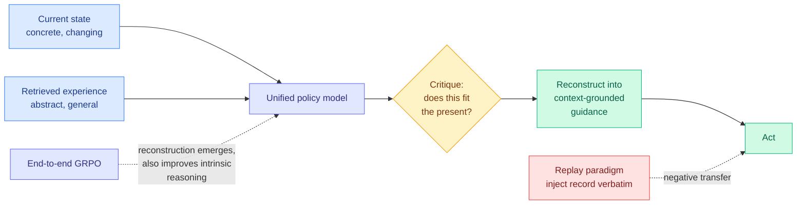

# MemHarness: Memory Is Reconstructed, Not Replayed

**arxiv:** [2607.28272](https://arxiv.org/abs/2607.28272) · **Source:** [HuggingFace Daily Papers 2026-07-31](../../raw/huggingface/2026-07-31-memharness-memory-is-reconstructed-not-replayed.md) (13 upvotes)

## TL;DR

Memory-augmented agents retrieve a past experience and paste it into context verbatim, as a record to be replayed. MemHarness argues that is the wrong operation, and its reason is precise: stored experience is **abstract and general**, while the state the agent faces at decision time is **concrete and ever-changing**. Injecting the record regardless of fit causes **negative transfer**, meaning the retrieved memory actively makes the decision worse than having no memory at all.

The fix borrows from how people actually recall. At each decision step, a **single unified policy model critiques and reconstructs** the retrieved experience conditioned on the current state, producing **context-grounded guidance** before it acts. The reconstruction ability is not hand-engineered or prompted; it **emerges from end-to-end GRPO training** (group-relative policy optimisation, the RL method that scores a batch of rollouts against each other instead of against a learned value model). On ALFWorld and WebShop it substantially beats both pure RL and static memory-augmented baselines, and holds up in out-of-distribution settings. The analysis result is the more interesting one: the reconstruction objective also acts as **latent guidance during training**, improving the agent's intrinsic reasoning rather than only its memory use.

## How this relates to prior wiki pages

**The title is nearly the wiki's own prior thesis, and the difference between the two versions is the contribution.** [MRAgent (06-15)](2026-06-15-mragent-graph-memory-reconstruction.md) claimed "memory is reconstructed, not **retrieved**," and implemented it as a *retrieval-side* loop: store memory as a Cue-Tag-Content associative graph, then let the LLM's reasoning iteratively expand and prune retrieval paths as evidence accumulates, with evidence-based pruning to avoid combinatorial blow-up. Up to +23% on LoCoMo and LongMemEval while *cutting* token cost, because it stops expanding once it has enough. MemHarness says "reconstructed, not **replayed**," and moves the reconstruction to the *use* side: retrieval can stay dumb, but what comes back must be rewritten against the present state before it is allowed to influence the action.

Retrieved-then-reconstruct versus reconstruct-while-retrieving is a real architectural fork, and MemHarness has one clear advantage: it needs no bespoke memory representation. It works over whatever store you already have. MRAgent's advantage is that it can find things a single retrieval pass would miss. They compose in principle and neither paper tests the combination.

**Negative transfer is a failure the [agent-memory](agent-memory.md) page has circled for two months without naming.** The page tracks three interface failures ordered by pipeline position: **triggering** ([InMind, 07-29](2026-07-29-inmind-implicit-association-blind-spot.md): retrieval-based systems answer at most 14.4% of indirect questions whose facts they demonstrably hold, against 84.0% with the same facts in context), then **access**, then **compliance** ([TRACE, 06-13](2026-06-13-trace-compiling-user-corrections.md): with Mem0 memory in place, 57.5% of applicable user-preference checks were still violated, because an agent can recall a rule and ignore it). All three are failures of memory *not arriving* or *not being obeyed*. MemHarness names a fourth that sits between access and compliance and points the opposite way: the memory arrives, is obeyed, and **should not have been**. Call it **misfit**. It is the only one of the four where the correct behaviour is to discard what the store returned, which means every system optimising retrieval recall has been optimising a metric that can move against it.

**It also supplies the mechanism [Rethinking Continual Experience Internalization (06-05)](2026-06-05-continual-experience-internalization.md) said was necessary.** That paper found naive iterative self-evolution *collapses* unless the internalised experience is **principle-level** rather than instance-specific, step-wise injected, and off-policy internalised. It established the requirement and left the how open. MemHarness's reconstruction step is a concrete answer: rather than storing principles (which requires knowing in advance what generalises), store instances and **abstract them to principle level at read time, conditioned on the state that needs them**. That is a strictly easier engineering problem and it inverts where the abstraction work happens.

**The latent-guidance finding is the part that should generalise beyond memory.** Training the model to critique and reconstruct retrieved experience improved its intrinsic reasoning, not just its memory handling. That is the same shape as [MMPO (06-05)](2026-06-05-mmpo-metacognitive-memory-policy-optimization.md), which used **Belief Entropy** (a self-supervised proxy for how uncertain the model remains about the latent task state given its memory) to densely penalise summaries that raise epistemic uncertainty, and held 97.1% performance at 1.75M-token contexts. Both found that forcing the model to reason *about* its memory is a better training signal than rewarding the downstream outcome. Two independent results is not yet a pattern, but a third would make "memory metacognition as a general-purpose auxiliary objective" a claim worth stating.

**Read against the same day's [Metis](2026-07-31-metis-memory-foundation-model.md) and [Filesystem-Based Memory](2026-07-31-filesystem-based-memory.md), the three occupy the three available positions on where memory work belongs.** Metis puts memory inside the backbone as a native evolving state, so there is no retrieved record to misfit. Filesystem-Based Memory keeps it maximally external and finds that agent-side *organisation* buys retrieval economy but never better answers. MemHarness keeps the store external and dumb but makes the *reading* smart. Filesystem-Based Memory's negative result is the strongest available argument for MemHarness's position: if organising the store does not improve answers, the leverage was never in the store.

## Gaps

- **ALFWorld and WebShop are both small, well-structured embodied and shopping environments.** Both are standard, both are saturated, and neither has the long-horizon messy state where misfit should hurt most. No numbers appear in the abstract either, only "substantially outperforms."
- **Reconstruction cost per step is unreported.** Critiquing and rewriting the retrieved experience at *every* decision step is an extra generation on the critical path. MRAgent's headline included a token-cost *reduction*; MemHarness makes no such claim, and an inference-time tax at every step is the kind of thing that quietly disqualifies a method in production.
- **GRPO training means this is not drop-in.** Unlike a prompting or retrieval change, adopting MemHarness requires an RL run on your environment. That is a much higher adoption barrier than the abstract's framing suggests.
- **Nothing about poisoned memory.** A policy trained to reconstruct retrieved experience into guidance is a policy trained to take retrieved text seriously enough to rewrite it. [MisKnow-Agent (07-31)](../responsible-ai/2026-07-31-misknow-agent-deep-research-reliability.md), landing the same day, showed misleading evidence with tunable authority propagates into confident false conclusions even when a verifier would flag it in isolation. Pointing that generator at MemHarness is the obvious adversarial test and nobody has run it.

## Industrial implication

The deployable takeaway does not require the RL run. It is that **retrieval recall is the wrong dashboard metric for agent memory**, because a system can retrieve the right record and still be made worse by it. Anyone running memory in production should be measuring the counterfactual: how often does the agent do better with the retrieved memory suppressed? That number is cheap to compute, nobody publishes it, and MemHarness's negative-transfer result implies it is not small. Expect a "memory ablation win rate" to become a standard reported figure before any of these architectures ships.

## Related pages

- [Agent Memory](agent-memory.md) — the concept page this adds a fourth failure mode to
- [MRAgent (06-15)](2026-06-15-mragent-graph-memory-reconstruction.md) — reconstruction on the retrieval side
- [Metis (07-31)](2026-07-31-metis-memory-foundation-model.md) · [Filesystem-Based Memory (07-31)](2026-07-31-filesystem-based-memory.md) — the other two positions, same day
- [Self-Evolving Agents](self-evolving-agents.md) · [RL for LLMs](../llms-foundation-models/rl-for-llms.md)
- [Daily digest 2026-07-31](../daily-digest/2026-07/2026-07-31.md)
