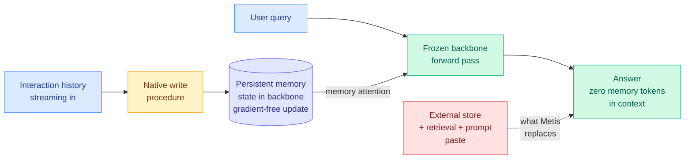

# Metis: Memory Foundation Model

**arxiv:** [2607.26760](https://arxiv.org/abs/2607.26760) · **Source:** [HuggingFace Daily Papers 2026-07-31](../../raw/huggingface/2026-07-31-metis-memory-foundation-model.md) (213 upvotes, #2 of 38) · **Authors:** Zeyu Zhang, Ziliang Guo, Yihang Sun, Xichong Zhang, Xixuan Hao, Zehao Lin, Tong Shen, Bo Tang, Feiyu Xiong, Zhiyu Li et al. (MemTensor Shanghai, Renmin University, NUS, SJTU, Tongji)

## TL;DR

Every memory system this wiki has tracked for three months puts the memory *outside* the model. A vector store, a knowledge graph, a directory of markdown files, a summary bank: something retrieves, and the retrieved text gets pasted into the prompt. Metis argues that arrangement is a historical accident, the same accident that once put chain-of-thought reasoning outside the model in a scaffold before reasoning models internalised it. Metis proposes **memory foundation models**: a foundation model with a persistent, dynamically evolving memory state living inside the backbone, plus **native memory procedures** the model executes as ordinary forward computation rather than as external tool calls.

Two properties make this more than a renaming. First, **online memory maintenance is gradient-free**: writing to memory costs one forward pass, no backward pass, no optimiser step. Second, **at inference all learned weights stay frozen** while the memory states transform themselves through standard forward computation. Historical information is compressed into the model and read back through a dedicated **memory attention** path, so no memory text occupies the context window at all. Metis acquires these procedures through mid-training on purpose-built large-scale memory data with several coupled objectives, and the authors release checkpoints.

## What is actually new

The paper's own framing is the useful one: it separates **memory state** from **memory procedure**, and claims both must be native.

A native memory *state* is not new in isolation. Test-time training adapts weights to a single sequence, and memory-augmented neural networks bolt a differentiable store onto a controller. The wiki's own [δ-mem (05-13)](../inference-efficiency/2026-05-13-delta-mem-online-memory.md) is a small frozen-backbone associative memory updated by a delta rule whose readout produces low-rank corrections to attention. Metis differs by making the state persistent across sessions and dynamically evolving, rather than per-sequence.

The native memory *procedure* is the sharper contribution. In every external system, the decision of what to store, when to consolidate, and what to surface is made by a separate module (sometimes an LLM call, sometimes a heuristic). Those decisions are discrete, so gradients do not flow through them, which is why nobody in the external-memory line can train the whole pipeline end to end. Metis makes storing and using memory part of the model's own computation, which restores differentiability during mid-training and removes the round-trip latency at serve time.

Three claimed advantages follow, and they map onto three distinct complaints the wiki has logged against external memory:

| Metis claim | The external-memory failure it targets |
|---|---|
| Architecture: memory in the backbone, read via memory attention | [InMind (07-29)](2026-07-29-inmind-implicit-association-blind-spot.md): retrieval only surfaces what resembles the query, so a stored allergy never fires on a macaron request |
| Optimisation: end-to-end trainable because procedures are computation | [EvolveMem (05-15)](2026-05-15-agent-memory-cluster-stale-preping-evolvemem.md) had to *search* retrieval configurations with an LLM diagnosis loop because it could not differentiate through them |
| Efficiency: no memory tokens in context, one forward pass to write | [Agentic Context Management (07-27)](2026-07-27-agentic-context-management.md): naive accumulation is quadratic in conversation length |

## How this relates to prior wiki pages

**This is the strongest attack yet on the premise the whole [agent-memory](agent-memory.md) page rests on.** That page tracks a three-way split in memory failures ordered by pipeline position: triggering (InMind, 07-29, does the fact surface at all), access, then compliance ([TRACE, 06-13](2026-06-13-trace-compiling-user-corrections.md), where an agent with Mem0 memory still violated 57.5% of applicable user-preference checks because it can recall a rule and ignore it). All three failures are *interface* failures. They exist because memory and model are separate things connected by a lossy channel. Metis proposes deleting the channel. If native memory works, the triggering failure in particular has nowhere to live, because nothing has to decide in advance which fact resembles the query.

**It sits directly on top of the [parametric-context-internalization](../inference-efficiency/parametric-context-internalization.md) axis, and extends it in the one direction that page said was missing.** That axis covers moving context into weights instead of into the prompt: [Code2LoRA and Video2LoRA (06-06)](../inference-efficiency/2026-06-06-code2lora-hypernetwork-repo-adapters.md) predict a LoRA adapter from a repo or a video in a single hypernetwork pass, and [Experience Distillation (07-25)](2026-07-25-experience-distillation-sample-efficient-agent-learning.md) does the same for tool-call histories by distilling a context-reading teacher. Every one of those is a **batch** operation: you internalise a fixed item once, offline. Metis internalises a **stream** online, during the interaction, with no gradient step. That is the freshness problem the page listed as an open question ("does the adapter accumulate error over thousands of commits") answered by a different mechanism rather than solved.

**Read against the same day's [Memory Decoder at Scale](../inference-efficiency/2026-07-31-memory-decoder-at-scale.md), the pair splits parametric memory into two incompatible bets.** Memory Decoder keeps memory as a *separate pretrained module* that can be swapped across base models and scaled independently (6.9B of memory attached to a 410M base beats a 12B monolith). Metis puts memory *inside* the backbone as a state, which makes it end-to-end optimisable but not obviously portable or independently scalable. Modularity versus integration is now the live design question, and neither paper runs the other's experiment.

**Against [PRO-LONG (07-27)](2026-07-27-pro-long-programmatic-memory.md) it is the maximal opposite.** PRO-LONG stores the complete uncompressed interaction log and searches it on demand, beating specialised harnesses by 18.0 points on ARC-AGI-3 with 4.2 to 5.8x fewer tokens, because the log is stored rather than resident. Metis compresses everything into a state and stores no text at all. One keeps every byte and pays only for retrieved slices; the other keeps no bytes and pays only for a forward pass. The wiki's [07-27 note](agent-memory.md) that "the learned-compression line owes a baseline it never ran, a complete searchable log" now applies to Metis too, and Metis does not run it.

## Gaps

The abstract is unusually candid, promising "a detailed analysis of its strengths, **limitations**, and behaviors," which is the language of a prototype rather than a result. Three things are not established:

1. **Scale.** No parameter count, no comparison against a frontier backbone. Every prior native-memory-state result on this wiki (δ-mem included) is at small scale, and the [parametric-context-internalization](../inference-efficiency/parametric-context-internalization.md) page already lists frontier-scale transfer as its open question.
2. **Staleness and conflict.** A compressed evolving state has no consolidation step you can inspect, so the [STALE (05-15)](2026-05-15-agent-memory-cluster-stale-preping-evolvemem.md) failure mode (best frontier model 55.2% on detecting implicit conflicts between stored memories, with the difficulty in propagation) is not obviously easier here. It is *less auditable*, which is worse.
3. **Governance.** [InKH (06-07)](2026-06-07-inkh-financial-agent-knowledge-harness.md) bought a 0.461 traceability improvement precisely by making memory a human-readable wiki surface. A memory state inside the backbone cannot be read, corrected, or deleted by a human. For any regulated deployment that is disqualifying, and the paper does not address it.

## Industrial implication

If this works at scale, the external memory-infrastructure category (Mem0, Zep, LangGraph memory, and the whole vector-store-as-agent-memory market) becomes a compatibility layer rather than a product, on the same trajectory that chain-of-thought scaffolds took when reasoning went native. The near-term tell is not a benchmark. It is whether a frontier lab ships a memory state as an API primitive with cross-session persistence and no retrieval step. Until then the honest read is that Metis names a category convincingly and demonstrates it at prototype scale.

## Related pages

- [Agent Memory](agent-memory.md) — the concept page this most changes
- [Parametric Context Internalization](../inference-efficiency/parametric-context-internalization.md) — the efficiency axis it extends from batch to stream
- [Memory Decoder at Scale (07-31)](../inference-efficiency/2026-07-31-memory-decoder-at-scale.md) — the modular counter-bet, same day
- [Filesystem-Based Memory (07-31)](2026-07-31-filesystem-based-memory.md) — the maximally external counter-position, same day
- [KV Cache](../inference-efficiency/kv-cache.md) — the short-term sibling
- [Daily digest 2026-07-31](../daily-digest/2026-07/2026-07-31.md)
