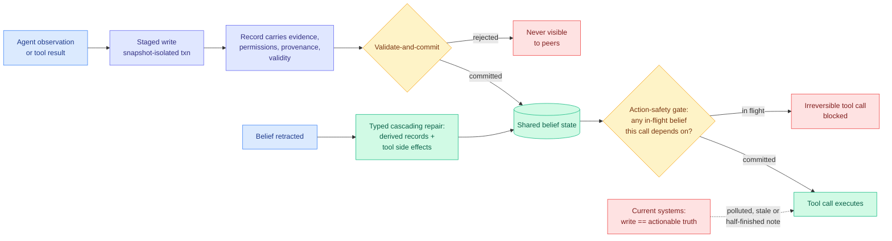

# MemTX: Transactional Belief Commit for Stateful Agent Memory

**Date ingested:** 2026-08-01
**Source:** Kurate weekly cs.AI leaderboard #8 (score 1511, win rate 65.5%, ai_rating 6.8/10). Flagged as LLM-rated underrated in the [07-31 digest](../daily-digest/2026-07/2026-07-31.md) before it was read.
**Paper:** [arXiv 2607.23929](https://arxiv.org/abs/2607.23929)
**Raw:** [Kurate cs.AI board](../../raw/kurate/2026-08-01-cs-ai.md)

---

## TL;DR

Every agent memory system on this wiki treats a write as final. The agent observes something, the observation goes into the store, and from that moment it is a premise other agents reason from and eventually act on. MemTX's claim is that this conflates two different events: **a memory write is not a belief commit.** It borrows the database transaction stack wholesale. Writes are staged inside snapshot-isolated transactions and pass a validate-and-commit pipeline before anything downstream can see them; each record carries evidence, permissions, provenance and validity rather than just content; irreversible tool calls are **gated on in-flight belief state**, so an action cannot fire while the belief justifying it is still uncommitted; and retracting a belief triggers **typed cascading repair** of every record derived from it and every tool side effect it caused. Two invariants, action-safety gating and cascade-repair completeness, are machine-checked by property-based testing plus bounded exhaustive enumeration over **5.5 million protocol states with zero violations**. Across five backbones from three model families it beats all eight baselines with paired-McNemar significance on four and ties the strongest baseline on the fifth, and it is **the only method with zero downstream harm on every backbone**.

---

## Architecture

---

## What problem it solves

The threat model is specific and worth stating in full, because it is the one multi-agent deployments actually hit. Agents coordinate through persistent shared memory, so **one agent's write becomes another agent's premise, and eventually a tool call with real side effects.** Three things can be wrong with that write: it can be *polluted* (a tool returned attacker-controlled or garbage content), *stale* (true when written, false now), or *half-finished* (a teammate was mid-reasoning and the note reflects an intermediate state). In every system this wiki has catalogued, all three are indistinguishable from a correct write the moment they land, and the first thing that notices is the irreversible action.

MemTX's response is to make visibility conditional and reversal complete. Snapshot isolation means a half-finished write is simply not there for other agents. The action-safety gate means the blast radius of a bad belief stops before the side effect. Cascading repair means retraction is not just deleting a row, it is unwinding the derived records and, where possible, the tool effects.

---

## How this relates to prior wiki pages

**This is the write-side counterpart to a page that is entirely about reads.** The [agent-memory](agent-memory.md) page tracks four read failures: triggering ([InMind, 07-29](2026-07-29-inmind-implicit-association-blind-spot.md), where six vector, graph and agentic memory systems answered at most **14.4%** of queries needing a stored fact that did not resemble the query, while the same systems recalled those facts on demand at up to 100%), staleness ([STALE, 05-15](2026-05-15-agent-memory-cluster-stale-preping-evolvemem.md), best frontier model at **55.2%** on detecting implicit conflicts between stored memories), compliance ([TRACE, 06-13](2026-06-13-trace-compiling-user-corrections.md), **57.5%** of applicable preference checks still violated with memory in place), and misfit ([MemHarness, 07-31](2026-07-31-memharness-reconstruct-not-replay.md), where a retrieved memory that does not match the current situation makes the agent worse than no memory at all). MemTX is the first paper on this page attacking **write integrity**. It is not a fifth read failure, it is a different axis, and the fact that the read literature is four papers deep and the write literature is one paper deep is itself the finding.

**It answers, partly, what [Filesystem-Based Memory (07-31)](2026-07-31-filesystem-based-memory.md) measured and could not fix.** That paper audited the industry's actual default, a self-organising directory of markdown files, and found organisation halves retrieval cost while never improving answers, and that organisation *erodes* for all but the strongest management agent. Erosion is a write-integrity failure described in read-side language: nothing validates a write, so quality decays monotonically. MemTX's validate-and-commit pipeline is the missing component, though on a substrate (transactional records with provenance) that a markdown folder does not have.

**It converges with [LEDGERMIND (07-31)](2026-07-31-ledgermind-evidence-ledger.md) from the opposite direction, and that convergence is now a pattern.** LEDGERMIND makes the agent trajectory a provenance-constrained state machine where every tool output normalises into a Structured Evidence Ledger that *is* the state, and downstream reasoning may cite only active ledger entries. MemTX makes shared memory a transaction log where every record carries provenance and downstream action is gated on commit status. Same primitive, different scope: LEDGERMIND constrains what a single agent may *say*, MemTX constrains what a group of agents may *do*. Add [Google's Science One](../daily-digest/2026-07/2026-07-31.md) shipping natively maintained verifiable evidence chains as a product, and that is three independent designs in five days all concluding that **provenance must be a first-class field on the record rather than a post-hoc audit trail**. Three is the threshold this wiki uses to declare a pattern, and it is crossed.

**It is also the counter-example to a claim the [07-31 Global View](../daily-digest/2026-07/2026-07-31.md) made about capability-deployment gaps.** The recurring shape that week was: the capability exists, nothing invokes it at the moment it matters. MemTX's own framing lands the same conclusion from a different angle and states it more sharply than any of them: **"backbone capability does not substitute for commit discipline."** Five backbones, three model families, and the strongest one does not escape the failure. That is the cleanest available evidence that the problem is protocol, not model.

---

## Key results

- **Zero violations** of action-safety gating and cascade-repair completeness under bounded exhaustive enumeration of **5.5 million protocol states**, plus property-based testing. Machine-checked invariants are rare in this literature and are the single most credible thing in the paper.
- Beats **all eight baselines** with paired-McNemar significance on **four of five backbones**, statistically tying the best baseline on the fifth and strongest.
- **The only method with zero downstream harm on every backbone.** Downstream harm is the metric that matters here, because the entire argument is about irreversible side effects rather than answer quality.
- Backbone capability does not substitute for commit discipline: the strongest model still needs the protocol.

---

## Gaps

The headline verification is a **protocol-level** guarantee, not a system-level one. Exhaustively enumerating 5.5 million states proves the state machine is correct; it says nothing about whether the LLM populating the evidence, permission and validity fields populates them correctly, and a transaction protocol fed wrong provenance commits wrong beliefs with full ceremony. That gap is where every practical failure will live. The abstract also gives **no cost number**, and snapshot isolation plus a validate-and-commit pipeline plus cascading repair is real overhead on the critical path of a multi-agent system, which is precisely the tax that made database transactions optional in high-throughput systems. And "cascade-repair completeness" for **tool side effects** is doing heavy lifting: many real side effects (an email sent, a payment made, a row deleted at a third party) are not repairable at all, so the invariant presumably holds over a repairable subset the abstract does not delimit.

---

## Research angle

The obvious experiment nobody has run: **MemTX's gate against a MemHarness-style read-time critic on the same workload.** MemHarness (07-31) says the fix is to critique and reconstruct a memory at read time against the current state. MemTX says the fix is to validate at write time and gate the action. These are substitutes for a shared class of failures, they have opposite cost profiles (read-time critique costs a generation per decision; write-time validation costs once per write and amortises over reads), and neither paper knows about the other. The workload where they diverge is one with many reads per write, where MemTX should dominate, versus one with many writes per read, where it should not.

Second: transaction systems have a well-developed theory of **isolation levels**, and MemTX picks snapshot isolation without arguing for it. Agent memory may well want something weaker for exploratory reads and something stronger for action-gating reads, which is exactly the read-committed-versus-serializable distinction databases spent thirty years mapping. None of that theory has been transferred.

---

## Related pages

- [Agent Memory](agent-memory.md)
- [Multi-Agent Systems](multi-agent-systems.md)
- [LEDGERMIND (07-31)](2026-07-31-ledgermind-evidence-ledger.md)
- [Filesystem-Based Memory (07-31)](2026-07-31-filesystem-based-memory.md)
- [MemHarness (07-31)](2026-07-31-memharness-reconstruct-not-replay.md)
- [Responsible AI](../responsible-ai/responsible-ai.md)
