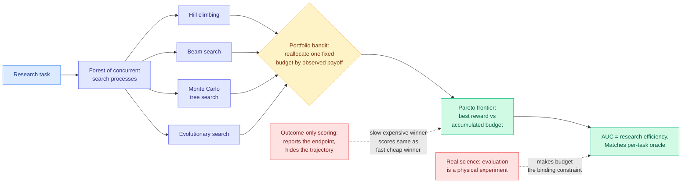

# Efficiency Matters in Autonomous Research

**Authors:** Haiqian Yang (MIT), Yuan Cao
**Source:** Kurate weekly cs.AI leaderboard **#3** (score 1502, **win rate 84.0%, the highest on either board this week**, ai_rating 5.7/10), published 2026-07-27
**Links:** [arXiv 2607.24647](https://arxiv.org/abs/2607.24647) · [raw](../../raw/kurate/2026-08-02-cs-ai.md)

## TL;DR

Every autonomous-research benchmark this wiki tracks scores the final answer. AutoLab, SWE-bench and MLE-bench all report the quality of the best solution found and treat the path to it as bookkeeping. This paper argues that the path is a second performance dimension, measures it, and shows it is **not correlated with the first**.

The proposed metric is the **area under the Pareto frontier** of best-found reward against accumulated budget, which is the "anytime performance" criterion that AutoML and molecular design have used for years and that agent evaluation never imported. Under it, the authors compare four families of search structure, greedy hill climbing, beam search, Monte Carlo tree search, and evolutionary search, across **twelve systems-optimization tasks**. Two findings follow. **No single search structure is consistently most efficient**, so the choice is task-dependent and there is no default. And **efficiency and outcome quality come apart**: a method that eventually reaches the best result can improve slowly and burn substantially more evaluation budget getting there, which under outcome-only scoring looks identical to a method that got there cheaply.

Because the right search policy is unknown in advance, the paper's constructive contribution is **fluid search**: a portfolio bandit that dynamically allocates one fixed evaluation budget across a *forest* of concurrently running search processes, reallocating toward whichever structure is currently paying. Across the twelve tasks it achieves the highest overall search efficiency and closely matches a **per-task oracle** handed the best search structure for each task in advance.

The motivating argument is the part worth keeping. Search efficiency is close to free in mathematics and coding, where verification costs a CPU second. It becomes the binding constraint the moment autonomous research moves into settings where evaluating a candidate means running a physical experiment or a clinical study.

## Diagram

## Key findings

- **Search efficiency and outcome quality are empirically distinct dimensions.** This is the load-bearing result and it invalidates the implicit assumption behind every leaderboard in this area, which is that ranking by final score also ranks by usefulness.
- **No search structure wins consistently across twelve systems-optimization tasks.** Hill climbing, beam search, tree search and evolutionary search each win somewhere, which means any paper reporting one structure has reported a task-specific result.
- **Fluid search matches a per-task oracle.** A portfolio bandit over a forest of search processes recovers nearly all of the benefit of knowing the right structure in advance, which is the practically deployable form of the finding: you do not have to choose.
- **The AUC-of-Pareto-frontier metric is borrowed, not invented.** AutoML and molecular design standardised anytime performance long ago. The contribution is noticing that agent evaluation skipped it.

## Gaps

Twelve systems-optimization tasks is a narrow and unusually well-behaved domain: evaluation is cheap, deterministic, and returns a scalar reward, which is precisely the regime the paper argues is *not* where efficiency matters. The motivating case, expensive physical evaluation, is where the metric earns its keep and is exactly where no experiment is run, so the empirical work validates the method in the setting where it is least needed. Fluid search also carries an unpriced overhead: maintaining a forest of concurrent search processes costs memory and orchestration, and running four structures to discover which one works spends budget the oracle does not. The paper reports the bandit closely matching the oracle without, on the abstract's evidence, separating out how much of the fixed budget the exploration itself consumed. And AUC of the Pareto frontier is a single scalar summarising a curve, so it inherits the flaw it was introduced to fix: two very different trajectories, one that plateaus early and one that improves steadily, can integrate to the same number.

## Relation to prior wiki state

**This is the measurement instrument that two earlier negative results on this wiki needed and did not have.** [AI Research Agents Narrow Scientific Exploration (05-28)](2026-05-28-ai-research-agents-narrow-exploration.md) generated 37,802 ideas across four agent frameworks and six models from shared seed literature and found the output distribution is *more concentrated* than human-authored work, stays much closer to the seed than human follow-on research does, and differs from prior work mainly by recombining existing methods. That is a diagnosis about the shape of the search, made by measuring the endpoints. [BES (05-28)](2026-05-28-bes-bidirectional-evolutionary-search.md), published the same day, proved formally that expansion-only search is confined to a narrow entropy shell around the model's mode and that evolutionary recombination escapes it, while backward task decomposition exponentially reduces the samples needed to reach a correct answer. Between them: agents search narrowly, and the fix is structural. **Neither could say what a search trajectory costs, because outcome-only scoring has no place to put that number.** An AUC-of-Pareto metric does, and BES's claim in particular, that recombination escapes the entropy shell, is an efficiency claim in disguise that was necessarily reported as an outcome claim.

**It also cuts directly at the wiki's live thread on whether agent benchmarks measure anything transferable.** [Shadow Evaluations of AI Research Agents (07-30)](2026-07-30-shadow-evaluations-ai-research-agents.md) handed frontier agents the central open question from two unpublished NeurIPS 2026 papers, watched them do all of the engineering unassisted, and had **both outputs rejected by the original authors**. The [07-31 digest](../daily-digest/2026-07/2026-07-31.md) read that against Frontis-MA1, a 35B agent lifting MLE-Bench Lite Medal Average from 39.39% to 71.21% on a single RTX 4090, and concluded that giving an agent a scored target produces excellent search while asking it to choose the target does not. This paper sharpens the first half of that conclusion. **Excellent search is not one thing.** An agent can hill-climb a scored target beautifully and still be economically useless if reaching the summit costs a hundred evaluations that each require a wet lab, and the current benchmark suite cannot distinguish those two agents at all.

The industry connection is immediate and mostly unflattering. The [08-01 digest](../daily-digest/2026-08/2026-08-01.md) noted that OpenAI published ten open mathematical problems with Lean certificates and a token bill of roughly **$2,000 for all ten**, while Noam Brown separately confirmed the system was tried and failed on other major problems including Millennium Prize problems, **with the denominator unpublished**. That is precisely the missing quantity this paper names. A $2,000 numerator over an unstated number of attempts is an outcome-only report, and the AUC of that search is the number that would tell you whether autonomous mathematics is currently cheap or currently subsidised. The same gap sits under every "our agent solved X" announcement this quarter.

One composition nobody has built: fluid search allocates a fixed budget across search *structures*, and [CLEAR (06-05)](../inference-efficiency/2026-06-05-clear-shadow-price-reasoning-budget.md) rations inference compute across a batch of queries using a single shadow price, reporting up to 3x accuracy when compute is scarce. Both are budget-allocation controllers over a portfolio, one at the search-structure level and one at the query level, and they are solving the same problem two layers apart.

## Related pages

- [AI Research Agents Narrow Scientific Exploration](2026-05-28-ai-research-agents-narrow-exploration.md)
- [BES: Bidirectional Evolutionary Search](2026-05-28-bes-bidirectional-evolutionary-search.md)
- [Shadow Evaluations of AI Research Agents](2026-07-30-shadow-evaluations-ai-research-agents.md)
- [Agentic Systems](agentic-systems.md)
