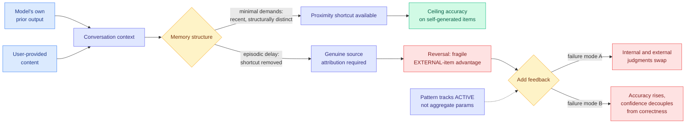

# Reality Monitoring in Large Language Models: Self-Knowledge That Transforms with Conversation Memory

**Authors:** Saurabh Ranjan, Brian Odegaard (Department of Psychology, University of Florida), Konstantina Sokratous (University of Missouri)
**Source:** Kurate weekly cs.AI leaderboard **#8** (score 1467, win rate 64.3%, ai_rating 6.5/10), published 2026-07-27
**Links:** [arXiv 2607.23927](https://arxiv.org/abs/2607.23927) · [raw](../../raw/kurate/2026-08-02-cs-ai.md)

## TL;DR

**Reality monitoring** is the cognitive-psychology term for telling apart what you thought from what you were told. In humans its failure is the mechanism behind confabulation and certain classes of delusion, and it has been studied for forty years. Nobody had tested whether language models have it. This paper adapts the human paradigm, runs two experiments across six models, and finds that the answer depends almost entirely on **how conversational memory is structured**, which is an engineering variable rather than a model property.

The headline result is a reversal. Under minimal memory demands, where the model's own prior output is recent and structurally distinct in the context, source attribution for self-generated content is at ceiling. Introduce **episodic delay**, which removes that structural shortcut, and the pattern flips into a fragile advantage for *external* items instead. The ceiling was never self-knowledge. It was a proximity cue in the prompt, and it dissolves when the conversation gets long enough to look like a real one.

The second experiment adds feedback and exposes two distinct failure modes that no existing benchmark would register. In some models, internal and external judgments **swap**, so the model becomes systematically wrong about provenance rather than merely uncertain. In others accuracy improves while **confidence decouples from correctness**, which is the worse outcome operationally: a model that is getting better and has stopped being able to tell you when it is not. Across models the pattern tracks **active parameter count rather than aggregate parameter count**, which is a mixture-of-experts observation hiding in a psychology paper.

## Diagram

## Key findings

- **The apparent self-knowledge is a context artifact.** Ceiling accuracy on self-generated content under minimal memory demands reverses to a fragile external-item advantage once episodic delay removes the shortcut. Any evaluation that tests source attribution in a short context is measuring prompt proximity.
- **Feedback produces two dissociations, both invisible to standard benchmarks.** Judgment swapping is a directional error, not noise. Confidence decoupling means the model's self-reported reliability stops tracking its actual reliability precisely while its accuracy improves, so a monitoring layer reading confidence gets *less* informative as the model gets better.
- **Active parameter count is the variable that separates models**, not total parameter count. In a field where sparse mixture-of-experts models are quoted by total size, this says the metacognitive property scales with what actually runs per token.
- **Six models, two experiments, adapted from a validated human paradigm.** The methodological import matters as much as the result: this is a psychology protocol with decades of construct validation applied to a system nobody had run it on.

## Gaps

The paper measures source attribution as a probe task, not inside a working agent, so the step from "the model misattributes provenance under episodic delay" to "an agent therefore treats its own hallucination as a user-supplied fact" is argued rather than demonstrated. No agentic benchmark result appears. The active-versus-aggregate parameter finding comes from a six-model comparison across families, which conflates architecture with training data and post-training recipe, so it is a correlation flagged as suggestive rather than a scaling claim. The human paradigms being adapted assume a memory architecture that a transformer context window does not have, and the paper's own framing, that memory structure determines the result, cuts both ways: it means the reported numbers are properties of the specific memory structures tested. Nothing is offered as a remedy.

## Relation to prior wiki state

**This is the fifth distinct read-side failure on the [agent-memory page](agent-memory.md), and it is the first one about the memory's own provenance rather than its content.** The four already tracked are triggering ([InMind, 07-29](2026-07-29-inmind-implicit-association-blind-spot.md), where six memory systems answered at most 14.4% of queries needing a stored fact that did not resemble the query, while recalling those same facts on demand at up to 100%), staleness ([STALE, 05-15](2026-05-15-agent-memory-cluster-stale-preping-evolvemem.md), best frontier model 55.2% on implicit conflicts), compliance ([TRACE, 06-13](2026-06-13-trace-compiling-user-corrections.md), 57.5% of applicable preference checks still violated), and misfit ([MemHarness, 07-31](2026-07-31-memharness-reconstruct-not-replay.md), a retrieved memory that does not fit the current situation is worse than no memory). All four ask whether the right content came back. This one asks whether the system knows **where the content came from**, and finds that it does not once the conversation is long enough to matter.

**It also supplies the measured failure that two very recent architectural proposals were designed for without being able to point at one.** [MemTX (08-01)](2026-08-01-memtx-transactional-belief-commit.md) makes every memory record carry evidence, permissions, provenance and validity, stages writes inside snapshot-isolated transactions, and machine-checks its action-safety gate over 5.5 million protocol states, on the argument that a write can be polluted, stale or half-finished and nothing today can tell the difference. [Grading the Narrators (07-30)](2026-07-30-grading-the-narrators-isnad-provenance.md) attaches a complete transmission chain to every claim and grades each transmitter, borrowing the apparatus from classical hadith science, on the argument that multi-agent systems build knowledge through chains of transformations and existing provenance tooling records what happened rather than who is reliable. Both are provenance infrastructure. Neither had a measurement of what a model gets wrong when provenance is left to the context window. **This paper is that measurement, and it is worse than the architectural papers assumed**, because the failure is not that provenance is unavailable, it is that the model produces a confident attribution that is systematically inverted.

The sharpest connection is to [Honest Lying and Memory Confabulation (06-09)](2026-06-09-honest-lying-memory-confabulation.md), which found an agent storing a confident wrong interpretation of its own failed trial as reflective memory, then acting on that false belief across resets, with 0 of 121 runs mentioning the correct object in a frozen environment until failure signals were extracted programmatically instead of by self-reflection. That paper documented an agent believing its own confabulation. This one gives the cognitive mechanism: **the agent could not tell that the belief was self-generated.** Read together, the fix in the 06-09 paper, extracting trajectory-level signals programmatically rather than asking the model to reflect, stops looking like a prompt-engineering preference and starts looking like the only sound option, because the model's introspective report about the source of its own belief is exactly the quantity this paper shows is unreliable.

One forward note. The active-parameter finding puts this on the [inference-efficiency](../inference-efficiency/kv-cache.md) side of the wall too. The industry's answer to serving cost has been sparsity, and every mixture-of-experts release is quoted as total-over-active, most recently Inkling-Small at 276B total and 12B active. If a metacognitive property scales with active count, then the sparsity trade has a cost nobody is pricing, and it is not on any benchmark.

## Related pages

- [Agent Memory](agent-memory.md)
- [MemTX: Transactional Belief Commit](2026-08-01-memtx-transactional-belief-commit.md)
- [Grading the Narrators: Isnad Provenance](2026-07-30-grading-the-narrators-isnad-provenance.md)
- [Honest Lying and Memory Confabulation](2026-06-09-honest-lying-memory-confabulation.md)
- [Responsible AI](../responsible-ai/responsible-ai.md)
