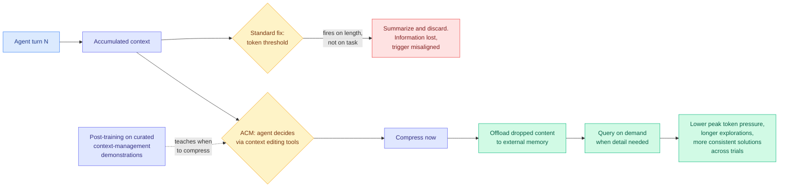

# ACM: Agentic Context Management for Long Horizon Tasks

**arxiv:** [2607.23809](https://arxiv.org/abs/2607.23809) · **Source:** [DAIR.AI Top AI Papers of the Week, via Gmail starred 2026-08-03](../../raw/gmail/2026-08-03-starred.md) · **Authors:** Xiaochuan Li, Ryan Ming, Meng Chu, Shuai Shao, Rong Jin, Chenyan Xiong (Meta, CMU) · **Code:** [github.com/lixiaochuan2020/agentic-context-management](https://github.com/lixiaochuan2020/agentic-context-management)

## TL;DR

Production agents accumulate context every turn and every deployed fix compresses on a **token threshold**: hit 80% of the window, summarize, discard the rest. ACM's complaint is that the trigger has nothing to do with the work. The threshold fires because of how much text exists, not because of what the agent is currently reasoning about, so compression happens at an arbitrary moment and throws away whatever was least recent rather than whatever is least needed.

ACM hands the decision to the agent. It equips the agent with **purpose-built context editing tools** so the agent decides when to compress, **offloads what it drops into an external memory system** rather than deleting it, and **queries that store on demand** when the detail is needed again. The paper calls this lossless context management, and the word is doing real work: nothing is destroyed, it is relocated. A post-training pipeline then builds demonstrations of good context management and trains the model to do it well, with gains on agentic search and coding.

The analysis section carries three effects worth more than the benchmark deltas: effective context management **reduces peak token pressure**, **enables longer explorations**, and **yields more consistent solutions across independent trials**. That third one is the interesting one, because run-to-run variance is a thing practitioners complain about constantly and almost no paper reports.

## Relation to prior wiki state

**It is the agent-side twin of [KAP (08-02)](../inference-efficiency/2026-08-02-kap-knowledge-access-planning.md), and the pairing is exact.** KAP's claim is that in a retrieval-augmented system the relevance signal already existed upstream (a retriever ranked the evidence, a graph supplied topology) and was destroyed by prompt serialization, so it compiles those priors into a runtime KV access plan and touches 5.5% of source KV at 128K context. ACM's claim is the same shape with a different upstream source: **the agent knows what it is working on, and the token-threshold trigger destroys that knowledge.** KAP recovers a signal from the retriever; ACM recovers it from the agent's own reasoning state. Both are arguments that context management has been done by a component that cannot see why the context exists.

**The prefix-invalidation problem is the thing to check.** [TokenPilot (06-16)](2026-06-16-tokenpilot-cache-efficient-agent-context.md) found that prompt-cache hit rate rather than raw token count is what clears the bill, and that **any context edit mutating the prefix triggers a full prefill recompute that cancels the saving.** ACM edits context by construction, repeatedly and at agent-chosen moments. The paper reports peak token pressure, not cache hit rate or prefill cost, so the economically decisive number is missing: an agent that compresses ten times in a session and invalidates the prefix ten times may use fewer tokens and cost more money. This is the single most important open question about the method.

**It contrasts usefully with the [Meta memory-coach agent](https://the-decoder.com/meta-ai-uses-a-second-ai-agent-as-a-memory-coach-to-keep-long-tasks-on-track/) reported the same week**, which puts a *separate* agent in charge of a structured memory bank, deciding when to remind the main agent and when to stay silent, for up to 8.3 points across two benchmarks. Same problem, opposite architecture: ACM gives the working agent the tools and trains it to self-manage; the memory coach externalizes the judgement to a second process. The trade is legible. Self-management keeps the decision next to the reasoning that motivates it. Externalizing it means the manager is not competing for the same context window it is managing, and is not subject to the same failure. Both are Meta results. Nobody has compared them.

**And it inherits an unresolved warning from [Reality monitoring (08-02)](2026-08-02-reality-monitoring-source-attribution.md)**, which found that models are at ceiling on distinguishing their own prior output from user-supplied content under short contexts and **invert** under episodic delay, because the apparent ability was reading proximity in the prompt. ACM asks the agent to decide what to offload and what to retrieve across exactly that kind of distance. If the agent cannot reliably attribute where a piece of context came from once it is far away, then agent-directed retrieval from external memory is being run by a faculty measured to be unreliable in precisely that regime.

## Gaps

No prompt-cache or prefill-cost accounting, as above. "Lossless" is a claim about the memory system retaining content, not about the agent retrieving it when needed, and a retrieval miss is functionally identical to a deletion; no miss rate is reported. The post-training pipeline requires demonstrations of *good* context management, which is a labeling problem with no obvious ground truth, and how those demonstrations were constructed determines whether this transfers off the two task families tested. Agentic search and coding both have external state the agent can re-query, which is the easy regime; a task where the discarded context is the only copy is not tested.

## Industrial read

Every agent framework shipping today uses a token-threshold compactor, and the ACM argument that the trigger is misaligned with the work is correct and cheap to act on partially: **let the agent request compaction, even if you keep the threshold as a backstop.** The offload-and-retrieve half is heavier and its economics are unproven until someone reports the cache numbers. The variance finding is the one to watch, because "more consistent solutions across independent trials" is the property enterprise buyers actually ask for and the one no agent benchmark scores.

## Related pages

- [Agent Memory](agent-memory.md)
- [KAP (08-02)](../inference-efficiency/2026-08-02-kap-knowledge-access-planning.md)
- [TokenPilot (06-16)](../inference-efficiency/2026-06-16-tokenpilot-cache-efficient-agent-context.md)
- [Reality monitoring (08-02)](2026-08-02-reality-monitoring-source-attribution.md)
- [KV Cache](../inference-efficiency/kv-cache.md)
