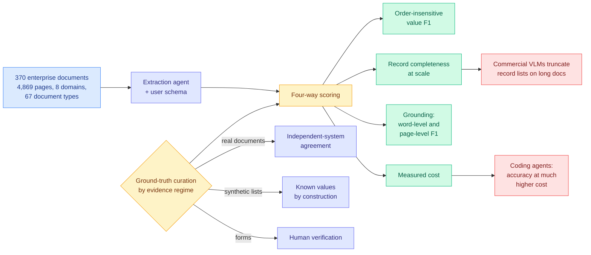

# ExtractBench: A Benchmark for Schema-Guided Enterprise Document Extraction

**arxiv:** [2607.29677](https://arxiv.org/abs/2607.29677) · **Source:** [HuggingFace Daily Papers, 2026-08-03](../../raw/huggingface/2026-08-03-extractbench-a-benchmark-for-schema-guided-enterprise-docume.md) · **Data:** [HuggingFace dataset](https://huggingface.co/datasets/llamaindex/ExtractBench) · [GitHub](https://github.com/run-llama/ExtractBench)

## TL;DR

Schema-guided extraction is the single most deployed agent task in enterprises and has had no serious benchmark. You hand an agent a document and a user-defined schema, and it must fill the schema correctly and attach source evidence showing where each value came from. ExtractBench is **4,869 pages across 370 enterprise documents, 8 business domains and 67 document types**, with challenge scenarios tagged rather than averaged away, and it is the first benchmark in this area to score four things **together**: value accuracy, record completeness at scale, grounding, and **measured cost**.

The ground-truth pipeline is the part worth copying. Real documents get labels by independent-system agreement, synthetic lists get labels by construction because the values are known, and forms get human verification. Three curation strategies matched to three evidence regimes, rather than one annotation contractor for everything. Scoring uses order-insensitive value F1 plus **two separate grounding metrics**, word-level and page-level F1, which is the right decomposition because an extractor can point at the correct page and the wrong span.

The finding is a clean cost-accuracy split. **Commercial vision-language models do well on short documents and truncate record lists on long ones.** Coding agents keep accuracy at much higher cost. LlamaExtract Agentic Plus tops all three metrics with accuracy comparable to coding agents at a fraction of the cost, and yes, LlamaIndex authored the benchmark, which is a conflict worth stating plainly.

## The two findings that generalize past document extraction

**Truncation is a completeness failure, not an accuracy failure, and only a completeness metric catches it.** A model that extracts 40 of 120 line items correctly scores well on value accuracy and has failed the task. This is the same shape as the record-list problem in any long-output agent job: summarizing every ticket, listing every dependency, enumerating every finding. Almost no agent benchmark measures completeness separately from correctness, and this one shows that when you do, the commercial models separate from the coding agents on exactly that axis.

**Grounding needs two resolutions.** Reporting word-level and page-level F1 separately distinguishes "the model found the right region and mislocated the span" from "the model cited the wrong document entirely." Those are different bugs with different fixes, and a single grounding score hides which one you have.

## Relation to prior wiki state

**This is the first benchmark in the wiki to do what [Efficiency Matters in Autonomous Research (08-02)](2026-08-02-efficiency-matters-autonomous-research.md) demanded, published one day later and independently.** That paper, top of the Kurate cs.AI board at an 84% win rate, argued that every agent leaderboard grades the best solution found and ignores what reaching it cost, proposed measuring the area under the Pareto frontier of best-found reward against accumulated budget, and showed empirically that search efficiency and outcome quality are distinct dimensions that come apart. ExtractBench does not use that metric, but it does the minimum version: **cost is a first-class reported number rather than a footnote**, and the resulting ranking is legible precisely because of it. "Comparable accuracy at a fraction of the cost" is a claim you cannot even state on a benchmark that does not measure cost.

The wiki's read on 08-02 was that the missing number sits under every "our agent solved X" post this quarter, including OpenAI's ten Lean-certified mathematical results at roughly $2,000 in tokens with the denominator of failed attempts unpublished. ExtractBench is a small, unglamorous counterexample in the most commercially boring corner of agent work, which is often where measurement discipline arrives first.

**It also puts a number on the deployment claim from [ToolSense (06-13)](2026-06-13-toolsense-parametric-tool-knowledge-audit.md)**, which found the tool boundary leakier than its schema suggests. Schema-guided extraction is the purest test of schema adherence there is: the schema *is* the task. A benchmark showing that models systematically truncate against a schema that explicitly asks for a list is direct evidence for the ToolSense finding in a setting where nothing else could be blamed.

**And it lands on [agent benchmarks](agent-benchmarks.md) as a rare industrial-realism entry.** Most of that page is research benchmarks. ExtractBench's 67 document types with tagged challenge scenarios is a distribution nobody would construct for a paper and everybody meets in production.

## Gaps

The benchmark is authored by LlamaIndex and the winning system is LlamaIndex's product, which does not make the numbers wrong but does mean the reported ranking should be replicated by a third party before anyone procures on it. The independent-system-agreement labeling strategy has a known bias: if two systems agree because they share a failure mode, the ground truth inherits it, and this is most likely on exactly the hard documents. "Measured cost" is reported without saying whether it is API spend, wall clock, or token count, and those rank systems differently. And the split between real, synthetic and form documents means the aggregate score mixes three different label-quality regimes, so a per-regime breakdown matters more than the headline.

## Industrial read

The actionable line for anyone running document extraction in production is the truncation finding: **your commercial vision-language model is probably silently dropping records on long documents and your accuracy metric is not telling you.** The check is trivial and almost nobody runs it. Extract from a document with a known record count and compare counts, not values.

The strategic read is about where the cost curve is going. A specialized extraction agent matching general coding agents at a fraction of the price is the standard pattern of a maturing task: general capability arrives first, then a narrow system captures the same quality at a tenth of the cost, then the general system stops being the sensible default. Enterprise extraction looks to be at that crossover now.

## Related pages

- [Agent Benchmarks](agent-benchmarks.md)
- [Tool Calling](tool-calling.md)
- [Efficiency Matters in Autonomous Research (08-02)](2026-08-02-efficiency-matters-autonomous-research.md)
- [ToolSense (06-13)](2026-06-13-toolsense-parametric-tool-knowledge-audit.md)
