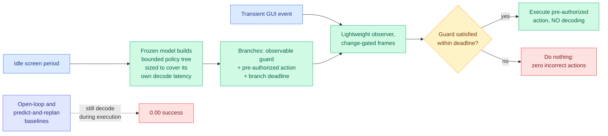

# AAPT: Why Are GUI Agents Correct but Late? Decode on the Decision-Time Critical Path

**Source:** Kurate weekly cs.LG leaderboard #5, ai_rating 6.0/10 · [arXiv 2607.28399](https://arxiv.org/abs/2607.28399) · published 2026-07-30 · raw: [`raw/kurate/2026-08-04-cs-lg.md`](../../raw/kurate/2026-08-04-cs-lg.md)

**Authors:** Zihan Dong (Georgia Tech), Rui Qian (Fudan), Qishi Zhan (Marquette), Dongshen Peng (UNC Chapel Hill), Kaixin Li (NUS), Yu Li (Southeast)

**Not on HuggingFace Daily Papers.**

## TL;DR

Computer-use agents fail on transient GUI events, meaning boot prompts, auto-dismissing dialogs, short-lived authentication requests, reaction-time game states, and the paper's claim is that this is a **timing failure rather than a comprehension failure**: the agent produces the correct action after the window has already closed. It names the cause precisely, autoregressive decoding sitting on the decision-time critical path, and then removes decoding from that path without touching the model. During idle screen periods, the same frozen multimodal model builds a bounded **conditional policy tree**: branches carry observable guards, pre-authorized actions, and branch-specific deadlines, and the tree is deliberately **sized to cover the model's own decoding latency**. When an event fires, a lightweight observer matches change-gated frames to a prepared branch and executes the corresponding action immediately, generating no new text. In paired trials with pre-registered endpoints and exact McNemar tests, success inside a contested decision window rises **from 0.50 to 0.79 (p = 1.8e-3) with zero incorrect actions**. Both open-loop and predict-and-replan baselines score **zero**, because they still decode during execution. A pre-registered oracle probe rejected the authors' own initial hypothesis and identified **branch routing**, not planning quality or observer speed, as the causal bottleneck. Reproduced on an independent general-purpose multimodal model over 126 paired trials (p = 4.9e-13).

---

---

## Key claims

- **The failure is latency, and the paper isolates it as a causal factor rather than asserting it.** AAPT is used as a controlled manipulation: hold the model, the perception, and the task fixed, move only the decode off the critical path, and see whether success changes. It does, by 29 points.
- **Irreversibility is why this is not speculative execution.** Speculative planning (Interactive Speculative Planning, Dynamic Speculative Planning, Speculative Actions, AgenticCache) hides latency by overlapping fast approximate execution with slow verification, which requires the speculated work to be undoable. Most GUI actions are not. AAPT prepares *several* actions and commits one only after a live observation satisfies its guard inside a deadline, which is admission control rather than speculation.
- **The tree-sizing rule is the falsifiable part and it held.** A preparation-time sweep shows the gain appears where the latency-based sizing rule predicts, which is stronger evidence than the headline number.
- **A pre-registered oracle probe rejected the authors' own hypothesis.** They expected planning quality or observer latency to bind; it was branch routing, i.e. correctly matching the live frame to the right prepared branch. Publishing a rejected pre-registered hypothesis is rare and makes the ablation credible.
- **The scope limit is stated, not hidden.** AAPT wins when candidate actions can be enumerated in advance. On an external benchmark it merely matches a reactive baseline, with complementary strengths, and reactive execution stays better when enumeration is impossible.

## Gaps

The headline result lives inside a "contested decision window," a setting constructed to expose the effect, so the 0.50 to 0.79 jump is a measurement of the mechanism rather than of end-to-end agent utility. The external-benchmark result is a tie. Tree construction consumes idle time and model calls, and no token or dollar accounting appears, which matters because the whole point is to spend more compute earlier: an agent that builds trees continuously during idle periods may cost several times a reactive agent for a category of events that is rare in most workflows. And the branch-routing bottleneck the oracle probe identified is not fixed here, only located.

## How this relates to prior wiki pages

**This is the first paper in the wiki to treat decode latency as an agent-correctness problem rather than a cost problem, and that reframing is the contribution.** Every efficiency result the [inference-efficiency](../inference-efficiency/kv-cache.md) side tracks prices latency in dollars or throughput: speculative decoding buys 1.45x to 2x, [DraftExpert (08-03)](../inference-efficiency/2026-08-03-draftexpert-moe-self-speculative-decoding.md) measured 1.45x on phones against the 2x-plus datacenters report, [LOCKS (07-29)](../inference-efficiency/2026-07-29-locks-page-local-key-summaries.md) halves per-token decode latency. AAPT says that in an environment running on its own clock, latency is not a cost axis at all, it is a **correctness axis with a step function**: below the deadline you succeed, above it you score zero regardless of how right the answer was. Both baselines scoring exactly 0.00 is the cleanest possible statement of that.

**The economic consequence flips the efficiency stack's direction for this workload.** The wiki's dominant efficiency framing, most recently in the [SemiAnalysis Kimi K3 primer (08-04)](../llms-foundation-models/2026-08-04-semianalysis-kimi-k3-architecture-primer.md), is that agentic serving is prefill-and-retention bound: the measured distribution is roughly 142k input tokens against 444 output tokens per turn over 65 turns, so decode throughput barely matters and prefill plus cache residency dominate. AAPT identifies a workload class where **decode latency is the only thing that matters**, because output length is tiny but the deadline is external and hard. Those are not contradictory, they are two different agent workloads, and no serving system currently distinguishes them. A scheduler that batches aggressively for throughput is exactly wrong for a deadline-bound GUI agent.

**It is also a much stronger version of what [gui-agents](gui-agents.md) has recorded about the perceive-reason-act loop.** Prior work on this page improved *perception* (Agent-Computer Observation Interface, DynamicGUIBench continuous sampling with change gating) or *anticipation* (WebDreamer, MobileDreamer, DynaWeb world models, TraceR1 receding-horizon replanning). AAPT's point is that the anticipation literature keeps the expensive model call on the critical path anyway: predicting the future state does not help if you still have to decode an action after observing it. The paper's own framing, that it is not proposing a better agent but a controlled manipulation that isolates decode latency, is the right one.

**And it composes with the procedural-memory line rather than competing.** PreAct, SkillDroid and ActionEngine compile successful past trajectories into reusable policies, which requires prior experience with the task. AAPT compiles a policy tree from the current screen with no prior experience. The obvious composition, seed the tree from procedural memory when experience exists and generate it fresh when it does not, would attack the branch-routing bottleneck the oracle probe found, since a remembered branch comes with a known guard.

## Open problems

- **Fix branch routing.** The paper locates it as the bottleneck and stops. Guard specificity, frame-matching thresholds, and how many branches are worth preparing are all untouched.
- **Who decides which workload a request is?** A serving stack needs to know whether a request is throughput-bound or deadline-bound to schedule it. Nothing in vLLM or SGLang expresses a per-request deadline today.
- **Cost per prevented miss.** Idle-time tree construction is unpriced, and the honest comparison is against simply running a smaller, faster model on the critical path.

## Related pages

- [GUI Agents](gui-agents.md)
- [Tool Calling](tool-calling.md)
- [Agent Memory](agent-memory.md)
- [Speculative Decoding](../inference-efficiency/speculative-decoding.md)
- [SemiAnalysis Kimi K3 architecture primer](../llms-foundation-models/2026-08-04-semianalysis-kimi-k3-architecture-primer.md)
