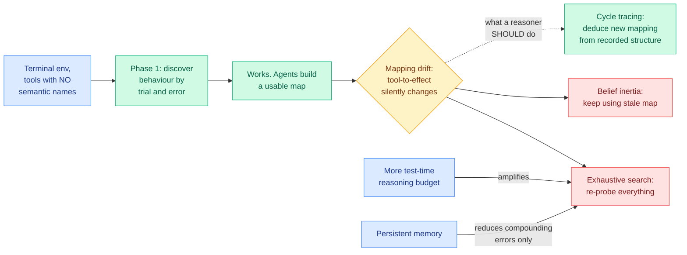

# ScrambleToolBench: agents brute-force even when their own map points at the answer

**TL;DR.** Every tool-use benchmark hands the agent a semantic schema: function names, argument names, docstrings. That means an agent can succeed by pattern-matching against pretraining knowledge without ever inferring anything from the environment. ScrambleToolBench strips the semantics out. It is an interactive terminal benchmark where tools have no meaningful names and behaviour must be discovered purely through trial and error, on a continuous task curriculum. Then it changes the environment underneath the agent: **mapping drift** (the tool-to-effect mapping silently changes), stochastic action failures, and temporal execution windows. The headline finding is a clean separation between two capabilities everyone had bundled: **initial discovery works, adaptation does not.** When the mapping drifts, agents do not deduce the new mapping using the structure they already recorded (cycle tracing would do it), they exhibit **belief inertia** or fall back to exhaustive search. And the part that should worry anyone selling reasoning as the fix: **more test-time reasoning amplifies the brute-force search rather than producing deduction.** Persistent memory reduces compounding errors but does not enable efficient structural inference.

## What it measures and why the design matters

The benchmark's contribution is a **subtraction**. Existing tool-use suites expose semantic schemas in static environments, which means a high score is consistent with two very different agents: one that infers behaviour from interaction, and one that recognizes a familiar API. ScrambleToolBench removes the semantic cue so only the first can score, and removes environment stasis so the agent has to maintain its model rather than build it once.

The three dynamic challenges are chosen to target distinct failures. **Mapping drift** tests hypothesis revision, and it is the one that produces the headline result. **Stochastic action failures** test whether the agent can distinguish "my model is wrong" from "the action happened not to work," which is the credit-assignment problem in a noisy environment. **Temporal execution windows** test whether the agent tracks that an action's validity is time-dependent.

The finding that carries beyond this paper is that **exhaustive search is the default recovery strategy, and reasoning budget makes it worse.** Cycle tracing (following a sequence of tool applications back to a known state to infer what changed) is available to any agent that recorded its earlier map. Agents do not use it. Given more reasoning tokens they search harder rather than reasoning better.

## How this relates to prior wiki pages

**It is the third result in a week saying that scaling test-time compute amplifies whatever strategy the agent already had.** [Efficiency Matters in Autonomous Research (08-02)](2026-08-02-efficiency-matters-autonomous-research.md), the top paper on that week's Kurate cs.AI board, argued every agent leaderboard grades the best solution found and ignores the budget spent reaching it, and showed across twelve tasks and four search families that search efficiency and outcome quality are empirically distinct dimensions. ScrambleToolBench gives that argument a mechanism: the reason budget and quality decouple is that **the marginal reasoning token buys more search, not better search.** And [Shadow evaluations (07-30)](2026-07-30-shadow-evaluations-ai-research-agents.md), which handed agents the central open question from unpublished NeurIPS submissions and had the papers' own authors grade the output, found that agents completed all of the engineering unassisted and failed on judgment: no sense of the publishable bar, uncreative responses to design flaws, **ineffective backtracking**, poor resource awareness. Ineffective backtracking and belief inertia are the same failure seen from two directions.

**It supplies the negative control that [agent-benchmarks](agent-benchmarks.md) has been asking for on protocol validity.** Kurate cs.AI #1 for the week of 07-30 was [Do Agent Benchmarks Measure Capability? Protocol Validity in the Age of Agentic AI](http://arxiv.org/abs/2607.22368), arguing agent benchmarks have a validity problem rather than a difficulty problem. ScrambleToolBench is an instance of the repair: if semantic schemas let prior knowledge substitute for inference, then every tool-use score is a mixture of two capabilities and the mixing ratio is unmeasured. It also rhymes with the free diagnostic Theta offered in an AI Engineer talk logged on the same page, **shuffle the subtask order and see whether the score moves**, as a test for whether a long-horizon benchmark has real sequential complexity. Scrambling the tool semantics is the same trick applied to the tool axis rather than the ordering axis, and both are cheap enough that there is no excuse for not running them.

**The memory result lands directly on the agent-memory line.** [agent-memory](agent-memory.md) has tracked memory as a capability that unlocks longer horizons. ScrambleToolBench reports persistent memory **reduces compounding errors but does not enable efficient structural inference**, which is a sharper version of what [InMind (07-29)](2026-07-29-inmind-implicit-association-blind-spot.md) found: memory systems recalled facts on demand at up to 100% while surfacing them on indirect queries at most 14.4%, so storage was never the bottleneck. Here the stored map is present, correct as of the last check, and simply not used deductively. **Two papers now say the failure is in the read-and-reason step, not the write step.**

## Gaps

No model list, no numbers, and no per-challenge breakdown appear in the abstract, so "state-of-the-art language models" is doing a lot of work. The three dynamic challenges are almost certainly not equally hard and the paper reports the aggregate story. The benchmark is synthetic by construction, which is the point, but it means "belief inertia" is measured in an environment with no prior over what a plausible change would be, whereas a real tool that changes behaviour usually changes it in a documented or guessable way. And the claim that increasing test-time reasoning amplifies brute-force search needs a budget sweep to be more than an observation; whether it is monotone or has a crossover matters a great deal for anyone tuning an effort dial.

## Links

- Paper: [arXiv 2608.02358](https://arxiv.org/abs/2608.02358) · [HuggingFace](https://huggingface.co/papers/2608.02358)
- Raw source: [raw/huggingface/2026-08-04-scrambletoolbench](../../raw/huggingface/2026-08-04-scrambletoolbench-agents-search-exhaustively-even-when-their.md)
- Related: [agent-benchmarks](agent-benchmarks.md) · [tool-calling](tool-calling.md) · [agent-memory](agent-memory.md) · [SWE-Touch](2026-08-04-swe-touch-shared-workspace-coding-agents.md)
