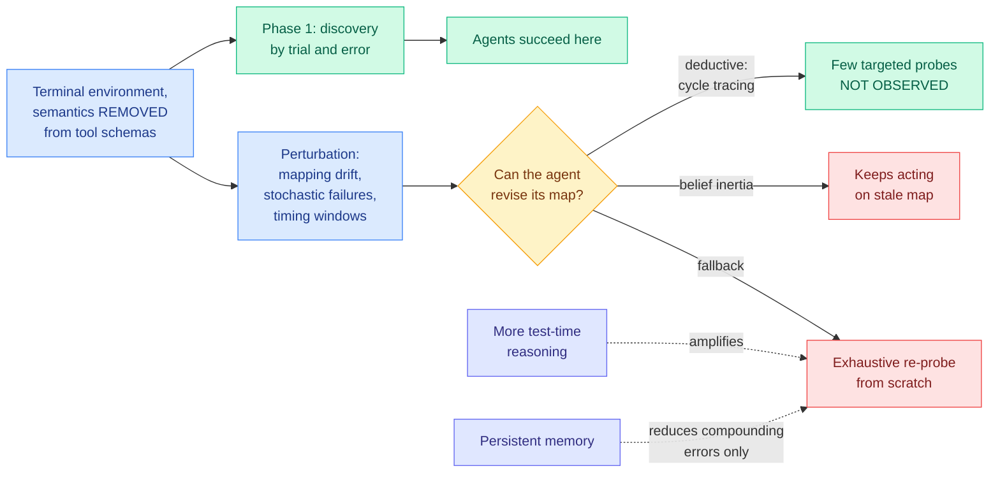

# ScrambleToolBench: Agents Search Exhaustively Even When Their Own Map Points to the Next Step

**Source:** HuggingFace Daily Papers 2026-08-04 · [arXiv 2608.02358](https://arxiv.org/abs/2608.02358) · raw: [`raw/huggingface/2026-08-04-scrambletoolbench-agents-search-exhaustively-even-when-their.md`](../../raw/huggingface/2026-08-04-scrambletoolbench-agents-search-exhaustively-even-when-their.md)

## TL;DR

Every existing tool-use benchmark hands the agent semantic tool schemas in a static environment, which means the agent can lean on prior knowledge about what a function named `send_email` probably does rather than discovering anything. ScrambleToolBench strips the semantics out. It is an interactive terminal benchmark where tool names and descriptions carry no meaning, so behaviour has to be learned entirely through trial-and-error interaction, and a continuous task curriculum keeps the agent using what it learned. Then it perturbs the world: **mapping drift** (the tool-to-effect mapping silently changes), stochastic action failures, and temporal execution windows. The finding is the title. Agents discover the tool mapping successfully at first, and then **fail to adapt when the mapping changes**. They do not use the deductive strategy the situation calls for, which the paper names as cycle tracing: your existing partial map already constrains where the change must be, so a few targeted probes identify it. Instead they exhibit **belief inertia** (keep acting on the stale map) or fall back to **exhaustive search** (re-probe everything from scratch). The result that matters most: **increasing test-time reasoning amplifies the brute-force search rather than producing deduction.** Persistent memory reduces compounding errors but does not restore efficient structural inference.

---

---

## Key claims

- **Removing semantic cues is the design move that makes the benchmark measure anything.** With meaningful names, an agent's apparent tool-discovery ability is prior knowledge. Scrambling them isolates behavioural reasoning, which is what open-world operation actually needs when documentation does not exist.
- **Initial discovery and subsequent adaptation are separate capabilities, and models have the first without the second.** This is the paper's core empirical separation and it is exactly the property a static benchmark cannot detect.
- **More test-time reasoning makes it worse, not better.** Extra reasoning budget goes into wider brute-force search. That is a negative scaling result on the axis the field has been leaning on hardest.
- **Persistent memory helps with the wrong failure.** It reduces compounding errors from acting on stale beliefs, but the agent still cannot infer *what structurally changed*, so memory is a mitigation rather than a fix.
- **Cycle tracing is the named missing strategy.** The agent's own partial map contains the information needed to localize the drift. It does not use it.

## Gaps

The abstract does not name which models were evaluated or report numbers, so the size of the gap is unquantified in the material available. Whether "semantics removed" is a fair test is arguable: a real open-world system usually does have *some* signal (error messages, response shapes, argument arity), and stripping it may create a harder problem than the deployment reality while also removing the cues a competent human explorer would use. And the benchmark is single-agent; nothing tests whether a second agent probing in parallel recovers the deductive shortcut cheaply.

## How this relates to prior wiki pages

**It is the strongest instance yet of a pattern [agent-benchmarks](agent-benchmarks.md) has been accumulating: agent benchmarks measure the capability they accidentally made available rather than the one they name.** The parallel is close to exact with Nick Heiner's 08-02 Surge AI talk ["When Will The Benchmaxxing Plague End?"](https://www.youtube.com/watch?v=-npY6XjM8CQ), which showed a frontier model reproducing SWE-bench Verified prompts and answers verbatim and measured elevated memorization of SWE-bench slices against the rest of the same repositories. Contamination there, semantic priors here: two mechanisms, one consequence, which is that the score is not measuring the process it claims to.

**The test-time-compute result is a genuine tension with the wiki's dominant inference-scaling story and should be named as such.** The [Extrapolation Cliff (05-14)](../inference-efficiency/2026-05-14-extrapolation-cliff-on-policy-distillation.md) established a closed-form threshold above which on-policy distillation collapses, and the broader inference-time-scaling line has generally found more compute buys more accuracy with diminishing but positive returns. ScrambleToolBench finds a regime where **the return is negative in kind**: more reasoning does not sample a better strategy, it executes the wrong strategy more thoroughly. That is not diminishing returns, it is a strategy-selection failure that compute cannot fix, and it echoes the AIMO 3 finding from 04-17 that prompt diversity is a dead end for inference-time scaling because resampling the same wrong strategy family does not widen coverage: in both cases the extra budget explores a space that does not contain the answer.

**It sharpens the agent-memory page's open question about what memory is for.** [agent-memory](agent-memory.md) tracks memory as a mechanism for retaining facts across turns and sessions, and [ACM (08-03)](2026-08-03-acm-agentic-context-management.md) gave the agent tools to decide what to compress and offload. ScrambleToolBench says persistent memory reduces compounding errors and still leaves the agent unable to infer structural change, which means **the missing capability is not storage or retrieval but revision**: recognizing that a stored belief has been invalidated and localizing the invalidation. No paper on the memory page addresses belief revision as a distinct operation.

**And it gives [AAPT (08-04)](2026-08-04-aapt-anticipatory-policy-trees.md) an uncomfortable sibling on the same day.** AAPT's whole mechanism is pre-enumerating candidate actions into a policy tree with guards, and its own oracle probe found **branch routing**, matching a live observation to the right prepared branch, to be the causal bottleneck. ScrambleToolBench says agents cannot revise a structural map when the environment drifts. Those are the same weakness at two timescales: AAPT's agent cannot pick the right prepared branch, ScrambleToolBench's agent cannot notice its map is stale. Both papers state the limitation clearly and neither fixes it, and the shared diagnosis, that agents are weak at mapping a live observation onto a maintained structural hypothesis, is the more useful takeaway than either paper alone.

## Open problems

- **Is cycle tracing elicitable by prompting?** The paper reports agents do not do it. Whether they *cannot* or merely *do not* is the difference between a capability gap and a scaffolding gap, and it is a one-experiment question.
- **Belief revision as a first-class agent operation.** Nothing on the memory page treats invalidation and re-localization as separate from storage and retrieval.
- **Does parallel probing recover the deduction?** Two agents splitting the hypothesis space is the classic cheap substitute for deduction, and the benchmark is single-agent.

## Related pages

- [Agent Benchmarks](agent-benchmarks.md)
- [Tool Calling](tool-calling.md)
- [Agent Memory](agent-memory.md)
- [AAPT: anticipatory policy trees](2026-08-04-aapt-anticipatory-policy-trees.md)
