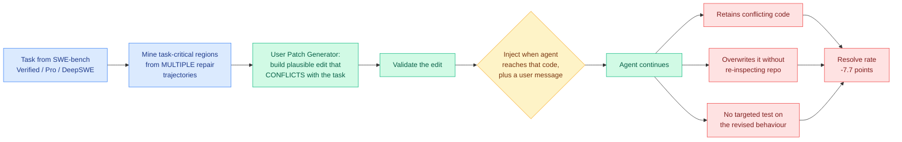

# SWE-Touch: coding agents lose 7.7 points when a human edits the code mid-task

**TL;DR.** Every repository-level coding benchmark evaluates an agent working alone, or restricts the human to sending messages. Real development is a shared workspace: while the agent works, a person inspects files and changes them. SWE-Touch stress-tests that with **validated Counter-Edits**, plausible edits to task-relevant code that actively conflict with completing the task. The pipeline mines task-critical regions from multiple repair trajectories, uses a separate User Patch Generator to construct the conflicting edit, and injects it with a contextual user message at the moment the agent reaches that code. Nine coding models were evaluated. **Counter-Edits drop average resolve rate on SWE-bench Verified by 7.7 percentage points**, and the degradation persists on the longer-horizon SWE-Bench Pro and DeepSWE. Trajectory analysis names the cause as limited awareness of an evolving workspace: agents either retain the conflicting code or overwrite it **without re-inspecting the repository or writing a targeted test for the revised behaviour**.

## What is novel here

Two things, and the second is the transferable one.

**The Counter-Edit construction.** An adversarial edit is easy to make and useless if it is implausible, because then the benchmark is measuring robustness to nonsense. The design constraint is that the edit must look like something a developer would genuinely write, while conflicting with the task. Mining task-critical regions from *multiple* repair trajectories is how they find the code that actually matters (the intersection across independent solution paths is a decent proxy for load-bearing code), and a separate generator model builds the edit so the conflict is semantic rather than syntactic.

**The failure taxonomy.** The trajectory analysis does not just report a score drop, it names three behaviours: retaining conflicting code, overwriting without re-inspection, and not validating the revised behaviour with a targeted test. Those are three distinct missing capabilities, and the paper states them as the optimization targets: **detect workspace changes, reconcile conflicting edits against the task, verify the affected behaviour.**

## How this relates to prior wiki pages

**It is the second paper in one day reporting that agents fail at state revision rather than at initial execution.** [ScrambleToolBench (08-04)](2026-08-04-scrambletoolbench-behavioral-tool-discovery.md), also on today's HuggingFace board, found that agents discover unfamiliar tool behaviour successfully and then exhibit **belief inertia** when the tool-to-effect mapping drifts underneath them, falling back to exhaustive search instead of deducing the change from structure they already recorded. SWE-Touch is the same failure with a human supplying the drift instead of the environment. Two independent benchmarks, two domains, one conclusion: **the agent builds a world model and then does not update it.** That is now a named pattern in this wiki rather than an observation, and it reframes a year of "long-horizon" work, since horizon length and state-revision capability have been measured together and are apparently separable.

**It confirms the shape [Shadow evaluations (07-30)](2026-07-30-shadow-evaluations-ai-research-agents.md) found in a completely different setting.** That protocol handed agents the central open question from unpublished NeurIPS 2026 submissions and had the papers' own authors grade the results; the agents completed **all of the engineering** unassisted and were unambiguously rejected on five judgment failures, one of which was **ineffective backtracking**. Engineering competence with revision incompetence is the same profile SWE-Touch measures, and the 7.7-point drop is the first cheap quantitative handle on it.

**It is the collaboration-side counterpart to a measurement gap on [agent-benchmarks](agent-benchmarks.md).** That page's running argument is that agent benchmarks measure the wrong dimensions: [Efficiency Matters in Autonomous Research (08-02)](2026-08-02-efficiency-matters-autonomous-research.md) added cost, [ExtractBench (08-03)](2026-08-03-extractbench-schema-guided-extraction.md) added record completeness and found commercial vision-language models silently truncate long record lists, and Theta's AI Engineer talk offered order-shuffling as a test for real sequential complexity. SWE-Touch adds **workspace volatility**, and it belongs in the same list: it is a dimension nearly every deployment has and nearly no benchmark scores.

**It reads directly against a production observation from the same day.** Steve Yegge, quoted by Simon Willison on 08-04, describes his Gas Town agent framework falling apart at Opus 4.7 because of a "just two more things" tic that stopped the model converging on being ready to do real work, so it always wanted to fiddle with the framework itself. That is a different pathology (non-convergence rather than stale state) but it is the same category of problem: **an agent's model of when the work is done, and of what changed since it last looked, is the fragile part of the stack, and neither is what the benchmarks grade.**

## Gaps

The 7.7-point figure is an average across nine models with no spread reported, so whether frontier models degrade less is the first thing anyone would want and it is not stated in the abstract. The Counter-Edit is injected at a single moment, when the agent reaches the relevant code, which is a favourable simplification of a real shared workspace where edits arrive at arbitrary times including while the agent holds a stale read. Every edit conflicts with the task by construction, so the benchmark cannot measure the more common real case, a **helpful** concurrent edit the agent should adopt rather than fight, and an agent that always re-reads and always distrusts would score well here while being annoying in practice. The User Patch Generator is itself a model, so edit plausibility is model-judged. And "longer-horizon tasks" from SWE-Bench Pro and DeepSWE are reported only as "degradation persists," without a number, which is exactly where the interesting scaling question lives.

## Links

- Paper: [arXiv 2608.02499](https://arxiv.org/abs/2608.02499) · [HuggingFace](https://huggingface.co/papers/2608.02499)
- Raw source: [raw/huggingface/2026-08-04-swe-touch](../../raw/huggingface/2026-08-04-swe-touch-benchmarking-coding-agents-when-users-touch-the-c.md)
- Related: [agent-benchmarks](agent-benchmarks.md) · [ScrambleToolBench](2026-08-04-scrambletoolbench-behavioral-tool-discovery.md) · [tool-calling](tool-calling.md)
