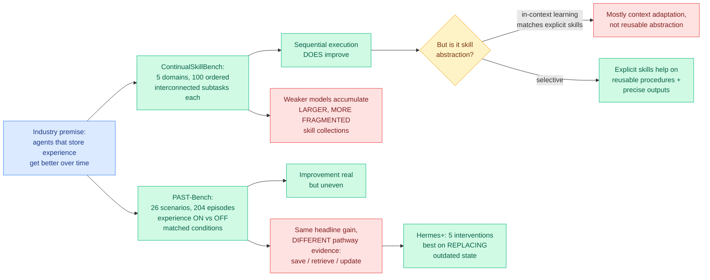

# Do Agents Actually Learn From Experience? ContinualSkillBench and PAST-Bench

**Source:** HuggingFace Daily Papers (both) · ContinualSkillBench [arXiv 2608.03874](https://arxiv.org/abs/2608.03874) · PAST-Bench [arXiv 2608.04003](https://arxiv.org/abs/2608.04003) ([code](https://github.com/Gen-Verse/PAST-Bench)) · raw: [`raw/huggingface/2026-08-05-continualskillbench-can-llm-agents-truly-evolve-their-capabi.md`](../../raw/huggingface/2026-08-05-continualskillbench-can-llm-agents-truly-evolve-their-capabi.md), [`raw/huggingface/2026-08-05-past-bench-benchmarking-the-foundations-of-recursive-self-im.md`](../../raw/huggingface/2026-08-05-past-bench-benchmarking-the-foundations-of-recursive-self-im.md)

## TL;DR

Two benchmarks landed the same morning asking the same question from opposite ends, and they agree on an uncomfortable answer. The premise both attack is the one holding up most of the agent industry: that an agent which writes its experiences into a skill library or a memory store gets better over time. **ContinualSkillBench** builds five domains of 100 interconnected subtasks ordered by increasing difficulty with deliberate opportunities for cross-task skill reuse, then measures whether explicit skill maintenance beats simply carrying prior context. It finds that sequential execution does improve performance, but that **in-context learning performs comparably to explicit skill maintenance on average**, which means most of the observed gain is adaptation to recent context and feedback rather than reusable skill abstraction. Explicit skills help selectively, on tasks needing reusable procedures or precise outputs, and less capable models accumulate **larger, more fragmented collections of task-specific skills**, which is the signature of memorizing instances rather than forming abstractions. **PAST-Bench** isolates the same question with a cleaner instrument: 26 scenarios and 204 episodes of fresh-session tasks run under matched conditions with retained experience toggled on and off, across seven base models and four agent frameworks. Its finding is that improvement is real but uneven across capabilities, and critically that **two agents with identical headline gains can differ completely in whether the gain came through the intended save-retrieve-update pathway**. The authors then build Hermes+, five targeted interventions across the agent loop, which raises average gain and produces clearer pathway evidence, strongest on tasks requiring outdated state to be replaced.

---

---

## Key claims

- **The headline gain from "agent memory" is mostly not what it is sold as.** ContinualSkillBench's central result is that in-context learning matches explicit skill maintenance on average. If carrying the last few turns of context does as well as a curated skill library, the library is not earning its complexity.
- **Fragmentation is the diagnostic for failed abstraction.** Less capable models produce more, smaller, more task-specific skills. A system genuinely abstracting would produce fewer, more general ones as it sees more tasks. The direction of that trend is a cheap health check anyone running a skill library can compute today.
- **Explicit skills do earn their place in two specific cases**: tasks requiring reusable procedures, and tasks requiring precise outputs. That is a narrower and more useful claim than either "memory works" or "memory does not."
- **PAST-Bench's methodological contribution is separating outcome from mechanism.** It reports both later-task gains *and* whether those gains followed the intended save-retrieve-update pathway, and shows the two dissociate. An agent can improve for reasons unrelated to its memory architecture, and every prior evaluation would have credited the architecture.
- **Hermes+ is strongest on replacing outdated state**, which is precisely the operation the rest of the wiki's agent evidence says is missing.
- Both find that improvement is **capability- and model-dependent**, so no general claim about "agents improve" survives.

---

## How this relates to prior wiki pages

**These two benchmarks close a loop the wiki opened three days ago, and the convergence is now five independent results.** The [08-04 digest](../daily-digest/2026-08/2026-08-04.md) paired two papers reaching an identical conclusion in different domains: [ScrambleToolBench](2026-08-04-scrambletoolbench-behavioral-tool-discovery.md) stripped semantics from tool names, found agents discover tools fine, then changed the tool-to-effect mapping and found they either act on the stale map or restart from scratch, with more test-time reasoning making the brute-force search worse rather than enabling deductive recovery. [SWE-Touch](2026-08-04-swe-touch-shared-workspace-coding-agents.md) let a human edit code mid-task and measured a **7.7-point average resolve-rate drop across nine models**. [Shadow evaluations (07-30)](2026-07-30-shadow-evaluations-ai-research-agents.md) found research agents completed all the engineering unassisted and were rejected on judgment failures including ineffective backtracking. The 08-04 summary named the missing capability as **revision**: noticing a stored belief has been invalidated and localizing the invalidation. ContinualSkillBench and PAST-Bench now supply the constructive half. PAST-Bench's Hermes+ gets its **largest improvement specifically on tasks requiring outdated state to be replaced**, which is the first measured progress on the exact deficit the other three papers identified. Five papers in seven days, four diagnosing and one treating.

**ContinualSkillBench's negative result on test-time context matches ScrambleToolBench's negative result on test-time reasoning.** ScrambleToolBench found more reasoning budget amplifies exhaustive search instead of producing deduction. ContinualSkillBench finds more accumulated skills produce fragmentation instead of abstraction. Both are cases where **scaling the resource the field reaches for first makes the symptom worse rather than better**, which is the more troubling version of a null result.

**It reframes the value of the wiki's agent-memory architectures.** [GROVE (08-05)](2026-08-05-grove-temporally-stratified-video-memory.md), landing the same day, builds temporally stratified memory over streaming video, consolidating perceptual evidence into moments, episodes and cross-day patterns, and reports its largest benefit exactly where evidence spans multiple days. Read against ContinualSkillBench, GROVE's stratification is a plausible answer to the fragmentation problem: it imposes an abstraction hierarchy structurally rather than hoping one emerges from accumulation. Nobody has tested a stratified memory on a skill-evolution benchmark.

---

## Gaps

Neither abstract names a single number for its headline claim, which for two benchmark papers is a significant omission: "comparably on average" and "improvement is real but uneven" are both unfalsifiable as stated. ContinualSkillBench's five domains and PAST-Bench's 26 scenarios are both authored task suites, so the interconnection structure and the reuse opportunities are designed by the same people measuring whether reuse happens, and a differently designed curriculum could produce a different answer about whether abstraction is possible. PAST-Bench's pathway evidence depends on an operationalization of save, retrieve and update that is not described in the abstract, and the whole methodological contribution rests on that operationalization being right. Hermes+ is five interventions reported as a bundle with no ablation. Neither benchmark tests an adversarial or drifting environment, which is what [ScrambleToolBench](2026-08-04-scrambletoolbench-behavioral-tool-discovery.md) showed is where the failure actually bites, so both may be measuring the friendly case. And ContinualSkillBench's fragmentation finding is correlational across model capability, not causal.

---

## Industrial implication

Every agent platform shipped in the last year has a memory or skills feature, and the pitch is compounding improvement. These two papers say that pitch is largely unsupported at present, and more usefully they say what to measure instead. The concrete recommendation a team can act on this week is PAST-Bench's: **run your agent with retained experience on and off under matched conditions, and check not just whether the gain exists but whether it flowed through your memory system.** Most teams have never run the off condition, which means most reported compounding is unattributed. The second actionable item is ContinualSkillBench's fragmentation metric: if your skill library is growing faster than your task diversity, it is memorizing rather than abstracting, and it will keep getting more expensive to retrieve from without getting better. This also raises the stakes on [SkillJack (08-05)](../responsible-ai/2026-08-05-skilljack-persistent-skill-backdoors.md), which showed that extracted skills evade safety detection at 11.4% versus 98.5% for the poisoned trajectories they came from. A skill library that is not delivering abstraction but is delivering a durable attack surface is a bad trade, and both halves of that sentence were measured today.

## Related pages

- [2026-08-04-scrambletoolbench-behavioral-tool-discovery.md](2026-08-04-scrambletoolbench-behavioral-tool-discovery.md)
- [2026-08-04-swe-touch-shared-workspace-coding-agents.md](2026-08-04-swe-touch-shared-workspace-coding-agents.md)
- [2026-07-30-shadow-evaluations-ai-research-agents.md](2026-07-30-shadow-evaluations-ai-research-agents.md)
- [2026-08-05-grove-temporally-stratified-video-memory.md](2026-08-05-grove-temporally-stratified-video-memory.md)
- [../responsible-ai/2026-08-05-skilljack-persistent-skill-backdoors.md](../responsible-ai/2026-08-05-skilljack-persistent-skill-backdoors.md)
