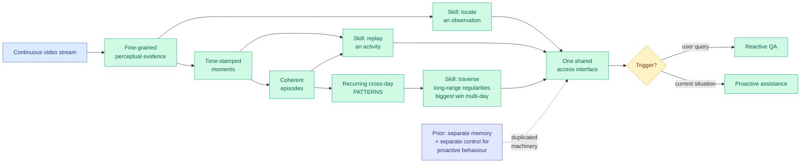

# GROVE: Growing and Reasoning over Temporally Stratified Memory from Streaming Video Experience

**Source:** HuggingFace Daily Papers · [arXiv 2608.02392](https://arxiv.org/abs/2608.02392) · [code](https://github.com/SitongGong/GROVE) · raw: [`raw/huggingface/2026-08-05-grove-growing-and-reasoning-over-temporally-stratified-memor.md`](../../raw/huggingface/2026-08-05-grove-growing-and-reasoning-over-temporally-stratified-memor.md)

## TL;DR

A wearable assistant watching a continuous video stream needs to do two different things: answer questions about what it has seen, and notice on its own that something from the past is relevant right now. Existing video-memory systems do the first. Proactive assistants do the second, usually with a separate memory and a separate control mechanism bolted alongside. GROVE's claim is that these are the same capability accessed two ways, and it builds one memory that serves both. The memory is **grown causally** from the stream, never rewritten with hindsight, and it is **stratified by timescale**: fine-grained perceptual evidence is retained, then incrementally consolidated into time-stamped moments, then into coherent episodes, then into recurring cross-day patterns. Each stratum gets its own retrieval skill matched to its scale, one for locating a single observation, one for replaying an activity, one for traversing long-range regularities. Reactive question-answering and proactive assistance then share exactly the same memory and the same access interface, differing only in whether retrieval is triggered by a user query or by the current situation. It is **training-free**. It achieves the best results among compared methods on several benchmarks including MM-lifelong and EgoServe, and the ablations show the strata and their access skills are complementary, with **the pattern stratum contributing the largest benefit when evidence spans multiple days**.

---

---

## Key claims

- **Reactive recall and proactive assistance can share one memory.** The only difference is the trigger. Prior systems duplicated the machinery because they treated proactivity as a control problem rather than a retrieval problem.
- **Stratification by timescale, with a retrieval skill per stratum.** The strata are not just summaries at different granularity; each has a matched access operation, which is what makes them usable rather than merely stored.
- **Causal growth, no hindsight rewriting.** The memory is built forward from the stream, which is the honest constraint for a live assistant and rules out the retroactive reorganization that makes offline video-QA systems look good.
- **Training-free**, so it composes with an existing model rather than requiring one.
- **Ablations show the strata are complementary**, and the cross-day pattern stratum delivers the largest benefit precisely when evidence spans multiple days, which is the regime the other strata cannot reach.
- Best results among compared methods on multiple benchmarks including the difficult **MM-lifelong** and **EgoServe**.

---

## How this relates to prior wiki pages

**GROVE is a structural answer to the fragmentation problem measured the same morning.** [ContinualSkillBench (08-05)](2026-08-05-do-agents-learn-from-experience-skillbench-pastbench.md) found that agents accumulating skills from experience mostly fail to abstract, that in-context learning matches explicit skill maintenance on average, and that weaker models accumulate **larger, more fragmented collections of task-specific skills**. That is what happens when you hope abstraction emerges from accumulation. GROVE does not hope: it imposes the abstraction hierarchy as architecture, consolidating evidence into moments into episodes into patterns on a fixed schedule. Whether an imposed hierarchy beats an emergent one on a skill-evolution benchmark is the obvious experiment and neither paper runs it.

**It gives the agent-memory thread its missing operation, partially.** The [08-04 digest](../daily-digest/2026-08/2026-08-04.md) concluded from [ScrambleToolBench](2026-08-04-scrambletoolbench-behavioral-tool-discovery.md) (agents discover tools fine, then act on a stale map when the environment drifts) and [SWE-Touch](2026-08-04-swe-touch-shared-workspace-coding-agents.md) (a human editing code mid-task costs 7.7 resolve points) that the missing capability is **revision**, not storage or retrieval, and that no paper on the agent-memory page treated belief revision as distinct from remembering. GROVE is still a storage-and-retrieval system and does not close that gap. But its cross-day pattern stratum is the first mechanism on this page that could *detect* a drift, because a recurring regularity that stops recurring is exactly the observable signal a revision trigger would need. [PAST-Bench's Hermes+ (08-05)](2026-08-05-do-agents-learn-from-experience-skillbench-pastbench.md) attacks the same gap from the other side and reports its strongest gains on replacing outdated state.

**Multi-day memory is a long-context cost problem wearing a different label.** A continuously growing stratified memory over streaming video has the same underlying economics the [kv-cache page](../inference-efficiency/kv-cache.md) tracks: what to keep at full fidelity, what to compress, what to drop. GROVE's answer is a hand-designed retention hierarchy, and its shape is close to what [OmniPack (08-05)](../inference-efficiency/2026-08-05-omnipack-omni-modal-token-compression.md) arrived at for token compression, which is that a single compression decision at a single point is worse than staged decisions at different points with different information available.

---

## Gaps

No numbers appear in the abstract for any benchmark, only "best results among the compared methods," and the comparison set is unnamed. Training-free means the consolidation policy is hand-designed, so the timescales of the strata (what counts as a moment, an episode, a pattern) are hyperparameters chosen by the authors and their sensitivity is unreported, which matters because the whole method is a retention schedule. Memory growth over genuinely long horizons is unaddressed: consolidation reduces the rate of growth but the fine-grained perceptual stratum is described as retained, so the storage cost over weeks or months is unknown, and neither latency nor memory footprint is reported. Causal growth without hindsight rewriting is the right constraint but it means an early misinterpretation propagates upward into episodes and patterns with no correction path, which is the revision problem again. And proactive assistance is evaluated on EgoServe, a benchmark whose notion of "the right moment to intervene" is a design choice that may not survive contact with a real user.

---

## Industrial implication

Wearables are the obvious target and the least interesting one. The transferable part is the design pattern: **one memory, several strata, a retrieval skill matched to each stratum, and proactivity as a trigger rather than a subsystem.** That applies directly to long-running software agents, where the current practice is a flat vector store plus a separately engineered set of heuristics for when the agent should speak up unprompted. Collapsing those into one interface removes a whole class of consistency bug where the proactive path and the recall path disagree about what the agent knows. The caution is the one today's other agent papers supply: [ContinualSkillBench](2026-08-05-do-agents-learn-from-experience-skillbench-pastbench.md) showed that a memory system's headline gain often is not flowing through the memory system at all, and [PAST-Bench](2026-08-05-do-agents-learn-from-experience-skillbench-pastbench.md) showed how to check. GROVE reports ablations, which is better than most, but nobody should adopt a stratified memory without running the experience-off condition first.

## Related pages

- [2026-08-05-do-agents-learn-from-experience-skillbench-pastbench.md](2026-08-05-do-agents-learn-from-experience-skillbench-pastbench.md)
- [2026-08-04-scrambletoolbench-behavioral-tool-discovery.md](2026-08-04-scrambletoolbench-behavioral-tool-discovery.md)
- [../inference-efficiency/2026-08-05-omnipack-omni-modal-token-compression.md](../inference-efficiency/2026-08-05-omnipack-omni-modal-token-compression.md)
- [../inference-efficiency/kv-cache.md](../inference-efficiency/kv-cache.md)
