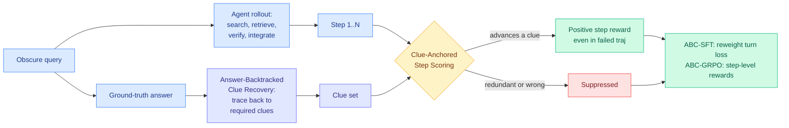

# ABSeeker: Training Long-Horizon Search Agents via Answer-Backtracked Credit Assignment

**Source:** HuggingFace Daily Papers 2026-08-06
**Paper:** [arxiv 2608.05102](https://arxiv.org/abs/2608.05102)
**Raw:** [raw/huggingface/2026-08-06-abseeker-training-long-horizon-search-agents-via-answer-back.md](../../raw/huggingface/2026-08-06-abseeker-training-long-horizon-search-agents-via-answer-back.md)
**Authors:** Yijun Lu, Rui Ye, Jiajun Wang, Yuwen Du, Tian Jin, Songhua Liu, Siheng Chen (Shanghai Jiao Tong University)

## TL;DR

A search agent takes many steps to reach one answer, and standard training gives it one bit of feedback at the end. Every step in a failed trajectory is punished, including the three steps that were correct, and every step in a successful one is rewarded, including the six that were wasted. ABSeeker's fix exploits something specific about search tasks: **they are backtrackable**. Given the question and the ground-truth answer, you can work backwards to recover the intermediate clues any solution must have passed through, then score each of the agent's actual steps against those clues. That turns one sparse binary outcome into dense per-step rewards. Trained on Qwen3.5-4B with only 8.5k examples, ABSeeker scores 37.3% on BrowseComp and 39.1% on BrowseComp-ZH, rising to 55.3% and 52.9% with context management, which **matches agents around 30B** and beats same-scale 4B agents by a wide margin.

## Diagram

## What the paper actually claims

The credit-assignment problem for long-horizon search agents is that outcome supervision is trajectory-level and binary, so all steps share one label regardless of contribution. The paper's survey of prior fixes is the useful framing. **IGPO** assigns step rewards from the increase in the model's own likelihood of the ground-truth answer, which makes the credit signal drift as the policy updates, since it is measured against a moving self-belief. **CSO** identifies critical steps by testing alternative actions and verifying the impact, which is expensive and leaves all non-critical steps unsupervised. **SAPO and MindDR** assign credit from intermediate entities by graph proximity to the answer, which is an indirect proxy that does not settle whether a specific search decision was valid.

ABC's move is to build the credit signal from something **fixed and external**: the answer itself. Two stages. **Answer-Backtracked Clue Recovery** starts from the ground-truth answer and traces backwards to recover the intermediate clues a solver would need, producing a static target set that does not move as the policy trains. **Clue-Anchored Step Scoring** then evaluates each of the agent's actual steps against those clues, converting binary outcome supervision into dense step-level rewards.

The pay-off the authors emphasise is the asymmetry it buys: **useful actions inside failed trajectories still get positive credit**, which is exactly the signal that trajectory-level rewards destroy. Two training recipes are built on it, ABC-SFT reweighting per-turn loss and ABC-GRPO using step scores as rewards inside GRPO.

The efficiency claim is the striking one. 8.5k training examples, a 4B backbone, and performance matching roughly 30B agents. With context management the numbers roughly clear 50 percent on both BrowseComp variants.

## How this relates to prior wiki pages

**This is the fourth distinct mechanism the wiki has logged for converting a sparse outcome into dense turn-level credit, and its stability property is the one that separates it.** [PBSD (06-09)](../llms-foundation-models/2026-06-09-pbsd-bayesian-self-distillation.md) used the likelihood ratio between a standard student and a privileged answer-conditioned teacher to produce Bayes-calibrated turn-level credit, for long-horizon search agents specifically. [CAST (07-30)](../inference-efficiency/2026-07-30-cast-solver-advantage-distillation.md) took the credit signal from a classical solver's state-value change, showing the teacher need not be a neural network at all. [CoRT (07-30)](../inference-efficiency/2026-07-30-cort-counterfactual-replay-token-credit.md) used per-token log-likelihood contrast under rubric-conditioned versus criteria-free prompts. ABSeeker's clue set is closest to CAST in spirit, because both derive credit from a source **external to the policy**, which is precisely the property IGPO lacks and the paper explicitly criticises it for. The pattern crossing the wiki's three-paper bar is now clear: **credit signals anchored outside the learning policy are more stable than credit signals read off the policy's own beliefs.**

**It also lands directly on the day's dominant theme from the other side.** Today's [RSTG](../inference-efficiency/2026-08-06-rstg-negative-group-teacher-guidance.md) attacks GRPO's zero-variance hole (when every rollout in a group gets the same reward there is no gradient) by importing dense supervision from a teacher. ABSeeker attacks the same hole by manufacturing dense supervision from the answer. Two papers, same day, same diagnosis, and the difference is whether the density comes from a bigger model or from the task structure. ABSeeker's version is cheaper and does not inherit a teacher's biases; RSTG's version works where no backtrackable clue structure exists. **Neither cites the other and the comparison is obvious.**

**The scale result belongs on the efficiency ledger, not just the agent ledger.** 4B matching 30B on BrowseComp with 8.5k examples is a compression claim about where search competence lives, and it sits next to [VibeThinker-3B (06-16)](../inference-efficiency/2026-06-16-vibethinker-3b-compression-coverage.md)'s Parametric Compression-Coverage Hypothesis, which separated compressible verifiable reasoning from coverage-bound open-domain knowledge. Search is interesting for that hypothesis because it looks like coverage-bound work (you need to know things) but is actually procedure-bound (you need to know how to find things). ABSeeker is evidence for the procedural reading.

**The context-management jump is the underreported number.** 37.3% to 55.3% on BrowseComp from context management alone is an 18-point swing, larger than most of the gains the credit-assignment machinery buys. That is consistent with [ACM (08-03)](2026-08-03-acm-agentic-context-management.md) and belongs in any honest accounting of where long-horizon agent performance actually comes from.

## Gaps

The clue-recovery step needs the ground-truth answer, which makes ABC train-time-only and confines it to tasks with verifiable answers, the same wall the reliability-gating line has hit since 06-18. The paper does not report how clue recovery is performed or how sensitive results are to a noisy or incomplete clue set, which matters because a missing clue silently penalises a correct step. There is no ablation separating ABC-SFT from ABC-GRPO, so the split between the two contributions is unknown, and the 18-point context-management delta is reported without describing the mechanism.

## Links

- Concept pages: [agent-benchmarks.md](agent-benchmarks.md), [rl-for-llms.md](../llms-foundation-models/rl-for-llms.md)
- Digest: [2026-08-06](../daily-digest/2026-08/2026-08-06.md)
