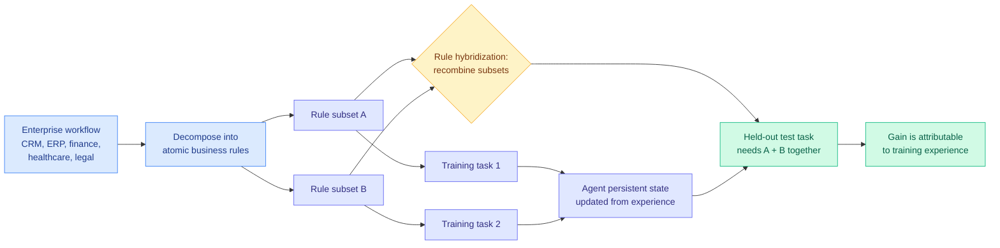

# GDPevo: Evaluating Agent Self-Evolution on Real Business Tasks

**Source:** HuggingFace Daily Papers 2026-08-06
**Paper:** [arxiv 2608.03764](https://arxiv.org/abs/2608.03764) · [code and benchmark](https://github.com/Prism-Shadow/GDPevo)
**Raw:** [raw/huggingface/2026-08-06-gdpevo-evaluating-agent-self-evolution-on-real-business-task.md](../../raw/huggingface/2026-08-06-gdpevo-evaluating-agent-self-evolution-on-real-business-task.md)

## TL;DR

Measuring whether an agent actually learned from experience is harder than it looks, because a test-time gain can come from training experience, from contamination, or from the task simply being easy. GDPevo makes the gain **attributable by construction**. Its core mechanism, **rule hybridization**, decomposes each enterprise workflow into atomic business rules, distributes subsets of those rules across training tasks, then recombines them into held-out test tasks, so a model can only succeed at test time if it carried something over from training. It spans CRM, ERP, finance, healthcare, legal and data-centric workflows, with V1 at 120 tasks in 12 groups and a fully automated pipeline that expanded it to 240 tasks in 24 groups within two days, which is a practical answer to contamination. Across four agents under four supervision types, self-evolution improves held-out accuracy by **up to 16.44 percentage points**, while the best evolved agents remain far below a fully-informed **oracle ceiling of 91.6%**.

## Diagram

## What the paper actually claims

Agent self-evolution means updating an agent's persistent state from prior experience and reusing it on related tasks. The paper names three problems with how it has been evaluated. Existing benchmarks cover **economically valuable task domains thinly**. They do not reliably design training and test tasks such that a test-time gain can be **attributed** to training experience rather than to something else. And they are vulnerable to data contamination, since a static public benchmark leaks into training corpora over time.

Rule hybridization answers all three at once, and it is the contribution worth remembering. Take a real enterprise workflow and decompose it into atomic business rules. Hand different training tasks different **subsets** of those rules. Build the held-out test tasks by **recombining** subsets in ways no single training task covered. Now a test task is solvable only by an agent that retained rules from more than one training episode and composed them, which makes the gain attributable by construction rather than by argument. V1 ships 120 tasks in 12 groups, five training and five held-out test tasks per group, spanning CRM, ERP, finance, healthcare, legal and data-centric workflows.

The contamination answer is the pipeline rather than the dataset. Because generation is fully automated, the authors expanded to 240 tasks in 24 groups **within two days**, which reframes benchmark freshness as a regeneration cadence rather than a one-time property.

The empirical result has two halves and the second is the one that matters. Across four agents, each a harness plus a model, under four supervision types, self-evolution consistently helps, by up to 16.44 points on held-out accuracy. But the best evolved agents remain **far below the fully-informed oracle ceiling of 91.6%**, which is the score achievable when the agent is simply given the rules. The authors' reading is that current self-evolution ability is far from realized, and the oracle gap is what quantifies "far."

## How this relates to prior wiki pages

**The oracle ceiling is the number this wiki has been missing, and it reframes several prior results.** The [self-evolving agents](self-evolving-agents.md) page has accumulated harness mechanisms for months, and the recurring evaluation weakness is that a gain over no-evolution says nothing about how much of the available headroom was captured. GDPevo supplies the denominator: 16.44 points of gain against a 91.6% ceiling. Read that against [ContinualSkillBench and PastBench (08-05)](2026-08-05-do-agents-learn-from-experience-skillbench-pastbench.md), which found plain in-context learning matches explicit skill-library maintenance on average, and the two are compatible in an uncomfortable way. GDPevo shows self-evolution helps; PastBench shows the elaborate machinery is not what makes it help. Nobody has run a skill library against an in-context baseline **on GDPevo**, which is now the obvious experiment because the oracle ceiling makes the comparison interpretable.

**Attribution-by-construction is the same instinct as ABSeeker's, applied to evaluation instead of training.** [ABSeeker (08-06)](2026-08-06-abseeker-answer-backtracked-credit.md) makes credit assignment stable by anchoring it to something **external and static**, the clue set recovered by backtracking from the answer, rather than to the policy's own moving beliefs. GDPevo makes evaluation attributable by anchoring it to something external and static too, the rule decomposition, rather than to a held-out split that merely hopes for generalization. Same day, same structural move at two different layers.

**And it sits in direct tension with the day's other evaluation result, which is the more important pairing.** [Shadow evaluations (08-06)](2026-08-06-shadow-evaluations-open-ended-research.md) gave frontier agents six days, real compute and thousands of dollars on genuine unpublished research questions, and the original authors rejected both resulting papers, with four of five failure modes being judgment and allocation rather than capability. GDPevo reports self-evolution working. Both are right, and the difference is that GDPevo's test tasks have a **checkable success criterion fixed in advance**, assembled from known rules, while a research question does not. The [agent-benchmarks](agent-benchmarks.md) page now carries this as a standing caution: rule recombination measures whether an agent retained and composed known rules, which is genuinely valuable and is not evidence about open-ended work in the stronger sense.

## Gaps

The oracle ceiling is defined by handing the agent the rules, so it measures retention-and-composition rather than discovery, and an agent could saturate GDPevo while being unable to infer a rule nobody wrote down. Rule decomposition is itself a modelling choice, and the paper does not report how sensitive results are to granularity, which matters because coarser rules make recombination easier and finer rules make it nearly impossible. Four agents under four supervision types is a reasonable spread but the abstract does not break the 16.44-point gain down by supervision type, so which kind of feedback drives self-evolution is unreported. And the automated pipeline that answers contamination also means the benchmark's difficulty is set by a generator whose calibration is not independently validated.

## Links

- Concept pages: [agent-benchmarks.md](agent-benchmarks.md), [self-evolving-agents.md](self-evolving-agents.md)
- Same-day counterpart: [Shadow evaluations](2026-08-06-shadow-evaluations-open-ended-research.md)
- Digest: [2026-08-06](../daily-digest/2026-08/2026-08-06.md)
