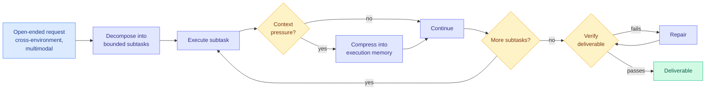

# OneDayAgent: A Long-Horizon Harness for Autonomous Agents

**Source:** [arxiv 2608.05013](https://arxiv.org/abs/2608.05013) · [HuggingFace](https://huggingface.co/papers/2608.05013) · [raw](../../raw/huggingface/2026-08-06-onedayagent-towards-a-long-horizon-harness-for-autonomous-ag.md)

## TL;DR

Prior work has attacked long-horizon agent failures one at a time: goal drift, state loss, context overflow. OneDayAgent asks whether **one harness can manage all three jointly** and stay effective across model backends. It turns an open-ended request into a managed execution process with three components: decompose the task into bounded subtasks, maintain execution memory under context pressure, and verify then repair the final deliverable. On AgentIF-OneDay across 104 tasks it sets a new state of the art at **0.821 overall** with the GLM-5.2 backend, and the same untuned harness runs across five backend LLMs from three model families, with different models inducing distinct execution styles under the same workflow.

## Key points

- **The joint-management claim is the contribution**, not the score. Goal drift, state loss, and context overflow each have their own literature and their own fix; this is the first harness evaluated on holding all three at once.
- **Backend-agnostic without tuning.** Five backends, three families, one harness. That is the property that separates a harness result from a model result, and it is the reason the number is worth taking seriously.
- **Verify-then-repair on the final deliverable** is the least common of the three components in shipped agent frameworks and the one most likely to transfer.
- **Different models induce distinct execution styles under an identical workflow**, which is an underexplored observation: the harness constrains the process, not the strategy.

## How this relates to prior wiki pages

**It is the strongest same-day counterpoint to the day's other agent result, and the tension is real rather than rhetorical.** [Shadow evaluations (08-06)](2026-08-06-shadow-evaluations-open-ended-research.md), from the AI Snake Oil team with UK AISI coauthors, gave frontier agents six days, thousands of dollars in API credits, and the real research questions behind two unpublished papers; the original authors rejected both agent papers outright, and the log analysis found the agents ended with **less than half their API budget spent and hours to spare**. Both papers use the word "open-ended." They do not mean the same thing. AgentIF-OneDay's open-endedness is **multi-step, cross-environment, and multimodal** with a checkable deliverable; the shadow evaluation's open-endedness is that **the success criterion is not knowable in advance**. A harness that decomposes, remembers, verifies, and repairs is well-designed for the first and structurally silent on the second, because there is nothing to verify against. **The field is using one adjective for two problems and reporting progress on the easier one.**

**Its execution-memory component lands in a beat that has been mostly negative results.** [InMind (07-29)](2026-07-29-inmind-implicit-association-blind-spot.md) found retrieval-based agent memory only surfaces a fact when the fact resembles the query, with six memory systems reaching at most 14.4% on indirect queries against 84.0% when the memory was simply placed in context. [ContinualSkillBench (08-05)](2026-08-05-do-agents-learn-from-experience-skillbench-pastbench.md) found explicit skill maintenance matched by plain in-context learning. [The Personalization Mirage (08-06)](../responsible-ai/2026-08-06-personalization-mirage-over-inference.md) finds inferred attributes accumulate approximately linearly with little revision in a multi-turn pilot, so persistent memory compounds fabrication rather than correcting it. OneDayAgent's memory is **compression under context pressure within a single run**, which is a much narrower and more defensible claim than durable cross-task memory, and that narrowness is probably why it works.

**And it belongs on the harness-versus-model question the wiki keeps circling.** The [agent-benchmarks page](agent-benchmarks.md) has repeatedly found agent results that turn out to be harness results. Here the authors make that the explicit design goal and report backend transfer as evidence, which is the right way round. The unanswered version is the inverse: what does the harness cost? Decompose-plus-verify-plus-repair is more model calls than a single agent loop, and no token or wall-clock accounting appears.

## Gaps

104 tasks on a single benchmark, and the state-of-the-art number comes from one backend while the generalization claim comes from the others, so the reader cannot tell how much of 0.821 is GLM-5.2. No cost accounting for a harness whose three components all add model calls. The verify-then-repair loop needs a verifiable deliverable, which quietly restricts the task class. And "different models induce distinct execution styles" is an interesting observation reported without a measurement.

## Links

- Concept pages: [Agent Benchmarks](agent-benchmarks.md), [Agent Memory](agent-memory.md)
- Same-day tension: [Shadow evaluations](2026-08-06-shadow-evaluations-open-ended-research.md)
- Digest: [2026-08-06](../daily-digest/2026-08/2026-08-06.md)
