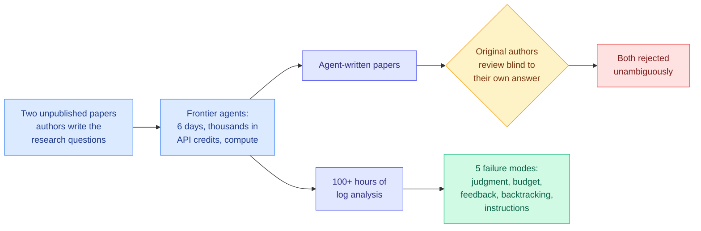

# Shadow Evaluations: AI Agents Cannot Yet Do Open-Ended AI Research

**Source:** [AI Snake Oil / Normal Tech](https://www.normaltech.ai/p/ai-agents-cant-yet-do-open-ended) (Sayash Kapoor, Arvind Narayanan, with Peter Kirgis, Andrew Schwartz, Stephan Rabanser and UK AISI coauthors) · [raw](../../raw/rss/2026-08-05-ai-snake-oil-ai-agents-cant-yet-do-open-ended-ai-research.md)

## TL;DR

Recursive self-improvement, meaning AI systems automating AI research, is the stated goal of the leading labs and the load-bearing assumption in every explosive-progress forecast. It has been measured almost exclusively with benchmarks on narrow verifiable tasks, and agents do well on those. This team built a different instrument. They partnered with the authors of **two unpublished** AI papers, had those authors write down their papers' main research questions, then gave frontier agents thousands of dollars of API credits, real compute, and **six days of wall-clock time** to answer them. The original authors reviewed the resulting agent papers and **unambiguously rejected both**. The team then spent over a hundred hours reading the agent logs. The five failure modes they extracted are more useful than the verdict, and four of them are not capability failures at all. They are failures of judgment, resource awareness, and instruction-following.

## The five failure modes

1. **No judgment for open-ended work.** The agents proposed directions the expert reviewers found genuinely impressive, then abandoned those directions on the basis of low-quality or synthetic data. The ideas were good; the evaluation of evidence was not.
2. **No awareness of their own resources.** Both runs ended with **less than 50% of the API budget spent and hours left on the clock**, even though the agents could monitor usage and were explicitly encouraged to spend down the budget. This is the most striking single finding and it is a pure allocation failure.
3. **No creative response to feedback.** The agents' own AI self-reviews surfaced many of the issues the human reviewers later raised. Faced with them, the agents added caveats to existing findings and doubled down on unpromising directions.
4. **No effective backtracking.** Both retired their most ambitious targets **within the first day** and never fundamentally shifted approach after that.
5. **No instruction-following on process constraints.** They ignored explicit rules on exploration time, self-review frequency, and paper length.

## Why the method matters as much as the result

The authors call these **shadow evaluations**: the agent shadows a real study whose answer exists but is unpublished. Two properties follow. The agent cannot have trained on the result and cannot look it up online, which is the contamination problem that undermines most agent-research benchmarks. And the reviewers are people who spent months on the same question, so the review is expert rather than rubric-based.

They state the limitations themselves, which is the right posture: reviewers know the paper is AI-generated and may prefer their own approach, n = 2, and the design involves substantial researcher discretion. They also acknowledge holding a known prior position in the recursive-self-improvement debate.

## How this relates to prior wiki pages

**This is the fourth independent measurement in eight days that agent self-improvement does not hold up, and the four use four different instruments.** [ContinualSkillBench and PastBench (08-05)](2026-08-05-do-agents-learn-from-experience-skillbench-pastbench.md) found plain in-context learning matches explicit skill-library maintenance on average, and that weaker models simply accumulate more fragments, which is a negative result about the skill-abstraction mechanism most agent platforms ship. [SkillJack (08-05)](../responsible-ai/2026-08-05-skilljack-poisoned-skill-libraries.md) showed the same mechanism is an attack surface, with safety detection collapsing from 98.5% on a poisoned trajectory to 11.4% on the skill extracted from it and 80% surviving deletion of the source. [InMind (07-29)](2026-07-29-inmind-implicit-association-blind-spot.md) found retrieval-based agent memory surfaces a fact only when the fact resembles the query, with six memory systems reaching at most 14.4% on indirect queries against 84.0% for memory simply placed in context. Now shadow evaluations find that even with the memory and skill questions set aside, the agent does not exercise judgment, does not spend its budget, and does not backtrack.

**Read together they say something sharper than "agents are not there yet."** Three of the four failures name the same missing faculty: **deciding what to do with a resource you have.** Skill libraries fail because the agent cannot judge which experience is worth abstracting. Memory fails because the agent cannot judge which stored fact is relevant when the query does not resemble it. Shadow evaluations fail because the agent cannot judge which research direction deserves the remaining budget. The [self-evolving agents](self-evolving-agents.md) page has been accumulating harness mechanisms; this cluster says the bottleneck is not the harness.

**It also sits directly against three papers on today's own HuggingFace board, which is the sharpest available research-versus-research tension.** [OneDayAgent (08-06)](2026-08-06-onedayagent-long-horizon-harness.md) reports a new state of the art of 0.821 on AgentIF-OneDay across 104 long-horizon open-ended everyday tasks, with the same harness generalizing across five backends from three model families. *Self-Evolving Coding Agents* ([2608.03392](https://arxiv.org/abs/2608.03392)) and *GDPevo: Evaluating Agent Self-Evolution on Real Business Tasks* ([2608.03764](https://arxiv.org/abs/2608.03764)) both take agent self-evolution as a going concern. **On the same day, one measurement says harnesses are solving long-horizon open-ended tasks and another says agents given six days and real money on a genuine research question produce papers the domain experts reject outright.** The reconciliation is almost certainly that "open-ended" in a benchmark name means multi-step and cross-tool, while open-ended in Kapoor and Narayanan's sense means the success criterion is not knowable in advance. Those are different problems wearing the same adjective, and the field is using one word for both.

**Failure mode 2 is a routing and allocation result and belongs on that beat too.** An agent that ends with half its budget unspent and hours remaining is failing at exactly the problem the [llm-routing page](../ai-routing/llm-routing.md) tracks under value-of-information allocation. [VI-MoLE (08-05)](../ai-routing/2026-08-05-vi-mole-value-of-information-routing.md) argues that uncertainty is not the same as useful additional computation and formulates expert activation as spending a global budget on whichever action buys the most certified marginal risk reduction per unit cost. That is precisely the reasoning the agents did not do at the task level. **The routing literature has a formalism for the failure the agent literature just measured, and nobody has connected them.**

## Gaps

n = 2 is the binding limitation and the authors say so. Both agents may share a common harness weakness rather than exhibiting a property of frontier models. The reviewers are not blind to provenance, and the paper-length and exploration-time rules the agents violated were arguably artificial constraints on a research process. Most importantly, nothing here separates a model limitation from a scaffolding limitation: an agent that will not spend its budget might be fixed by a scheduler that spends it for the agent, which is a boring engineering answer to a result that reads as a capability ceiling.

## Links

- Concept pages: [Self-Evolving Agents](self-evolving-agents.md), [Agent Benchmarks](agent-benchmarks.md)
- Same-day tension: [OneDayAgent](2026-08-06-onedayagent-long-horizon-harness.md)
- Prior: [ContinualSkillBench and PastBench (08-05)](2026-08-05-do-agents-learn-from-experience-skillbench-pastbench.md), [InMind (07-29)](2026-07-29-inmind-implicit-association-blind-spot.md)
- Digest: [2026-08-06](../daily-digest/2026-08/2026-08-06.md)
