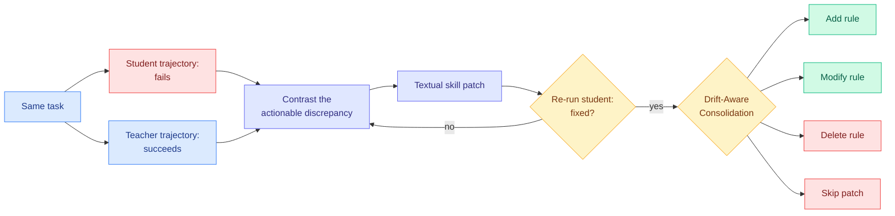

# SKILL-KD: Contrastive Skill Distillation for LLM Agents

**Source:** [arxiv 2607.28048](https://arxiv.org/abs/2607.28048) · [HuggingFace](https://huggingface.co/papers/2607.28048) · [raw](../../raw/huggingface/2026-08-06-skill-kd-contrastive-skill-distillation-for-llm-agents.md)

## TL;DR

Skill-based prompting, where an agent keeps a library of written procedures it consults, has become standard practice, and every existing method builds those skills by **summarising the agent's own successful experience**. SKILL-KD argues that is the wrong construction for a weak student. When a student fails for lack of task knowledge or operational strategy, its own failed trajectory does not contain the evidence needed to infer the missing behaviour, and a teacher's successful trajectory is usually too implicit to be internalised as a reusable rule. So SKILL-KD treats a skill as an **explicit distillation medium between agents of different capability**: given a student failure and a teacher trajectory on the same task, it distils their **actionable discrepancy** into a textual skill patch, tests the patch by re-running the student, and refines it iteratively while the student still fails. To stop repeated local patches from causing skill drift, it maintains trace-linked edit histories and performs **Drift-Aware Skill Consolidation**, deciding per patch whether to add a rule, modify one, delete one, or skip. Consistent improvements to **frozen** student agents across five benchmarks and two student settings.

## How this relates to prior wiki pages

**It is a direct answer to yesterday's negative result, published the same week, and it answers it by changing where skills come from.** [ContinualSkillBench and PastBench (08-05)](2026-08-05-do-agents-learn-from-experience-skillbench-pastbench.md) found that plain in-context learning matches explicit skill-library maintenance on average, and that weaker models accumulate more skill fragments without getting more benefit from them. Read literally, that is a verdict against the whole skill-library programme. SKILL-KD's diagnosis is more precise and, if right, rescues the programme: **the problem is not that skills do not work, it is that a weak agent cannot author its own.** Every method benchmarked in ContinualSkillBench derives skills from the agent's own experience, and SKILL-KD's opening argument is that a failed trajectory does not contain the evidence needed to name what was missing. Nobody has run SKILL-KD on ContinualSkillBench, which is the obvious and cheap test of whether teacher-sourced skills clear the bar that self-sourced skills do not.

**It is the tenth entry in the neutral-exchange-channel pattern and the most abstract channel yet.** The [knowledge distillation concept page](../inference-efficiency/knowledge-distillation.md) tracks the channel climbing from lossless re-encodings toward interpretations: [TESSY (04-18)](../inference-efficiency/2026-04-18-tessy-teacher-student-sft.md) hybrid token sequences, [Switch-KD (04-18)](../inference-efficiency/2026-04-18-switch-kd-vision-language-distillation.md) a shared text probability space, [BPM (07-29)](../inference-efficiency/2026-07-29-bpm-cross-tokenizer-opd.md) raw bytes, [MAPD (08-02)](../inference-efficiency/2026-08-02-mapd-multi-agent-protocol-distillation.md) a JSON task-plan-facts schema, [Any-OPD (08-05)](../inference-efficiency/2026-08-05-any-opd-heterogeneous-on-policy-distillation.md) and [Poly-OPD (08-06)](../inference-efficiency/2026-08-06-poly-opd-multi-teacher-pixel-bridge.md) pixels plus a frozen vision representation. SKILL-KD's channel is **editable natural-language rules**, which is the least constrained substrate on the list and the only one a human can read and modify. The page's caution applies with full force: there is no unique lowest common substrate for reasoning, so a rule format is a bet, and no ablation reports how much competence fails to fit into rules.

**But it fixes the specific weakness the page flagged in every text-medium predecessor.** MAPD's protocol is compiled once per query and never revised. SKILL-KD's patch is **tested by re-running the student and refined until it works**, which makes the skill an outcome-verified artifact rather than an interpretation nobody checked. That is the same move [SPOT (08-06)](../inference-efficiency/2026-08-06-spot-sparse-probing-outcome-calibration.md) makes at the token level, calibrating a distillation target against verifier-scored student continuations instead of against a trust heuristic. **Two papers today independently deciding that the distillation target should be validated by running it.**

**Drift-Aware Skill Consolidation is the part worth borrowing and it addresses a failure nobody had named.** Iterative local patching of a shared rule set is a lossy edit stream, and the natural failure is that later patches silently contradict earlier ones. Trace-linked edit histories with an explicit add/modify/delete/skip decision is a **versioned skill library**, which is exactly the provenance layer the [08-05 Looking Ahead](../daily-digest/2026-08/2026-08-05.md) predicted a major agent framework would need to ship within 90 days, after [SkillJack (08-05)](../responsible-ai/2026-08-05-skilljack-persistent-skill-backdoors.md) showed safety detection falling from 98.5% on a poisoned trajectory to 11.4% on the skill extracted from it, with 80% surviving deletion of the source. SKILL-KD is a research paper rather than a framework changelog, so the prediction is not scored, but the mechanism it needs for quality reasons is the same mechanism SkillJack needs for security reasons. **Skill provenance turns out to be load-bearing twice over, and neither paper cites the other.**

**Working on frozen students is the deployment-relevant detail.** No gradient updates, so this is a prompt-layer capability transfer that runs against an API-only student. That places it alongside MAPD in removing constraints on what distillation requires, and it further weakens the policy premise the concept page tracks, namely that distillation needs teacher internals or industrial scale.

## Gaps

Five benchmarks and two student settings is decent breadth but the comparison class is "fixed-model adaptation baselines," which is weaker than comparing against the plain-in-context-learning baseline ContinualSkillBench found competitive. The iterative refinement loop re-runs the student on every failure, so the cost is a multiple of a single rollout and is not priced. And the consolidation policy is described as a decision per patch without stating what makes the decision, which is where drift is actually prevented or not.

## Links

- Concept pages: [Self-Evolving Agents](self-evolving-agents.md), [Knowledge Distillation](../inference-efficiency/knowledge-distillation.md)
- Prior: [ContinualSkillBench and PastBench (08-05)](2026-08-05-do-agents-learn-from-experience-skillbench-pastbench.md), [SkillJack (08-05)](../responsible-ai/2026-08-05-skilljack-persistent-skill-backdoors.md)
- Digest: [2026-08-06](../daily-digest/2026-08/2026-08-06.md)
