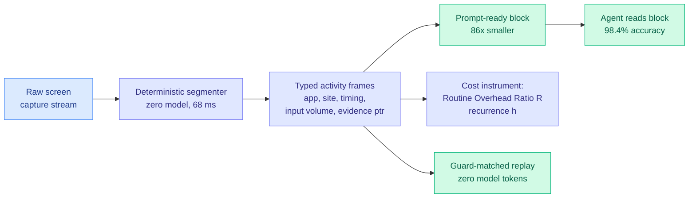

# Activity Frames: Deterministic Screen-Activity Compilation for Agent Memory and Replay

**Source:** [arxiv 2608.05784](https://arxiv.org/abs/2608.05784)
**HuggingFace Daily Papers, 2026-08-07.** No alphaxiv overview yet; written from the abstract.

## TL;DR

The premise is a cost observation, not a capability one. A computer-use agent pays full frontier-model inference to re-derive routines its user has already performed by hand, because agent memory today stores **what the user said** rather than **what the user did**. Activity Frames compiles a passively captured screen-activity stream into agent memory with **no model anywhere in the pipeline**. A deterministic compiler segments the capture into typed frames, bounded episodes carrying application, site, timing, input volume, and evidence pointers back to the raw rows. Because there is no model in the loop, the output is byte-identical across runs, cacheable, and mechanically auditable, which are three properties no LLM-summarized memory has. On one professional's corpus of 128,756 frames across 51 active days, a day of raw capture compiles to a prompt-ready context block **86x smaller in 68 milliseconds**, and an agent reading that block answers questions about the day at **98.4% accuracy** (Wilson 95% CI 91.7 to 99.7) against an independent oracle, against **66 to 80% for an LLM summary of the same capture**. A mid-tier model reading the compiled block matches a frontier model reading it.

## The second contribution is the one worth keeping

The same compiler doubles as a **demand-side cost instrument**, and this is the part that has no prior on this wiki. Every agent-cost model in circulation assumes two parameters that, as far as the authors can find, nobody has measured: the **Routine Overhead Ratio R**, how much more an agent spends re-deriving a routine than replaying it, and the **routine recurrence h**, what fraction of a person's activity is repeated often enough to be worth delegating. Read off passive pre-delegation human activity rather than agent rollouts, they report first values: **R between 60x and 343x** as a modeled upper bound, and a delegable recurrence of **9.0% in-sample and 7.7% out-of-sample**, implying a realistic all-fleet token ceiling near **8%**. A compiled routine then replays deterministically with the model out of the loop, demonstrated live at zero model tokens on a guard-matched hit. Schema, compiler and evaluation harness are open.

Read the 8% carefully, because it cuts both ways. It is the honest ceiling on what deterministic replay can remove from an agent fleet's token bill, and it is far below what the 60-343x overhead ratio suggests if you only read the first number. The paper is unusually disciplined about that: the huge ratio applies only to the small recurrent slice.

## How this relates to prior wiki pages

**It is the strongest argument yet for the position the [agent memory page](agent-memory.md) has been circling, that agent memory is a compilation problem rather than a retrieval problem.** Everything on that page so far either retrieves (embedding search over past turns) or summarizes (an LLM compresses history into prose). Both put a model between the raw evidence and the agent, and both therefore inherit the model's variance. Activity Frames removes the model entirely and beats LLM summarization by 18 to 32 accuracy points on the same input. **The mechanism is not that the compiler is smart; it is that a typed schema with evidence pointers preserves exactly the fields the questions ask about, and a summarizer does not know which those are.**

**It converges on Kurate's #10 cs.AI entry from the opposite direction.** *Beyond Retrieval: Analytic Memory for Multimodal Agents* (2607.29440, ai_rating 6.0) argues in its title that retrieval is the wrong frame for agent memory. Activity Frames argues the same thing with a zero-model compiler and a cost instrument attached. **Two independent groups on the same week's boards saying retrieval-based agent memory is the wrong abstraction is the beginning of a pattern; a third makes it one.**

**It is the cheapest item in today's cost-optimization cluster and the only one that removes the model rather than shrinking it.** PaDoc restructures decoding, Bonsai shrinks weights to 1.125 bits, OSReward trains cheaper judges. Activity Frames is the only one whose saving comes from **not calling a model at all on the recurring slice**, which is the highest-leverage form of cost optimization and the least studied.

## Gaps

n=1. One professional, one corpus, 51 days. The recurrence figure of 7.7 to 9.0% is the load-bearing number for the whole cost argument and it is measured on a single person's work life; a developer, a salesperson and an analyst plausibly differ by a factor of several. The Routine Overhead Ratio is explicitly a **modeled upper bound**, not a measurement, so the 60-343x range should not be quoted as an observed saving. And "guard-matched hit" is doing real work in the replay claim without a false-positive rate: a deterministic replay that fires on a near-match rather than a true match is a correctness hazard, not a saving.

## Links

- Concept page: [Agent Memory](agent-memory.md)
- Raw: [raw/huggingface/2026-08-07-activity-frames-deterministic-screen-activity-compilation-fo.md](../../raw/huggingface/2026-08-07-activity-frames-deterministic-screen-activity-compilation-fo.md)
- Digest: [2026-08-07](../daily-digest/2026-08/2026-08-07.md)
