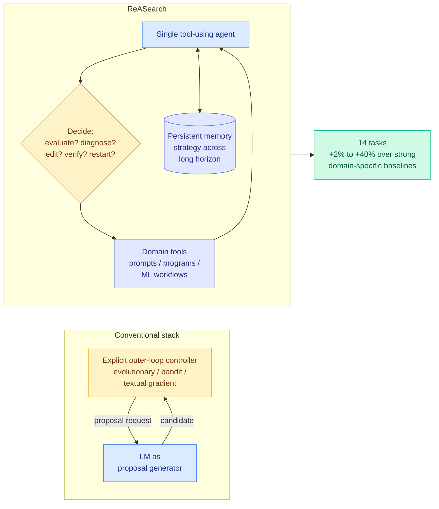

# ReASearch: The Optimizer Is the Agent

**Source:** HuggingFace Daily Papers 2026-08-10 · [arXiv 2608.06714](https://arxiv.org/abs/2608.06714) · [raw](../../raw/huggingface/2026-08-10-the-optimizer-is-the-agent-reasoning-driven-search-across-pr.md)
**Topic:** agentic optimization, prompt optimization, AutoML, search

## TL;DR

Systems that optimize prompts, programs and ML workflows almost all wrap a language model inside an **explicit outer-loop controller**: evolutionary search, bandits, or textual-gradient methods. ReASearch asks how much of that controller can be deleted and internalized. One tool-using agent decides what to evaluate, how to diagnose a failure, which edit to make, and when to verify or restart, carrying strategy across a long horizon in persistent memory. The same scaffold, with only the domain tools swapped, optimizes all three targets. Across 14 tasks it is competitive with and mostly better than specialized systems, by 2% to 40%, and in some cases beats prior human best-known results. The claim worth arguing about: **search behaviors that are normally hand-coded as controller logic emerge from the agent's reasoning.**

## Key findings

- **One scaffold, three domains.** Prompt optimization, program optimization and ML-workflow optimization share the agent loop and differ only in tools. That is the paper's strongest structural claim, because the three literatures currently share nothing.
- **2% to 40% over specialized baselines** across 14 tasks, with some results improving on prior human best-known solutions.
- **The agent allocates its own budget.** It decides how many evaluations to spend and when to restart, which is the function a bandit controller exists to perform.
- **Emergent search behavior.** Behaviors normally implemented as controller code appear from reasoning, which is either the interesting result or a restatement of "a capable model can follow a good strategy," and the paper does not fully disambiguate the two.

## How this relates to prior wiki pages

**It runs directly into the wiki's strongest recent negative result about agents managing their own budgets.** [Shadow evaluations (08-06)](2026-08-06-shadow-evaluations-open-ended-research.md) gave frontier agents six days and thousands of dollars of API credit on genuine unpublished research questions, and **both runs ended with under 50% of the budget spent and hours remaining**, despite being able to monitor usage and being told to spend down. That is a pure allocation failure. ReASearch's core claim is that an agent *can* allocate a search budget well. Both cannot be fully right, and the plausible reconciliation is that ReASearch's tasks have a dense, cheap, automatically computable score, while open-ended research does not. **If that is the distinction, then "the optimizer is the agent" holds exactly where a verifier exists, which is the same boundary condition the RLVR literature keeps rediscovering.**

**It is the strongest current instance of a pattern [self-evolving-agents.md](self-evolving-agents.md) has been skeptical of.** [ContinualSkillBench (08-05)](2026-08-05-continual-skill-bench.md) found that explicit skill maintenance matches plain in-context learning on average, and that weaker models just accumulate more fragments. ReASearch's persistent memory is a skill library by another name, and its gains are real but on tasks with tight feedback loops. The two results together suggest **persistent agent memory pays off in proportion to how quickly the environment tells you whether the memory was right.**

**It also composes cleanly with [VI-MoLE's (08-05)](../ai-routing/2026-08-05-vi-mole-value-of-information-routing.md) framing**, which formalizes allocation as spending a global budget on whichever action buys the most certified risk reduction per unit cost. VI-MoLE derives the allocation rule; ReASearch lets a model improvise it. Running VI-MoLE-style certificates as a *tool* the ReASearch agent can call is the obvious composition and nobody has tried it.

## Gaps

No cost accounting against the baselines. An agent that reasons at length before each edit spends far more tokens per candidate than an evolutionary controller does, and without a matched-token comparison the 2% to 40% range is not a like-for-like win. This is the exact methodological hole that the DAIR.AI-highlighted **Sample More Reflect Less** study exposed in the self-reflection literature this week, where seven methods all lost to plain repeated sampling once every generated token was counted. ReASearch is not a self-reflection method, but it is a method whose mechanism is "generate more reasoning," and it is not held to that standard here. Also: 14 tasks is a broad sweep with little depth per domain, and the "beats human best-known" claims are not identified specifically enough to check.

## Industrial implication

For teams already running an agent harness, this is an argument to stop building a separate optimizer service and instead hand the agent the evaluation tools. That is a real simplification of the AutoML side of a stack. The caution is the token bill: until someone publishes a matched-cost comparison, treat the reported gains as an upper bound obtained at unknown expense, and instrument tokens-per-improvement before committing a budget.

## Links

- [Self-evolving agents concept page](self-evolving-agents.md)
- [Shadow evaluations (08-06)](2026-08-06-shadow-evaluations-open-ended-research.md)
- [VI-MoLE (08-05)](../ai-routing/2026-08-05-vi-mole-value-of-information-routing.md)
- [Daily digest 2026-08-10](../daily-digest/2026-08/2026-08-10.md)
