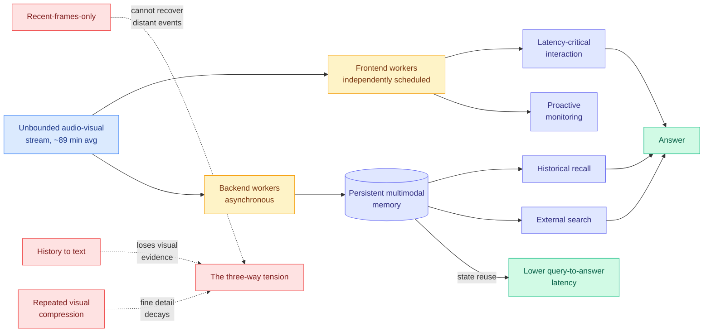

# StreamArena and StreamMind: hour-scale streaming video agents

**Source:** HuggingFace Daily Papers 2026-08-10 · [arXiv 2608.05703](https://arxiv.org/abs/2608.05703) · [raw](../../raw/huggingface/2026-08-10-streamarena-toward-continuous-interactive-and-long-horizon-a.md)
**Topic:** agent memory, streaming multimodal, benchmark design, latency

## TL;DR

Streaming-video evaluation has been broken in a way that flatters every method: short clips plus multiple choice, which lets a baseline that looks at only **the last four frames** match or beat complex streaming models, while the answer options leak language shortcuts. StreamArena replaces that with 243 full-length videos averaging **88.8 minutes** and 3,646 open-ended question-answer pairs spanning real-time perception, historical retrospection, proactive interaction, and multimodal tool use. The benchmark surfaces a structural tension rather than a leaderboard: keep only recent frames and you cannot recover distant events; convert history to text and you lose the visual evidence; repeatedly compress visual memory and fine detail decays. The companion system, StreamMind, splits the problem across two tiers, putting latency-critical interaction on independently scheduled frontend workers while backend workers asynchronously build persistent multimodal memory and do recall and external search. It wins on all four capabilities and **cuts query-to-answer latency by reusing persistent state**.

## Key findings

- **The four-frame baseline is the headline.** A minimal method that reads only the last four frames matches or surpasses complex streaming models on existing benchmarks. Every streaming-video result published against those benchmarks needs re-reading.
- **Multiple choice leaks.** Answer options expose language shortcuts, so open-ended answering is not a stylistic preference here, it is required for the benchmark to measure perception.
- **The tension is a genuine three-way tradeoff, and each corner has a named failure.** Recency loses the past, textualization loses the pixels, repeated compression loses the detail. This is the clearest statement of the streaming-memory tradeoff currently in this wiki.
- **The architectural answer is scheduling, not modeling.** StreamMind's gain comes from separating latency-critical work from memory construction onto independently scheduled tiers, and from reusing persistent state so a query does not rebuild context.

## How this relates to prior wiki pages

**The compression corner of StreamArena's tension is exactly what [WorldTrace (08-10)](../inference-efficiency/2026-08-10-worldtrace-addressable-kv-memory.md) diagnoses, on the same day, from the generation side.** WorldTrace finds that compressed visual KV memory in video world models becomes *unaddressable* once rollouts pass the training horizon, because the positional-embedding offsets fall out of distribution, and that averaging cache entries in rotated positional space corrupts them. StreamArena observes empirically that "methods that repeatedly compress visual memory struggle to preserve fine-grained details over time." **One paper measures the symptom in an understanding benchmark, the other names a specific arithmetic cause in a generation model, neither cites the other, and WorldTrace's virtual-position fix is a candidate answer to StreamArena's third failure mode.** That is the sharpest untested cross-paper composition on today's board.

**The four-frame baseline is the third benchmark-validity failure in this wiki in two weeks.** [ScrambleToolBench (08-04)](2026-08-04-scrambletoolbench-behavioral-tool-discovery.md) and [SWE-Touch (08-04)](2026-08-04-swe-touch-shared-workspace-coding-agents.md) found agents discover fine and then never revise, and that human edits cost 7.7 resolve points. [SkillBench and PastBench (08-05)](2026-08-05-do-agents-learn-from-experience-skillbench-pastbench.md) found explicit skill maintenance matches plain in-context learning. Now a trivial recency baseline matches streaming video models. See [agent-benchmarks.md](agent-benchmarks.md): the pattern is that the *protocol*, not the model, has been producing the reported gains.

**StreamMind's two-tier design is the same shape as the frontend/backend split in production agent memory.** [Activity frames for deterministic agent memory (08-07)](2026-08-07-activity-frames-deterministic-agent-memory.md) argues for a deterministic memory record built outside the model's inference path. StreamMind builds its persistent multimodal memory on asynchronous backend workers for the same reason: memory construction must not sit on the latency-critical path. **Two independent arrivals at "memory writes are a background job."**

## Gaps

243 videos is small for a benchmark meant to be a field standard, and the annotation is by the authoring group. StreamMind is evaluated on the benchmark its own authors designed, which is the standard conflict in benchmark-plus-system papers and is not mitigated here. There is no cost accounting for the two-tier architecture: running frontend and backend workers concurrently is more total compute than a single-pass model, and the latency win may be bought with a throughput loss that is not reported.

## Industrial implication

For anyone building a continuous-perception product, screen agents, camera assistants, meeting agents, the reusable finding is the scheduling split, and it is available today without new models: separate the interaction loop from the memory-construction loop and let the second one lag. The benchmark's more uncomfortable implication is commercial: if a four-frame baseline matches shipped streaming models, some vendors' long-context video claims are not currently distinguishable from recency, and open-ended evaluation will make that visible.

## Links

- [Agent benchmarks concept page](agent-benchmarks.md)
- [Agent memory concept page](agent-memory.md)
- [WorldTrace (08-10)](../inference-efficiency/2026-08-10-worldtrace-addressable-kv-memory.md)
- [Daily digest 2026-08-10](../daily-digest/2026-08/2026-08-10.md)
