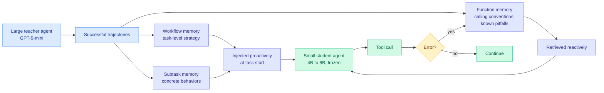

# Agent Memory Distillation (AMD): Hierarchical Teacher Memory for Small Agents

**Source:** HuggingFace Daily Papers · [arXiv 2608.07169](https://arxiv.org/abs/2608.07169)
**Raw:** [raw/huggingface/2026-08-11-agent-memory-distillation-empowering-small-llm-agents-with-h.md](../../raw/huggingface/2026-08-11-agent-memory-distillation-empowering-small-llm-agents-with-h.md)
**Date:** 2026-08-11
**Authors:** Taeil Kim, Kangsan Kim, Sung Ju Hwang (KAIST, DeepAuto.ai)

## TL;DR

Agent memory systems are almost always evaluated on large proprietary models. On small models they fail for a reason that has nothing to do with the memory design: a small agent rarely succeeds, so its self-built memory store fills with failures and holds very few useful examples. AMD's fix is to build the store from a **large teacher agent's successful trajectories** instead, and the contribution is that it does not dump raw traces. It factors teacher experience into **three memory types at three granularities**: Workflow memory (task-level strategy), Subtask memory (concrete behavioral examples at intermediate granularity), and Function memory (per-function calling conventions and common pitfalls). Workflow and Subtask are injected **proactively** at task start; Function memory is retrieved **reactively** when a tool call errors. Entirely **training-free**. With GPT-5-mini as teacher and four students at 4B to 8B: **+27.2 percentage points on AppWorld, +11.2 on BFCL V3, +3.4 on ToolSandbox**, beating existing memory baselines. Subtask memory contributes the largest share, and **4B students benefit most**.

## The two design decisions that carry the result

**Granularity, not content, is the mechanism.** The naive version of this idea, hand a small agent the teacher's traces, is a known non-starter, because a trace tuned to a strong policy's decisions is not actionable for a weak one. AMD's answer is that different levels of abstraction survive the capability gap differently: strategy transfers, concrete intermediate behaviors transfer best, and API conventions transfer as reference material. **Subtask memory contributing the largest gains is the empirical form of that claim**, and it says the useful abstraction level sits between "here is the plan" and "here is the exact call."

**Timing is split by cost.** Proactive injection spends context tokens on every task. Reactive retrieval spends nothing until a tool call fails. Putting Function memory on the reactive path is a cost decision, and it works because tool-convention errors are self-announcing: the environment returns an error that acts as the retrieval trigger.

**The reported dependency is two-sided.** Teacher effectiveness depends on *both* teacher capability and student compatibility, which is the memory-side echo of the [Extrapolation Cliff (05-14)](../inference-efficiency/2026-05-14-extrapolation-cliff-on-policy-distillation.md), the on-policy distillation result that found a closed-form threshold above which a too-large capability gap makes distillation collapse. Here the analogous effect shows up as **4B students benefiting most**, meaning the gain is not monotone in how much headroom the student has.

## How this relates to prior wiki pages

**It is the training-free branch of a question [knowledge-distillation.md](../inference-efficiency/knowledge-distillation.md) has been answering with gradients.** That page's entire nine-axis cluster asks where to place a teacher's supervision signal inside a gradient update. AMD asks the same question with **no gradient at all**: where in the context window should teacher experience be placed, and when. The parallel to [MAPD (08-02)](../inference-efficiency/2026-08-02-mapd-multi-agent-protocol-distillation.md) is close and worth naming, because MAPD compiled a proprietary teacher's competence into a **JSON protocol** of task type, reasoning plan and extractive grounding facts, shown only to a privileged student branch. AMD's Workflow / Subtask / Function split is the same instinct, a **semantic schema as the neutral exchange channel**, but it stops before the distillation step: the schema is served at inference instead of being distilled into weights. That makes it the cheapest rung yet on the neutral-channel ladder this wiki has tracked from bytes ([BPM 07-29](../inference-efficiency/2026-07-29-bpm-cross-tokenizer-opd.md)) through pixels ([Poly-OPD 08-06](../inference-efficiency/2026-08-06-poly-opd-multi-teacher-pixel-bridge.md)) to editable prose rules ([SKILL-KD 08-06](2026-08-06-skill-kd-contrastive-skill-distillation.md)).

**It gives [agent-memory.md](agent-memory.md) its first result on the cold-start problem.** Every self-evolving memory system on that page assumes the agent generates enough successful experience to learn from. AMD names the case where it does not, and shows the store can be **bootstrapped from a different, stronger policy**, which is a structurally different source than everything else on the page.

**It pairs almost too neatly with [RoMeRL (08-11)](2026-08-11-romerl-reduced-order-memory.md), published the same day.** RoMeRL attacks feedback sparsity in learned agent memory by bounding the utility space; AMD attacks experience sparsity by importing the experience. Both are about a memory system starving for good signal, from opposite ends: **one fixes the estimator, the other fixes the data.** Nobody has composed them, and the composition is obvious: seed a RoMeRL memory with AMD's teacher-derived entries, then let the reduced-order utility states learn on top.

## Gaps

- **Context cost is unreported.** Proactive injection of Workflow and Subtask memory consumes prompt tokens on every task, and [TokenPilot (06-16)](../inference-efficiency/2026-06-16-tokenpilot-cache-efficient-agent-context.md) established that agent-context methods optimizing token count while mutating the prefix trigger full prefill recomputes that cancel the saving. AMD reports accuracy, not cost. A 4B model with a large injected memory may be more expensive to serve than a smaller injection into a stronger model.
- **The gain range is 27.2 to 3.4 percentage points across three benchmarks**, which is an enormous spread and is not explained. ToolSandbox's 3.4 points suggests the mechanism is much weaker where the environment is less forgiving, and that is the number a practitioner should anchor on.
- **Teacher cost is a fixed one-time charge that is never amortized in the reporting.** GPT-5-mini generating successful trajectories on AppWorld is real money, and the comparison against simply serving GPT-5-mini is not run.
- **No test of stale memory.** Function memory encodes API conventions. APIs change. Nothing measures what happens when the store is wrong.

## Industrial implication

This is the cheapest credible path from a 4B local model to usable tool-use behavior, and it needs no training infrastructure at all, which puts it directly in reach of the local-deployment audience that [the local model KV economics report (07-30)](../inference-efficiency/2026-07-30-local-model-kv-cache-economics.md) profiled. Expect it to show up as a feature of agent frameworks rather than as a research artifact: record a strong model's successful runs once, factor them into the three levels, ship the store alongside the small model. The commercial catch is that the store is derived from a frontier model's outputs, which puts it squarely inside the distillation-provenance fight this wiki has tracked since [the Distillation Panic (05-04)](../inference-efficiency/2026-05-04-distillation-panic-lambert.md).

## Related

- [agent-memory.md](agent-memory.md), [tool-calling.md](tool-calling.md), [knowledge-distillation.md](../inference-efficiency/knowledge-distillation.md)
- [RoMeRL (08-11)](2026-08-11-romerl-reduced-order-memory.md), [MAPD (08-02)](../inference-efficiency/2026-08-02-mapd-multi-agent-protocol-distillation.md), [SKILL-KD (08-06)](2026-08-06-skill-kd-contrastive-skill-distillation.md)
