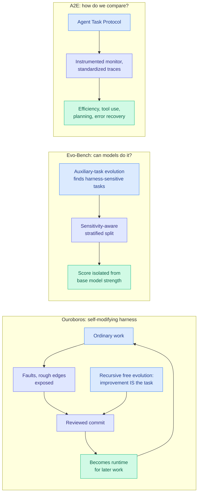

# Harness Evolution: Ouroboros, Evo-Bench, and A²E

**Source:** HuggingFace Daily Papers (three papers, same day)
**Links:** [Ouroboros 2608.08311](https://arxiv.org/abs/2608.08311) · [Evo-Bench 2608.09096](https://arxiv.org/abs/2608.09096) · [A²E 2608.07346](https://arxiv.org/abs/2608.07346)
**Raw:** [Ouroboros](../../raw/huggingface/2026-08-11-ouroboros-a-self-developing-frontier-coding-agent-with-revie.md) · [Evo-Bench](../../raw/huggingface/2026-08-11-evo-bench-can-language-models-improve-agent-harness.md) · [A²E](../../raw/huggingface/2026-08-11-an-end-to-end-agent-auditing-engine.md)
**Date:** 2026-08-11

## TL;DR

Three papers landed on the same board treating the **harness**, meaning the tools, prompts, context assembly and scaffolding wrapped around a model, as the object being optimized rather than as fixed infrastructure. One builds a self-modifying harness (Ouroboros), one benchmarks whether models can improve harnesses at all (Evo-Bench), one builds the measurement layer for comparing harnesses (A²E). Three papers making the same architectural bet in one day crosses this wiki's pattern threshold: **the field has moved the unit of optimization from the model to the model-harness pair.**

## The three papers

**Ouroboros** is a self-developing coding-agent harness whose tools, prompts, context assembly and core implementation improve through **reviewed commits that become the runtime for later work**. Two evolution modes: *recursive free evolution*, where improvement is itself a task and finishing one cycle can schedule the next, and *experience-driven core evolution*, where ordinary work and social interaction expose bugs and inefficient context construction that lead to reviewed structural changes. Results: **Terminal-Bench 2.1 at 86.74%** (best reported), **OSWorld-Verified at 90.69%** (exceeding the best previously reported), and a five-rollout CL-Bench campaign at normalized reward 0.2301 (new state of the art), all on Opus 5. The part that matters more than the numbers is **Hope**, a 161-day living deployment under free evolution across seven human-interaction surfaces, where humans surface faults and propose changes but **the agent decides which to pursue**. The authors state the safety framing plainly: because a self-developing agent may rewrite its own code and select new model APIs, guardrails must remain authoritative under evolutionary and public social pressure. Benchmark campaigns run on frozen snapshots while Hope evolves on a separate lineage.

**Evo-Bench** asks whether models can improve a harness at all, and its contribution is methodological. The hard part of benchmarking harness evolution is isolating it from base model strength, preventing task-specific overfitting, and capturing long-horizon iterative work. Evo-Bench uses **auxiliary-task evolution to identify tasks genuinely sensitive to framework improvements**, then a sensitivity-aware stratified split for cross-suite generalization, across Search, Office and General domains. Across nine frontier and open-weight models, top models reach **absolute gains up to 16.6 points, closely approaching human-engineered baselines**. The texture is more interesting than the headline: autonomous evolution *beats* human harnesses on General tasks and excels at Search, but **struggles on Office tasks that demand highly specific processing workflows**. It also reports **early saturation** as a temporal anomaly, and finds the synthesized harnesses act as **highly transferable reasoning structures** that boost diverse policy models.

**A²E (Agent Auditing Engine)** is the measurement layer. It introduces an **Agent Task Protocol (ATP)** so evaluation tasks integrate quickly with different harnesses, an automatically instrumented Monitor that captures standardized execution traces, and multidimensional metrics covering execution efficiency, tool use, task planning and error recovery rather than correctness alone. Its headline finding is a negative one with real consequences: **model-harness combinations vary substantially by task type, and no single combination consistently wins across every task.**

## How this relates to prior wiki pages

**The A²E finding is the empirical justification for everything on [llm-routing.md](../ai-routing/llm-routing.md), moved one level up the stack.** This wiki's routing corpus is built on the premise that no single model wins everywhere, so route per query. A²E says the same is true of the **harness**, and that the model-harness *pair* is the thing that has task-dependent strengths. That is a larger routing space than anything currently deployed, and nothing in [Kilo's routing audits (07-31, 08-04)](../ai-routing/2026-08-04-kilo-open-weight-code-review-routing.md) or [Microsoft's MAI production routing (07-25)](../ai-routing/2026-07-25-microsoft-mai-production-routing.md) routes over harnesses.

**Evo-Bench's transferability result is the strongest evidence yet for the [DSPy task-model separation claim (07-25)](../ai-routing/2026-07-25-dspy-task-model-separation-550x.md).** That entry argued the task specification and the model should be separate artifacts, with a 550x cost gap available from re-optimizing the specification rather than the model. Evo-Bench finds synthesized harnesses act as transferable reasoning structures that boost *diverse* policy models, which is exactly the claim that the harness is a portable artifact with value independent of the model it was tuned against.

**Ouroboros is the concrete instance of the recursive self-improvement the safety community spent this week worrying about.** Import AI 468 leads with [23 policy ideas for dealing with recursive self-improvement](https://importai.substack.com/), and the [WAIC safety forum takeaways (08-11)](../responsible-ai/2026-08-11-waic-agentic-safety-forum.md) record Zhou Bowen arguing that because AI is beginning to recursively improve itself, **safety must be re-proven every generation**, and Yang Xiaofang noting that monitoring behavior is insufficient once agents build other agents. Ouroboros has been running for 161 days.

**It extends the self-evolving-agents line from memory to code.** [self-evolving-agents.md](self-evolving-agents.md) has tracked systems that evolve their *memory* or their *skills*: SkillProx (Kurate cs.AI #10 today) evolves agent skills via proximal textual gradient descent, [SKILL-KD (08-06)](2026-08-06-skill-kd-contrastive-skill-distillation.md) distils failures into editable natural-language rule patches with trace-linked edit histories to prevent skill drift, and today's [RoMeRL (08-11)](2026-08-11-romerl-reduced-order-memory.md) bounds the utility space of self-evolving memory. Ouroboros evolves the **implementation**. That is a strictly larger blast radius, and the reviewed-commit gate is the only thing standing between it and an unbounded rewrite.

**The evaluation-integrity thread gets a third witness.** [SWE-Bench ProMax (08-11)](2026-08-11-swe-bench-promax.md) cites an audit finding nearly 60% of unsolved SWE-bench Verified instances contain flawed tests. A²E argues correctness alone is too coarse a metric for harnesses. Evo-Bench builds explicit machinery to prevent task-specific overfitting. **Three papers on one board saying the current agent benchmarks do not measure what they are trusted to measure.**

## Gaps

- **Ouroboros's benchmark numbers and its living deployment are on separate lineages**, which is methodologically honest and means the state-of-the-art scores are not evidence that 161 days of free evolution improves anything. The Hope lineage has no reported quantitative trajectory.
- **Nobody reports the cost of evolution.** Recursive free evolution spends model calls on improving the harness rather than on user work. Evo-Bench's 16.6-point gain and Ouroboros's records are both unpriced in tokens or dollars, which makes them incomparable to any fixed-harness baseline.
- **Evo-Bench's early saturation is the most important unexplained result** and gets one clause. If autonomous harness evolution saturates early, the whole recursive-improvement premise is bounded, and by how much is the question.
- **A²E's "no combination wins everywhere" needs a routing baseline.** The natural follow-up, a learned model-harness router evaluated on ATP traces, is not run.
- **Ouroboros's guardrail claim is asserted, not measured.** "Guardrails must remain authoritative under evolutionary and public social pressure" is stated as a design problem; no adversarial evaluation of whether they held over 161 days is reported.

## Industrial implication

The near-term shift is that harness quality becomes a purchased artifact rather than an in-house craft. If synthesized harnesses transfer across policy models, they are sellable, forkable and versionable, which turns scaffolding into a product category alongside the model API. Expect harness marketplaces and harness benchmarks before harness routing. The slower implication is governance: Ouroboros makes "the agent changed its own runtime" a thing that has happened in production for five months, and no current AI governance framework, including the L1–L5 autonomy white paper launched at WAIC, has a review gate that assumes the artifact under review rewrites itself between reviews.

## Related

- [self-evolving-agents.md](self-evolving-agents.md), [agent-benchmarks.md](agent-benchmarks.md), [llm-routing.md](../ai-routing/llm-routing.md)
- [SWE-Bench ProMax (08-11)](2026-08-11-swe-bench-promax.md), [RoMeRL (08-11)](2026-08-11-romerl-reduced-order-memory.md)
- [WAIC safety forum (08-11)](../responsible-ai/2026-08-11-waic-agentic-safety-forum.md)
