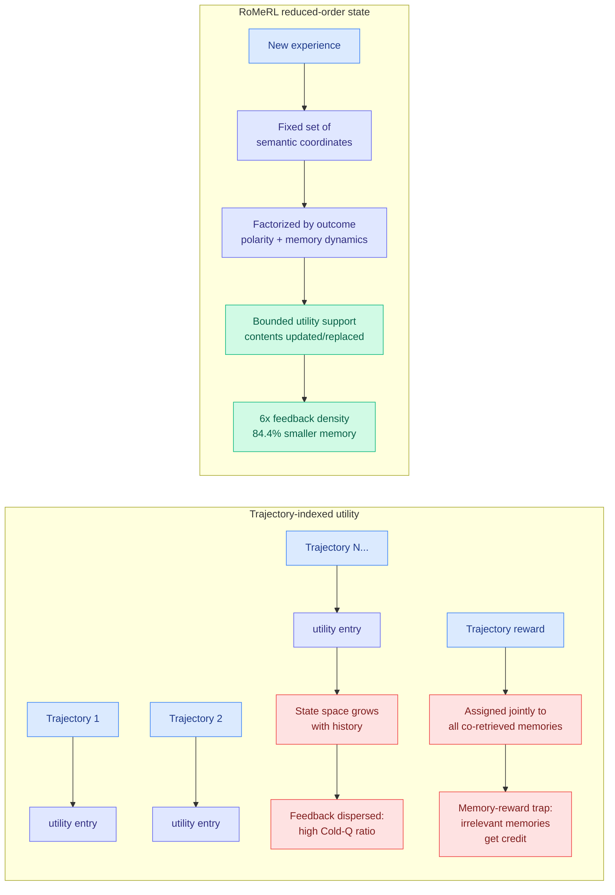

# RoMeRL: Reduced-Order Utility States for Self-Evolving Agent Memory

**Source:** HuggingFace Daily Papers · [arXiv 2608.02508](https://arxiv.org/abs/2608.02508) · [code](https://github.com/YOUNG-fnxm/RoMeRL)
**Raw:** [raw/huggingface/2026-08-11-romerl-balancing-feedback-coverage-and-the-memory-reward-tra.md](../../raw/huggingface/2026-08-11-romerl-balancing-feedback-coverage-and-the-memory-reward-tra.md)
**Date:** 2026-08-11

## TL;DR

Learned memory systems for self-evolving agents fail in two coupled ways. First, utilities are indexed by trajectory, so the state space grows with interaction history and a fixed amount of feedback gets dispersed ever more thinly. Second, a trajectory-level reward is assigned jointly to every memory that was co-retrieved, so **irrelevant experiences absorb credit they did not earn**, which RoMeRL names the **memory-reward trap**. The fix is to stop indexing utility by trajectory. RoMeRL represents the utility space with a **fixed-dimensional per-task memory state factorized by outcome polarity and memory dynamics**, so new experience enters through a bounded set of semantic coordinates whose contents are updated or replaced over time rather than appended to. Feedback concentrates on a support that does not grow. On ALFWorld and LifelongAgentBench: **Cold-Q ratio down 80.0%, feedback density up ~6.0x, maintained memory size down 84.4%, LLM calls down 21.1%**, with task performance improved.

## What is actually new

**The diagnosis is a credit-assignment problem wearing a memory-systems costume.** Co-retrieved memories sharing a trajectory reward is exactly the failure GRPO-style methods have at the token level, where a response-level advantage is broadcast uniformly across every token regardless of which span earned it. [CoRT (07-30)](../inference-efficiency/2026-07-30-cort-counterfactual-replay-token-credit.md) fixed the token version by replaying the response under a rubric-conditioned prompt and a matched criteria-free prompt, using the per-token log-likelihood contrast to redistribute the signed advantage for +4.4 points. **RoMeRL is the same problem at the memory-item level and solves it by changing the index rather than by measuring per-item contribution.** Neither cites the other, and the composition is unrun.

**The theory claim is unusually concrete for this literature.** The paper shows that reduced-order parameterization increases the average feedback per utility coordinate, and characterizes the steady-state occupancy of erroneous coordinates under a generic coordinate-transition model. That second part is the one worth watching, because it is a statement about how much contamination persists rather than about whether contamination is reduced.

**Cold-Q ratio is a metric this wiki should adopt.** It names the fraction of utility entries that have never received meaningful feedback, which is the quantity every memory paper implicitly hopes is small and none of them report. An 80% reduction is a bigger claim than the accuracy numbers.

## How this relates to prior wiki pages

**It is the third mechanism in three weeks arguing that agent memory should be *allocated* rather than accumulated.** [Raven (08-04)](../llms-foundation-models/2026-08-04-raven-sparse-memory-routing.md) keeps a fixed set of memory slots inside a linear-time language model and routes which subset each token writes to, holding recall at 16x its training context. [WorldTrace (08-10)](../inference-efficiency/2026-08-10-worldtrace-addressable-kv-memory.md) assigns each compressed KV summary slot a distinct in-distribution virtual position, so position becomes an address you assign rather than a timestamp you inherit, for +19.5% episodic recall. RoMeRL fixes the number of utility coordinates and replaces their contents. **Three papers, three levels of the stack (model state, KV cache, agent memory store), one principle: a bounded, addressed memory beats an appended one.** The [08-10 digest](../daily-digest/2026-08/2026-08-10.md) predicted this would be named as one modality-general principle within 90 days; this is the third instance in eight days.

**It sharpens the [Zero-Mem result](../daily-digest/2026-08/2026-08-10.md) logged on 08-10**, which cut memory-operation time cost 57.6% by spending zero LLM tokens on anything but the final answer, indexing raw traces twice instead of generating summaries, and argued most production memory-stack spend buys structure that plain indexing already provides. RoMeRL cuts LLM calls 21.1% while *keeping* a learned utility model. Read together: Zero-Mem says the structure is often not worth its token cost, RoMeRL says the structure is worth it if the utility support is bounded. **Those are compatible only if the expensive part was the unbounded index, not the learning**, which is a testable claim nobody has stated.

**It is the estimator-side twin of [AMD (08-11)](2026-08-11-agent-memory-distillation.md), published the same day.** AMD fixes memory starvation by importing a strong teacher's successful trajectories; RoMeRL fixes it by making the surviving feedback go further. Data problem and estimator problem, same board.

## Gaps

- **The fixed dimension is a hyperparameter and its sensitivity is unreported.** The whole method rests on the utility support being bounded; how performance degrades as the bound tightens is the ablation that decides whether this generalizes past ALFWorld and LifelongAgentBench.
- **Replacement is lossy by construction.** Coordinates whose contents are "updated or replaced over time" discard old experience, and no experiment tests catastrophic forgetting of a rare-but-important memory.
- **Two benchmarks, both in the standard household-and-lifelong-task family.** [Eviction as Estimation (08-03)](../inference-efficiency/2026-08-03-eviction-as-estimation-rmm.md) established that memory-management gains appear specifically where reuse is endogenous and time-separated; ALFWorld is a weak test of that.
- **The memory-reward trap is diagnosed but its magnitude in existing systems is not measured on those systems.** The paper shows RoMeRL avoids it, not how much prior work loses to it.

## Industrial implication

The Cold-Q ratio and feedback-density numbers are the ones a team running an agent memory stack in production should act on, because they say the bottleneck is not retrieval quality but the fact that most stored utilities were never trained. Combined with the 84.4% smaller store and 21.1% fewer LLM calls, this is a straightforward cost win with no model change. The broader signal is that agent memory is converging on the same answer as KV cache management: fixed, addressed, bounded state beats an ever-growing log.

## Related

- [agent-memory.md](agent-memory.md), [self-evolving-agents.md](self-evolving-agents.md)
- [AMD (08-11)](2026-08-11-agent-memory-distillation.md), [Raven (08-04)](../llms-foundation-models/2026-08-04-raven-sparse-memory-routing.md), [WorldTrace (08-10)](../inference-efficiency/2026-08-10-worldtrace-addressable-kv-memory.md), [CoRT (07-30)](../inference-efficiency/2026-07-30-cort-counterfactual-replay-token-credit.md)
