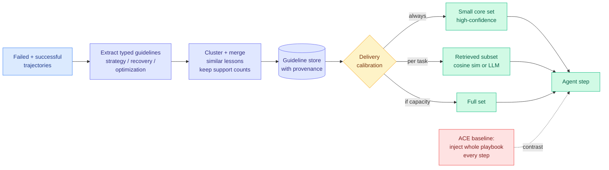

# ALTK-Evolve: the agent playbook should be delivered selectively, not injected whole

**Source:** IBM Research, HuggingFace blog, published 2026-08-11 · [Post](https://huggingface.co/blog/ibm-research/altk-evolve-sldd) · [raw](../../raw/rss/2026-08-11-huggingface-blog-thinking-of-ace-we-can-do-it-with-fewer-tokens.md)

**TL;DR.** ACE (Agentic Context Engineering) is the current default way to let an agent learn from its own failed runs: a Generator, Reflector and Curator loop builds one comprehensive playbook of lessons, keeps per-item counters for how often each lesson recurs, and injects **the whole playbook at every inference step**. IBM Research's ALTK-Evolve keeps the learning loop and attacks the delivery. It clusters and merges similar lessons while preserving their support counts, extracts typed guidelines (strategy, recovery, optimization) with causal attribution back to the trajectories that produced them, and then treats how much context to send as an adjustable parameter rather than a fixed one. On AppWorld it reaches **higher task-goal completion at roughly 40% of ACE's token cost** on one model and **15% of it** on another.

---

---

## The numbers

On **AppWorld**, 168 test tasks, a ReAct code agent where each step writes Python and reads back environment output. TGC is task-goal completion.

| Model | Method | TGC | Tokens per task |
|---|---|---|---|
| DeepSeek-V3.2 | ACE | 80.4% | 634K |
| DeepSeek-V3.2 | **ALTK-Evolve** | **89.3%** | **263K** |
| GPT-oss-120b | ACE | 54.8% | 777K |
| GPT-oss-120b | **ALTK-Evolve** | **56.0%** | **116K** |

The DeepSeek row is the one that matters: **8.9 points more accuracy at 41% of the token cost**. This is not a cost-accuracy tradeoff being navigated well, it is both axes moving the right way at once, which means the baseline was paying for context that was actively unhelpful, not merely redundant. The GPT-oss row is the cheaper story, roughly tied accuracy at 15% of cost, and it carries the secondary finding: **weaker models want curated subsets, stronger models can absorb more**. Delivery volume is a per-model parameter, not a constant.

## What is actually load-bearing

Two mechanisms, and the post is clear that the second is the one doing the work.

**Merging with preserved support counts** is the storage-side move. When several lessons say nearly the same thing, they collapse into one guideline that remembers *how many tasks it helped*, so provenance is not lost in the merge. That is a hygiene improvement over an append-only playbook and it shrinks the store.

**Calibrated selective delivery** is the inference-side move and it is where the token reduction comes from. A small core of high-confidence guidelines always ships. Beyond that, task-specific guidelines are retrieved by cosine similarity or by asking a model to choose. If the model has capacity, send everything. The key reframing: ACE treats the playbook as a single object with one delivery policy, and ALTK-Evolve treats "how much playbook does this step need" as a decision.

## How this relates to what the wiki already knows

**Same-day convergence with SkillZip, from the opposite direction.** [SkillZip (08-12)](2026-08-12-skillzip-skill-compression.md) attacks the identical bottleneck, the cost of an agent's accumulated procedural memory, by making the *artifact* structurally smaller through a minimum-description-length objective. ALTK-Evolve leaves the artifact large and makes the *delivery* smaller through retrieval. Both are dated within a day of each other, neither cites the other, and one is a paper while the other is an engineering post with a benchmark table. The compression-versus-selection split is now a real design fork on this topic, and the two are composable in principle: compress the store, then still deliver a subset of it. Nobody has run that combination.

**It is a retrieval method, which puts it on the wrong side of a result this wiki already logged.** [InMind (07-29)](2026-07-29-inmind-implicit-association-blind-spot.md) found that retrieval-based memory surfaces a fact only when the fact resembles the query, with six systems reaching at most 14.4% on indirect queries against 84.0% for memory simply placed in context. ALTK-Evolve's per-task selection is cosine similarity or LLM choice, which is exactly the mechanism InMind indicts. The always-on core set is a partial hedge, and the AppWorld gains suggest the blind spot did not bite on this benchmark, but AppWorld tasks are stated fairly directly. The falsifiable prediction is that ALTK-Evolve's margin over ACE shrinks or inverts on a benchmark with indirect task statements.

**It confirms a claim the concept page has been carrying since 08-05 with better evidence.** [SkillBench and PastBench (08-05)](2026-08-05-do-agents-learn-from-experience-skillbench-pastbench.md) found explicit skill maintenance merely matches plain in-context learning on average, with weaker models accumulating more fragments. ALTK-Evolve's per-model finding is the mechanism behind that: weaker models are hurt by volume, so a method that dumps everything into weaker models will average out to nothing. The fix is not better skills, it is less of them per step for the models that cannot use them.

**And it is the practitioner half of an industry story running the same week.** Ben Lorica's [continual-learning survey (08-11)](../ai-industry/2026-08-12-continual-learning-market.md) counts more than twenty startups building deployed-system learning loops and names the economic argument in almost these words: you pay to reprocess the same information at the start of every session, so information you use often should be compressed into the system rather than re-read from scratch. ALTK-Evolve is that argument with a table attached.

## Gaps

- **One benchmark.** AppWorld only, 168 tasks. No cross-domain evidence that the merge-and-select policy transfers.
- **Retrieval quality is unmeasured directly.** The post reports end-task TGC, not whether the right guideline was delivered. A win could come from delivering fewer *distracting* guidelines rather than the right ones, which predicts different scaling.
- **No comparison against simply truncating ACE's playbook** by support count, the obvious cheap baseline. Without it, some of the margin may be attributable to sending less of anything rather than to sending the right thing.
- **The core-set size is not ablated**, so the split between "always-on core" and "retrieved tail" is unexamined even though it is the main knob.

## Related

- [SkillZip (08-12)](2026-08-12-skillzip-skill-compression.md) · [self-evolving-agents.md](self-evolving-agents.md) · [agent-memory.md](agent-memory.md)
- [Continual learning as a market (08-12)](../ai-industry/2026-08-12-continual-learning-market.md)
- [Daily digest 2026-08-12](../daily-digest/2026-08/2026-08-12.md)
