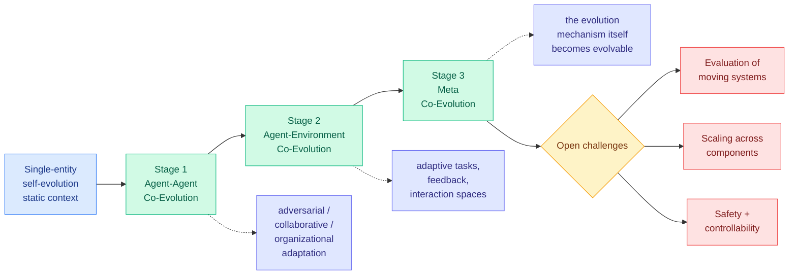

# Co-Evolution in Agentic Systems: a three-stage taxonomy for shedding human design

**Source:** HuggingFace Daily Papers, 2026-08-12 · [arXiv 2608.10299](https://arxiv.org/abs/2608.10299) · [raw](../../raw/huggingface/2026-08-12-co-evolution-in-agentic-systems-toward-self-directed-evoluti.md)

**TL;DR.** A survey with one genuinely useful organizing idea. Single-entity self-evolution is bounded by a **static learning context**: the tasks are fixed, the feedback is fixed, so the agent can only get better at a world that is not changing. Co-evolution is the multi-component case where agents and their environment impose adaptive pressure on each other. The taxonomy is a progressive three-stage ladder ordered by **how much human-engineered constraint the system has shed**, which is a more honest axis than the usual capability ordering.

---

**Stage 1, Agent-Agent.** Agents adapt through dynamic peers rather than fixed ones. Three sub-modes: adversarial (peers try to break each other), collaborative, and organizational (the structure of who talks to whom adapts).

**Stage 2, Agent-Environment.** The loop extends to tasks, feedback and interaction spaces that change as the agents change. The environment is no longer a fixed exam.

**Stage 3, Meta Co-Evolution.** The evolution mechanism itself becomes evolvable. The survey treats this as a possibility to explore rather than an established practice, which is the correct posture.

## Why the taxonomy is worth adopting

Most surveys of this area sort by technique. Sorting by **how much human scaffolding has been removed** is better because it makes the safety story fall out of the same axis as the capability story. Each stage up the ladder removes a place where a human had specified something, which is simultaneously the source of the capability gain and the loss of a review point. The survey names its open challenges accordingly: evaluating systems whose components are all moving, scaling across multiple co-evolving components, and keeping increasingly autonomous evolutionary processes safe and controllable.

## How this relates to what the wiki already knows

**It gives a name and a slot to something this wiki identified as a pattern in June and never labeled well.** The [self-evolving-agents concept page](self-evolving-agents.md) recorded a "the evolving environment turn" on 2026-06-14, when three papers in one HuggingFace batch shared a single reframe, stop assuming the world is static: **EvoArena/EvoMem** made progressive environment updates the evaluation unit, **Evoflux** evolved tool-workflow graphs at inference time against changing tool catalogs, and **EvoBrowseComp** auto-regenerated a contamination-free benchmark to keep pace with shifting world knowledge. That page noted the distinction was "subtle but real": those agents adapt to an environment evolving underneath them, rather than evolving themselves. This survey's Stage 2 is exactly that distinction, formalized, and Stage 3 is where the June cluster was pointing without saying so.

**Stage 1's organizational sub-mode is where the wiki has the most existing material and the survey will be thinnest.** [DecoEvo (07-30)](2026-07-30-decoevo-solver-rubric-coevolution.md) co-evolves a solver skill and a rubric-generator skill under decoupled objectives, auditing the generator on requirement coverage and response discrimination so that neither audit can be satisfied by lowering the bar. That is a Stage 1 adversarial system with a specific anti-gaming argument, and it is the strongest defense this wiki has logged against the failure mode any co-evolution scheme invites: **if one side's updates are selected by the other side's score, the pair learns that an easier task raises the score.** Whether the survey's taxonomy carries that distinction, between co-evolution with decoupled objectives and co-evolution with a shared one, is the thing that would decide whether it is useful for design rather than just for filing.

**It arrives on a board that contradicts its premise's optimism.** The same 2026-08-12 board carries [three benchmarks](2026-08-12-agent-benchmark-cluster.md) in which the best available agent completes 56.70% of real data-science workflows and open-source agents complete under 1%. A survey arguing the frontier is systems that shed human design is being published the same day as evidence that agents fail at tasks where the human design is still fully present. Both can be true, and the honest reading is that co-evolution is a research frontier rather than a deployment one. The survey does not make a deployment claim, which is to its credit.

**The safety collision is already on the record and is now three days old.** The [WAIC forum takeaways (08-11)](../responsible-ai/2026-08-11-waic-agentic-safety-forum.md) record Shanghai AI Lab's Zhou Bowen arguing that because AI is beginning to recursively self-improve, **safety must be re-proven every generation**, and Alibaba's Yang Xiaofang noting that monitoring behavior stops working once agents build other agents. Yang's point is precisely a Stage 1 organizational-adaptation problem, and Zhou's is a Stage 3 problem. Meanwhile **Ouroboros** has run a [161-day live deployment](2026-08-11-harness-evolution-cluster.md) in which the agent decides which changes to its own implementation to pursue. The survey's third open challenge is therefore not forward-looking; it describes a system that has been in production for five months.

## Gaps

- **It is a survey, so it inherits rather than tests.** Nothing here validates the ladder empirically, and the ordering is an argument rather than a measurement.
- **No cost axis anywhere.** Co-evolution multiplies the number of components being trained or rewritten, which multiplies the bill. This is the standing unpriced variable across the whole topic and a survey was the natural place to demand it.
- **Stage 3 is close to empty.** Meta co-evolution is presented as a possibility, so the ladder's top rung is aspirational, and the survey does not say how one would recognize a genuine Stage 3 system versus a Stage 2 one with an extra loop.
- **No treatment of whether decoupled objectives are necessary**, which is the one design question the existing literature has actually answered.

## Related

- [self-evolving-agents.md](self-evolving-agents.md) · [multi-agent-systems.md](multi-agent-systems.md)
- [Mendel Gödel Machine (08-12)](2026-08-12-mendel-godel-machine.md) · [Agent benchmark cluster (08-12)](2026-08-12-agent-benchmark-cluster.md)
- [DecoEvo (07-30)](2026-07-30-decoevo-solver-rubric-coevolution.md) · [Harness evolution cluster (08-11)](2026-08-11-harness-evolution-cluster.md)
- [WAIC agentic safety forum (08-11)](../responsible-ai/2026-08-11-waic-agentic-safety-forum.md)
- [Daily digest 2026-08-12](../daily-digest/2026-08/2026-08-12.md)
