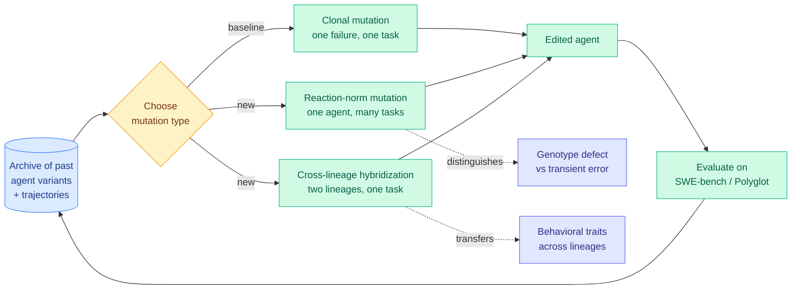

# Mendel Gödel Machine: self-modification from the archive, not from the last failure

**Source:** HuggingFace Daily Papers, 2026-08-12 · [arXiv 2608.07645](https://arxiv.org/abs/2608.07645) · [raw](../../raw/huggingface/2026-08-12-mendel-gdel-machine-recursive-self-improving-coding-agents-v.md)

**Authors:** Changzhi Liu (UESTC), Yilun Liu, Sikuan Yan, Volker Tresp, Yunpu Ma (LMU Munich / Munich Center for Machine Learning).

**TL;DR.** Self-improving coding agents rewrite their own source code. Every published version of the loop derives each rewrite from **one failure trajectory on one task**, which throws away everything the agent's archive of past attempts already knows. MGM adds two self-modification operators that read the archive instead. *Reaction-norm mutation* edits an agent using its trajectories across **multiple tasks at once**, so a recurring failure can be told apart from a one-off. *Cross-lineage hybridization* edits an agent using the trajectory of a **reference agent from a different lineage on the same task**, so a behavior that worked elsewhere can be transferred. The paper proves faster convergence under an additive fitness-landscape model, confirms it in controlled surrogate simulation, and reports consistent gains on SWE-bench and Polyglot.

---

---

## The argument

The genetics framing is not decoration, it is the actual claim. A **reaction norm** in biology is the pattern of phenotypes one genotype produces across a range of environments. Here the "environments" are tasks and the "phenotype" is the success-or-failure profile. The point is diagnostic: if an agent fails one task, the failure could be a defect in the agent or an accident of that task. If the same failure mode recurs across several tasks, it is a property of the agent. Conditioning a rewrite on a single trajectory cannot make that distinction, so single-trajectory loops spend edits fixing noise.

**Cross-lineage hybridization** targets the other waste. When several agents from different evolutionary branches attempt the same task, their divergent trajectories are a natural controlled comparison. A failing agent can be edited using a successful sibling's trajectory as the contrast, and the paper notes the case of comparing two *failing* trajectories to identify complementary weaknesses, which is the more interesting version because it does not require a success to learn from.

The theoretical result is under an **additive fitness landscape**, which is a strong assumption: it means an agent's fitness decomposes into independent per-component contributions. That is precisely the regime where recombining components from two lineages should help, so the proof is somewhat load-bearing on an assumption that favors the method. The controlled surrogate simulation is the honest part of the evidence; SWE-bench and Polyglot are the realistic part.

## How this relates to what the wiki already knows

**It is the first paper to improve the self-modification *operator* rather than the loop around it.** The [08-11 harness-evolution cluster](2026-08-11-harness-evolution-cluster.md) had three papers about the loop: **Ouroboros**, the self-developing coding agent whose tools, prompts and core implementation improve through reviewed commits, scoring 86.74% on Terminal-Bench 2.1 with a 161-day live deployment; **Evo-Bench**, which isolates harness-evolving skill from base-model strength and finds up to 16.6 absolute points but reports early saturation; and **A²E**, which finds no model-harness combination wins across all task types. All three take "the agent edits itself given a failure" as a primitive. MGM opens that primitive up and asks what evidence the edit should be conditioned on. That is a genuinely different axis and it means the two lines compose rather than compete.

**And it is a candidate explanation for Evo-Bench's early saturation, which this wiki called "the single most important unexplained result" on the self-evolving page.** If each cycle conditions on one trajectory, the edits are high-variance and largely corrective of noise, so the improvement curve should flatten once the easy single-trajectory-visible defects are gone. MGM's whole premise is that the archive contains signal that single-trajectory conditioning cannot see. The falsifiable version: **run Evo-Bench with MGM's operators and see whether the saturation point moves.** The paper does not do this, and it is the experiment that would matter most.

**Its convergence claim sits awkwardly next to the day's benchmark results.** MGM reports "consistent improvement in performance, efficiency and generalizability" on SWE-bench, and [SWE-Bench ProMax (08-11)](2026-08-11-swe-bench-promax.md) cited an audit finding **nearly 60% of unsolved SWE-bench Verified instances contain flawed tests**, with frontier models able to reproduce gold patches verbatim from training data. An evolutionary loop optimizing against a partly broken fitness signal will happily evolve toward the broken part. Nothing in MGM's design detects that, and its archive-based operators arguably *amplify* it, because a defect that reliably pays off across many tasks is exactly what a reaction-norm mutation is built to lock in.

**Cost remains unpriced, which is now the standing complaint on this entire page.** Reaction-norm mutation requires trajectories on multiple tasks per edit and cross-lineage hybridization requires maintaining multiple lineages. Both are strictly more expensive per modification step than clonal mutation. Faster convergence *in cycles* is not the same as faster convergence *in dollars*, and the abstract reports the former. This is the same omission the concept page recorded against Ouroboros, Evo-Bench and A²E, and the same one [SkillZip (08-12)](2026-08-12-skillzip-skill-compression.md) partially closes on the memory side.

## Gaps

- **No token or dollar accounting**, so "faster and better convergence over single-trajectory baselines" is measured in the currency that flatters the method.
- **The additive fitness landscape assumption is the one under which recombination provably helps.** Real agent code has strong interactions between components; the theory says nothing about the non-additive case, and no empirical check of additivity is reported.
- **Lineage diversity is not characterized.** Cross-lineage hybridization needs genuinely different lineages, and nothing reports whether the population stays diverse or collapses, which is the classic failure of evolutionary search.
- **Evaluated on SWE-bench, whose validity was challenged on this wiki one day earlier.** Polyglot partially offsets this.

## Related

- [self-evolving-agents.md](self-evolving-agents.md) · [agent-benchmarks.md](agent-benchmarks.md)
- [Harness evolution cluster: Ouroboros, Evo-Bench, A²E (08-11)](2026-08-11-harness-evolution-cluster.md)
- [Co-Evolution in agentic systems survey (08-12)](2026-08-12-co-evolution-survey.md)
- [SWE-Bench ProMax (08-11)](2026-08-11-swe-bench-promax.md)
- [Daily digest 2026-08-12](../daily-digest/2026-08/2026-08-12.md)
