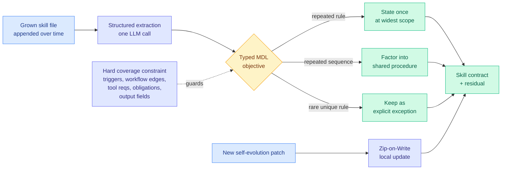

# SkillZip: Evaluation-Free Skill Compression for Self-Evolving Agents

**Source:** HuggingFace Daily Papers, 2026-08-12 · [arXiv 2608.11079](https://arxiv.org/abs/2608.11079) · [raw](../../raw/huggingface/2026-08-12-skillzip-evaluation-free-skill-compression-for-self-evolving.md)

**TL;DR.** A self-evolving agent grows its skill file by appending: every success adds a procedure, every failure adds a fix. Nobody ever removes anything. SkillZip observes that the resulting artifact is not just long, it is *structurally redundant*: the same requirement gets restated in several branches, examples and warnings, and common action sequences get copied rather than referenced. It compresses a skill by finding the shortest faithful structural explanation of it, under a typed minimum-description-length objective with a hard coverage constraint, and it does this **without running a single task**. That last part is the contribution. Every prior compression method for this setting is evaluation-guided: it proposes a shorter skill and tests whether behavior survives, which costs rollouts and makes the result dependent on whichever tasks happened to be in the compression-time evaluation set.

---

---

## What the paper actually argues

**Generic prompt compression is the wrong tool, and the paper is specific about why.** A skill is not a flat passage of text where you can drop the least informative sentences. It has parts that do different jobs and fail differently when damaged. The name and description decide *when the skill applies*, so damaging them causes mis-triggering. The workflow controls *execution order*. Tool and output contracts constrain *validity*, so damaging them produces well-formed but rejected calls. And rare exceptions may be load-bearing even though no sampled task activates them, which is exactly the case a sampling-based compressor deletes first because it looks like dead weight.

**The intuition is "explain once, reference many."** State a repeated rule a single time at the scope where it actually applies rather than in every branch that inherits it. Factor a repeated action sequence into one shared procedure. Then keep only the genuine differences as explicit exceptions. Formalized, this is a typed minimum-description-length problem: find the smallest (contract, residual) pair that still explains the original skill, subject to a hard coverage constraint over every extracted trigger, workflow edge, tool requirement, obligation and output field.

**The coverage constraint is what makes evaluation-free viable.** Because coverage is checked structurally rather than behaviorally, unique rare rules are preserved *by construction* instead of by hoping a test hits them. That flips the usual safety argument: the sampling-based method can only promise that behavior survived on the tasks it sampled, while SkillZip can promise that no extracted element was dropped, on all of them.

**Two modes.** One-shot runs a single structured extraction call and then deterministic optimization. **Zip-on-Write** is the more interesting one for deployment: it integrates each self-evolution patch as it arrives, without replaying tasks or reparsing the full history. The MDL formulation yields simple sharing thresholds, which is what makes those local updates cheap.

The paper reports gains on compression ratio, generalization across skills, and cost overhead. It does not, in the abstract, give a single headline number.

---

## How this relates to what the wiki already knows

**It answers an open problem this wiki wrote down two weeks ago, and it answers it awkwardly.** The [self-evolving-agents concept page](self-evolving-agents.md) closed its 07-27 section with: "does a self-expanding skill library reach genuinely new territory, or does it saturate and refine what it already covers? Every paper in this cluster reports downstream benchmark gains; none reports library growth or coverage over time." SkillZip is the first paper to look directly at the grown artifact, and what it finds is not new territory. It finds duplication. The premise of the entire method is that the library is *substantially compressible*, which is a measurement of redundancy standing in for the coverage curve nobody has plotted. That is evidence for the saturation branch of the question, though the paper frames it as an engineering problem rather than an epistemic one and never plots growth against coverage either.

**It also fills the cost hole the 08-11 harness cluster left open.** That page recorded, of Ouroboros, Evo-Bench and A²E: "Cost is the unpriced variable across all three. Neither the 16.6-point gain nor Ouroboros's records are reported in tokens or dollars." SkillZip is the first paper in the cluster whose *objective function is the cost*. It does not price the evolution loop, but it prices the artifact that loop produces, which is the recurring half of the bill: a skill is injected on every step, forever, while evolution is paid once.

**It is the structural counterpart to two memory papers from 08-11.** [RoMeRL (08-11)](2026-08-11-romerl-reduced-order-memory.md), which replaced trajectory-indexed memory with a fixed-dimensional per-task utility state and cut the store 84.4%, and [Agent Memory Distillation (08-11)](2026-08-11-agent-memory-distillation.md), which builds a small agent's store from a large teacher's *successful* trajectories to avoid a cold-start store full of failures, both bound memory by allocating a fixed budget. SkillZip bounds it by removing redundancy from an unbounded one. Three papers in two days treating agent memory as something to be sized rather than accumulated is the pattern, and this wiki flagged the first two as "allocated-not-accumulated." SkillZip is the third position: *deduplicated*, not allocated.

**The sharpest confirmation arrived the same day from industry, not from a paper.** IBM Research's [ALTK-Evolve post (08-11)](2026-08-12-altk-evolve-selective-context-delivery.md) attacks the identical bottleneck by a different route, selective delivery rather than structural compression, and reports the number SkillZip's abstract withholds: on AppWorld, **263K tokens per task against ACE's 634K at higher accuracy** on DeepSeek-V3.2, and **116K against 777K** on GPT-oss-120b. Two independent groups deciding on the same day that the accumulated agent playbook is the cost line is the strongest signal on this page today.

**The unaddressed risk is inherited from SkillJack.** A compressed skill is still prose, so it remains on the wrong side of the [copyable-context trilemma (08-03)](../responsible-ai/2026-08-03-copyable-context-safety-trilemma.md), and [SkillJack (08-05)](../responsible-ai/2026-08-05-skilljack-persistent-skill-backdoors.md) showed detection of a poisoned skill collapses from 98.5% on the source trajectory to 11.4% on the extracted skill, with 80% of attacks surviving deletion of the source records. SkillZip performs another abstraction step on top of that one, merging rules across branches, and merging is precisely the operation that would launder a poisoned rule into a shared procedure that many branches now reference. The paper does not discuss adversarial input.

## Gaps

- **No behavioral floor is reported for the evaluation-free claim.** Structural coverage guarantees no extracted element was dropped; it does not guarantee the compressed skill *induces the same behavior*, because meaning can shift when a rule is hoisted to a wider scope. The paper needs a held-out task comparison against an evaluation-guided compressor to show the guarantee is not weaker in practice than the thing it replaces.
- **Extraction is an LLM call, so the typed structure is model-inferred.** Everything downstream, including the coverage guarantee, is only as sound as that one extraction. A missed trigger is not covered, because it was never extracted.
- **No compression-ratio-against-degradation curve.** Without it, there is no way to choose an operating point.
- **Zip-on-Write is not tested over a long evolution run.** The interesting failure mode is drift across many incremental merges, which is exactly what a local-update rule risks and exactly what a one-shot evaluation cannot show.

## Related

- [self-evolving-agents.md](self-evolving-agents.md) · [agent-memory.md](agent-memory.md)
- [ALTK-Evolve: selective context delivery (08-12)](2026-08-12-altk-evolve-selective-context-delivery.md)
- [SKILL-KD (08-06)](2026-08-06-skill-kd-contrastive-skill-distillation.md) · [RoMeRL (08-11)](2026-08-11-romerl-reduced-order-memory.md) · [Agent Memory Distillation (08-11)](2026-08-11-agent-memory-distillation.md)
- [Daily digest 2026-08-12](../daily-digest/2026-08/2026-08-12.md)
