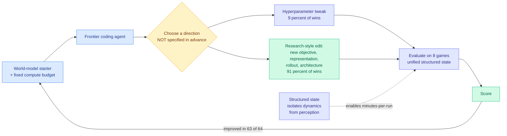

# AutoWorldModel-Bench: A State-Centric Benchmark for Automated World-Model Research

**Source:** [arXiv 2608.11216](https://arxiv.org/abs/2608.11216) · [HuggingFace](https://huggingface.co/papers/2608.11216) · [raw](../../raw/huggingface/2026-08-13-autoworldmodel-bench-a-state-centric-benchmark-for-automated.md)

## TL;DR

Almost every agent benchmark measures **engineering-to-spec**: here is a task with a defined correct answer, close the gap. This one measures something else. A frontier coding agent is handed a working world-model starter (a model that predicts how an environment evolves), a fixed compute budget, and no specification of what "better" means beyond the metric. It has to decide for itself what research direction to pursue.

World modeling was chosen deliberately because it is unsettled: architectures, training objectives, and state representations interact in complicated ways and no recipe dominates. So there is no known right answer for the agent to recover.

The benchmark spans **eight game environments under a unified structured-state representation**, ground-truth entity state extracted from each game and consumed through a shared tensor format. That choice does two things. It **isolates dynamics modeling from perception**, so the agent is not accidentally being scored on vision. And it makes runs take minutes rather than hours, which is what makes a closed-loop research benchmark affordable at all.

Across **64 sessions, Codex-5.4 and Claude Opus 4.6 improved their starter on 63.** More interesting: in **91% of sessions the winning edit was a non-trivial research-style modification**, a new objective, representation, rollout procedure, or architectural change, rather than a hyperparameter tweak.

---

---

## Key findings

- **63 of 64 sessions improved the starter.** Whatever else is true, frontier coding agents reliably make forward progress on an open-ended research objective under a compute budget.
- **91% of winning edits were research-style, not hyperparameter tuning.** This is the finding that separates the benchmark from an AutoML result. The agents changed the objective, the representation, the rollout procedure, or the architecture.
- **Structured state is the design move worth stealing.** Extracting ground-truth entity state and feeding it through a shared tensor format removes perception as a confound and collapses run time to minutes, which is what makes closed-loop iteration measurable at all.
- **Open-ended beats engineering-to-spec as a target.** The benchmark's stated contribution is the evaluation setting rather than any model result, and that framing is correct.

## How this relates to prior wiki pages

**This is the benchmark the self-improvement cluster has needed and kept not building.** [Mendel Gödel Machine (08-12)](2026-08-12-mendel-godel-machine.md) improved how a self-editing coding agent conditions its rewrites, moving from a single failure trajectory to the agent's accumulated archive. The [08-11 harness evolution cluster](2026-08-11-harness-evolution-cluster.md) covered Ouroboros (a self-developing agent at 86.74% on Terminal-Bench 2.1 across a 161-day live deployment), Evo-Bench, and A²E. All of those measure an agent improving **itself**. AutoWorldModel-Bench measures an agent improving **something else** under an unspecified objective, which separates the research-direction faculty from the self-modification faculty. Those have been conflated, and this makes them independently measurable.

**It is a partial answer to Evo-Bench's unexplained early saturation**, which [yesterday's digest](../daily-digest/2026-08/2026-08-12.md) called the most important open result in the area. If agents plateau quickly at self-improvement but reliably improve an external artifact 63 times out of 64, the plateau is more likely about the evidence available for self-editing than about a ceiling on the agents' research ability. That is a testable distinction and this benchmark is half of the test.

**It stands against the same board's negative results, and the contrast is sharp.** [The 08-12 benchmark cluster](2026-08-12-agent-benchmark-cluster.md) found the best agent completing **56.70% of real data-science workflows with every open-source agent below 1%**, and SPIEval finding **79% of failures are inaccurate information localization**. Yet here agents make research-grade progress in 91% of sessions. The reconciliation is probably that this task has a **dense automatic reward signal** and a clean, pre-parsed state representation, and the data-science benchmark has neither. That is not a criticism of either result, it is the most informative thing on the board: agents do well exactly where the environment does the grounding for them.

## Gaps in the study

**"Research-style modification" is the load-bearing term and it is a classification, not a measurement.** A new objective function that happens to help on eight game environments is a research-style edit by the paper's taxonomy and could still be search over a small space of known tricks. The paper does not report whether the winning edits were novel relative to the world-modeling literature, and that is the difference between a benchmark for research ability and a benchmark for recall of the literature the agent was trained on.

**Two agents, both frontier and both closed.** With no open-model results there is no capability gradient, so the benchmark cannot yet tell whether it discriminates. A benchmark where the only two entrants both succeed 98% of the time has limited headroom to measure the next thing.

**Structured state is a real limitation as well as a design win.** Removing perception makes the measurement clean and also removes the part of world modeling that most current systems find hardest, so success here does not transfer to the pixel setting the phrase "world model" usually implies.

## Industrial implication

The near-term use is not the benchmark, it is the **protocol**: give an agent a working baseline, a fixed compute budget, a fast automatic metric, and no direction, then measure what fraction of sessions produce a non-trivial improvement. Any team with an internal model and a fast eval can run that this quarter, and the resulting number is a far better procurement signal than a leaderboard score, because it measures the thing you would actually buy an autonomous agent to do.

The condition that makes it work is also the constraint on where to deploy it: **minutes-per-run and a dense automatic metric**. Where an eval takes hours or requires human judgment, this loop does not close, and the 63-of-64 result should not be expected to carry over.

---

**Related:** [Agent Benchmarks](agent-benchmarks.md) · [Self-Evolving Agents](self-evolving-agents.md) · [Mendel Gödel Machine](2026-08-12-mendel-godel-machine.md) · [Harness Evolution Cluster](2026-08-11-harness-evolution-cluster.md) · [Digest 2026-08-13](../daily-digest/2026-08/2026-08-13.md)
