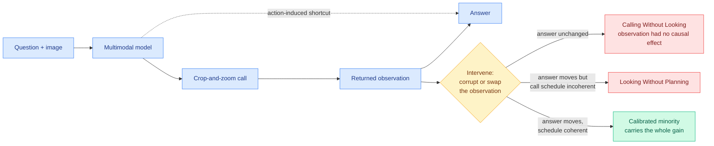

# The Illusion of Visual Tool-Use: A Causal Audit of Thinking with Images

**Source:** [arXiv 2608.06270](https://arxiv.org/abs/2608.06270) · [HuggingFace](https://huggingface.co/papers/2608.06270) · [code](https://github.com/OpenCausaLab/CauAudit) · [raw](../../raw/huggingface/2026-08-13-the-illusion-of-visual-tool-use-a-causal-audit-of-thinking-w.md)

## TL;DR

"Thinking with images" is the paradigm where a multimodal model can actively operate on an image mid-reasoning, most commonly crop-and-zoom into a region it wants a closer look at. It reports accuracy gains, so it has been widely adopted. This paper asks a question nobody had asked: **when the model crops a region and receives the zoomed patch back, does that returned image actually change the answer?**

The method is a causal audit rather than an accuracy comparison. Visual tool-use is formalized as a causal graph separating **observation-mediated paths** (the answer changed because of what the crop showed) from **action-induced shortcuts** (the answer changed merely because the model took an action, regardless of what came back). Three intervention levels test it: **policy** (tool-use versus direct inference), **trajectory** (corrupt every observation during a rollout and see whether the answer moves), and **step** (counterfactually swap one individual observation under a fixed prefix). The step-level estimand, **Visual Evidence Gain**, isolates the contribution of each returned observation.

Across six models and five fine-grained perception benchmarks, the result is two named failure modes. **Calling Without Looking**: the returned observations have no causal effect on the answer at all. **Looking Without Planning**: the observations are genuinely informative, but the schedule of when to call is incoherent. A trajectory-level diagnostic decomposes the aggregate accuracy gain and finds it concentrated in a **calibrated minority** of rollouts. Hence the title: the aggregate number is real, and it is not evidence that the mechanism works.

---

---

## Key findings

- **Aggregate accuracy gains from visual tool-use are real but not causally attributable to the visual evidence** across a broad range of rollouts. The gain concentrates in a calibrated minority.
- **Two distinct failure modes, with different fixes.** Calling Without Looking is a grounding problem: the model is not conditioning on what came back. Looking Without Planning is a scheduling problem: the evidence is useful but arrives at the wrong point in the reasoning.
- **The token cost is paid regardless.** The paper's opening observation is that these operations often deliver marginal or negative gains at substantially higher token cost, and that models repeatedly crop irrelevant regions and fail on questions direct inference answers correctly.
- **Visual Evidence Gain is a reusable instrument.** A step-level counterfactual under a fixed prefix is a general recipe for auditing any tool call, not just a visual one.

## How this relates to prior wiki pages

**This is the causal version of a failure this wiki measured behaviorally the day before.** [SPIEval, in the 08-12 benchmark cluster](2026-08-12-agent-benchmark-cluster.md), found **79% of agent failures are inaccurate information localization** and **fewer than 2% of retrieval actions use any advanced search method**: agents largely do not look, then commit to a plausible guess. This paper shows the harder version of the same pathology. Here the agent *does* look, receives the evidence, and still does not condition on it. "Not searching" and "searching without using the result" are separable defects, and the second one is invisible to any evaluation that only counts tool calls.

**It falsifies the cheapest available proxy for agent quality.** [Tool calling](tool-calling.md) as a concept page has accumulated several papers that treat tool-invocation rate or tool-selection accuracy as a capability signal. This result says neither measures what it claims: an agent can invoke the right tool, get the right observation, and route around it entirely. Any harness that scores agents on whether they used a tool is scoring an action-induced shortcut.

**It sharpens the evidential-face argument in [Agent Safety Should Be a Runtime Contract (08-13)](2026-08-13-agent-safety-runtime-contract.md), published the same day.** That paper proposes gating task submission on verifiable evidence that good actions happened. This one shows that evidence *arriving* is not the same as evidence *being used*, which means an evidence chain that only checks a log capture exists would pass a Calling Without Looking trajectory cleanly. The two papers compose into a sharper requirement than either states: the gate has to check that the evidence changed something.

**Cost intersection.** The gains being concentrated in a calibrated minority means the token spend on the non-calibrated majority is pure waste, which puts this in the same category as [ALTK-Evolve (08-12)](2026-08-12-altk-evolve-selective-context-delivery.md), where IBM reached 8.9 points higher accuracy at 41% of the token cost by delivering the agent playbook selectively rather than injecting it whole. Both find that the baseline was not merely wasteful but paying for context that did not help.

## Gaps in the study

The audit is diagnostic and stops short of a fix. It cleanly separates two failure modes with different remedies and proposes neither, so the most valuable follow-up, whether calibration can be trained or has to be scheduled by the harness, is left open. Second, **the finding is measured on fine-grained perception benchmarks**, which is the setting most favorable to crop-and-zoom, so it is unclear whether the calibrated minority grows or shrinks on tasks where the visual operation is less obviously the right move. Third, corrupting all observations during a rollout is a strong intervention, and a model that degrades gracefully under corrupted input may be doing something reasonable rather than ignoring the observation; the trajectory-level result would be sharper with a distributionally-plausible corruption alongside the destructive one.

## Industrial implication

If you are paying for a thinking-with-images stack, the actionable test is now cheap and the code is released: run the step-level counterfactual on a sample of your own traffic and find out what fraction of your rollouts are calibrated. That fraction is the share of your visual-tool token budget doing work. Given the paper reports the gain concentrating in a minority, the expected finding for most deployments is that a majority of the visual-tool spend can be cut with no accuracy loss by routing those queries to direct inference.

The broader lesson generalizes past vision. Any agent capability whose evidence is "accuracy went up when we turned it on" is vulnerable to this audit, and the audit is a counterfactual swap under a fixed prefix, which any team can run. **The class of results this method threatens is large, and most of it has not been checked.**

---

**Related:** [Tool Calling](tool-calling.md) · [Agent Safety Should Be a Runtime Contract](2026-08-13-agent-safety-runtime-contract.md) · [Agent Benchmark Cluster](2026-08-12-agent-benchmark-cluster.md) · [Digest 2026-08-13](../daily-digest/2026-08/2026-08-13.md)
