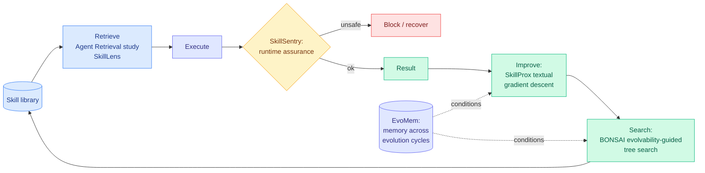

# The Kurate Skills Cluster: Six Papers, One Unit of Abstraction

**Source:** Kurate cs.AI weekly leaderboard, week of 2026-08-06 to 2026-08-11 · raw: [`raw/kurate/2026-08-13-cs-ai.md`](../../raw/kurate/2026-08-13-cs-ai.md), [`raw/kurate/2026-08-13-cs-lg.md`](../../raw/kurate/2026-08-13-cs-lg.md)

## TL;DR

Six of the twenty papers in this week's Kurate cs.AI leaderboard treat the **agent skill** as their primary object. Not the model, not the prompt, not the trajectory. The skill: a named, reusable, separately-storable unit of agent procedure. None of the six appeared in this week's HuggingFace Daily Papers, which is exactly the blind spot the cross-source rule exists to catch, and the cluster is more interesting than any of its members.

The six, by what they do to a skill:

| Paper | Operation on the skill | arXiv |
|---|---|---|
| **SkillSentry** | Guard it at runtime (reliable skill execution via runtime assurance) | [2608.09253](https://arxiv.org/abs/2608.09253) |
| **SkillProx** | Improve it (self-evolving skills via proximal textual gradient descent) | [2608.07449](https://arxiv.org/abs/2608.07449) |
| **SkillLens** | Retrieve it visually (visual skill cards for GUI action prediction + on-policy distillation) | [2608.10775](https://arxiv.org/abs/2608.10775) |
| **BONSAI** | Search over it (evolvability-guided tree search over skills) | [2608.07056](https://arxiv.org/abs/2608.07056) |
| **Agent Retrieval over Large Skill Libraries** | Find it at scale (comparative retrieval study) | [2608.06196](https://arxiv.org/abs/2608.06196) |
| **EvoMem** | Remember across it (memory-augmented evolution for code optimization) | [2608.10795](https://arxiv.org/abs/2608.10795) |

Two cs.LG entries sit alongside and both carry the inferred top-tier flag: **ReOrder-OPD** ([2608.10905](https://arxiv.org/abs/2608.10905)), reliability-aware prompt ordering for on-policy distillation, and **TideRL** ([2608.10402](https://arxiv.org/abs/2608.10402)), boosting agentic RL goodput with readiness-aware scheduling.

**Ranking caveat, stated up front:** every entry across both leaderboards sits at score=1200 with win_rate=0.0%, which is the TrueSkill baseline. The 3-LLM tournament had not run at scrape time, so **this week's Kurate ordering carries no quality signal** and these papers are selected on topic, not rank. This is the third consecutive week the tournament has been stale at scrape time.

---

---

## Why the cluster matters more than the papers

Six papers in one week performing six *different* operations on the same object is the signature of a unit of abstraction that has stabilized. Nobody is arguing about what a skill is any more. They are building the retrieval layer, the runtime guard, the improvement operator, the search procedure, and the cross-cycle memory around it, which is what a field does once it has agreed on its primitive.

Laid out as above, the six compose into a complete lifecycle with **no gaps and no overlaps**: retrieve, execute, guard, improve, search, remember. That is either genuine convergence or a naming convention doing the work, and the honest answer this week is that it cannot be distinguished, because none of the six cites the others and none is evaluated against another.

**This wiki has been tracking the skill as a unit since April** across [Corpus2Skill (04-18)](2026-04-18-corpus2skill-knowledge-navigation.md), [Ctx2Skill (05-05)](2026-05-05-ctx2skill-self-evolving-skills.md), the [skill curation cluster (05-09)](2026-05-09-skill-curation-cluster-strata-skill1-skillos.md), [SkillEvolBench (05-26)](2026-05-26-skillevolbench-episodic-to-procedural-skills.md), [SKILL-KD (08-06)](2026-08-06-skill-kd-contrastive-skill-distillation.md), and [SkillZip (08-12)](2026-08-12-skillzip-skill-compression.md). The threshold for declaring a pattern in this wiki is three papers making the same core architectural choice. This is well past it, and the observation to record is not that skills are a pattern but that **the skill lifecycle now has dedicated papers per stage**, which is a different and later phase of a field.

## The two efficiency entries

**ReOrder-OPD** is the one to actually track. On-policy distillation, where a student model learns from a teacher while generating its own rollouts, is the single most-covered method family in this wiki's 2026 record, with roughly a dozen summaries since [ReOPD (08-03)](../inference-efficiency/2026-08-03-reopd-prefix-replay-distillation.md). Nearly all of them refine *which* tokens or trajectories carry signal: [CRPO (08-04)](../inference-efficiency/2026-08-04-crpo-contrastive-privileged-self-distillation.md) sorts by predictive entropy, [Privileged-but-Biased (08-10)](../inference-efficiency/2026-08-10-privileged-but-biased-self-distillation.md) shows privileged teachers inject their own bias. ReOrder-OPD proposes a different axis entirely: **the order the prompts arrive in**, weighted by reliability. That is a curriculum claim rather than a filtering claim, and it is the first in the cluster to touch scheduling.

It also rhymes with a result from a completely different subfield the day before. [From Sweep to Seam (08-12)](../inference-efficiency/2026-08-12-icbq-interleaved-cross-block-quantization.md) found that in post-training quantization the **schedule, not the quantizer**, separates a usable 1.58-bit model from a broken one, because a left-to-right sweep bakes early error into every later block. Two papers in two days, in distillation and in quantization, both finding that the order of local operations is the underexploited lever. That is a pattern worth naming and neither author knows about the other.

**TideRL** attacks agentic RL **goodput**, the fraction of a training run's compute that produces usable gradient, via readiness-aware scheduling. Long-horizon agent rollouts finish at wildly different times, so a synchronous batch waits on its slowest trajectory and the accelerators idle. This is a systems paper wearing an RL title, and it belongs to the same cost-of-agent-training story as the harness work.

## Gaps across the cluster

The whole cluster shares one omission and it is the important one. **Not one of the six reports a cost.** Retrieval over a large skill library has an index cost, runtime assurance has a per-action tax, textual gradient descent has an LLM call per step, tree search over skills multiplies everything, and cross-cycle memory grows without bound. The skill exists as a unit largely because it is a **context-injection artifact**, which [SkillZip (08-12)](2026-08-12-skillzip-skill-compression.md) and [ALTK-Evolve (08-12)](2026-08-12-altk-evolve-selective-context-delivery.md) both established is a recurring bill rather than a one-time one: ALTK-Evolve reached 8.9 points higher accuracy at **41% of ACE's token cost** purely by changing delivery. A lifecycle built on that artifact with no cost accounting anywhere in it is measuring only half of its own subject.

Second, the safety layer is thin. **SkillSentry is the only one of the six guarding anything**, and it guards execution rather than content. [SkillJack (08-05)](../responsible-ai/2026-08-05-skilljack-persistent-skill-backdoors.md) measured detection of a poisoned skill collapsing from **98.5% on the source trajectory to 11.4% on the extracted skill**, with 80% of attacks surviving deletion of the source records. Five of these six papers perform exactly that extraction-and-abstraction step and none of them checks what came through.

## Industrial implication

For anyone running a skill library in production, the practical ordering is the reverse of the research attention. The cluster spends five papers on improving and searching skills and one on guarding them, while the deployed problem is retrieval quality and library hygiene: [the practitioner finding that 33% of 7,944 public Claude Code skills make an agent worse than no skill at all](../media-zone/2026-08/2026-08-13.md) says curation dominates generation at current library sizes. **The comparative retrieval study is the least glamorous of the six and the most immediately usable.**

Falsifiable version: if the skill lifecycle is real convergence rather than a naming convention, a paper composing at least three of these stages and evaluating end to end should appear within 90 days. If the six stay unaware of each other through the next two Kurate cycles, the shared vocabulary is coincidence and the cluster is an artifact of a popular word.

---

**Related:** [Self-Evolving Agents](self-evolving-agents.md) · [Agent Harness Engineering](agent-harness-engineering.md) · [Knowledge Distillation](../inference-efficiency/knowledge-distillation.md) · [SkillZip](2026-08-12-skillzip-skill-compression.md) · [Digest 2026-08-13](../daily-digest/2026-08/2026-08-13.md)
