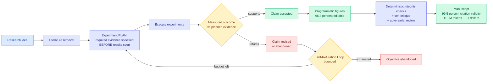

# Spark-to-Paper: End-to-End Research Paper Generation as a Composable Skill

**Source:** [arXiv 2608.11924](https://arxiv.org/abs/2608.11924) · [HuggingFace](https://huggingface.co/papers/2608.11924) · [raw](../../raw/huggingface/2026-08-13-spark-to-paper-end-to-end-research-paper-generation-as-a-com.md)

## TL;DR

A system that takes a research idea to a finished paper: retrieve the literature, design and run the experiments, revise the claims against what the experiments actually returned, produce publication-ready figures, and hold the whole thing consistent across a long generation. The architectural choice is the interesting part. It is implemented as **thirteen composable skills inside an existing coding assistant**, with no separate agent platform and no orchestration service.

Two separations carry the design. First, **model-based judgment is split from deterministic operations** that can be executed and checked, so anything verifiable is verified by code rather than by an LLM's opinion. Second, and more unusual, **experiment planning is separated from reporting**: the required evidence is specified *before* results are observed, and manuscript claims are then revised according to measured outcomes. That is preregistration, implemented as a control-flow constraint.

The system also names and bounds a failure mode it calls the **Self-Refutation Loop**, where repeated experiments keep rejecting the original research objective and the system would otherwise spin forever trying to rescue it.

The numbers are unusually complete for this genre. **99.5% citation validity. 96.4% figure editability.** A controlled ablation raises fabrication detection from **14% for a single-pass draft to 92% with the full integrity and review stack**, with adversarial review at **74% precision**. And the cost line, which almost nobody publishes: **11.9M tokens, $8.1 per manuscript, 3.2 hours on average.**

---

---

## Key findings

- **$8.1 and 3.2 hours per manuscript, 11.9M tokens.** Publishing the cost is the paper's quiet contribution. Almost no agentic-research system reports one, which makes cross-system comparison impossible and lets expensive methods hide behind accuracy tables.
- **Fabrication detection goes from 14% to 92%** between a single-pass draft and the full integrity stack. That is the ablation that justifies the whole architecture: the scaffold is doing the work, not the model.
- **99.5% citation validity** is the headline reliability number, and it is achieved by making citation checking a deterministic operation rather than a judgment call.
- **No separate agent platform.** Thirteen skills inside an existing coding assistant, which is an argument that the orchestration-service layer many agent frameworks sell may be unnecessary for long-horizon work.
- **Preregistration as a control-flow property.** Specifying required evidence before observing results is a mechanical block on the most common form of research self-deception, and it costs nothing to enforce once the pipeline is structured for it.

## How this relates to prior wiki pages

**This is the constructive counterpart to [Agent Safety Should Be a Runtime Contract (08-13)](2026-08-13-agent-safety-runtime-contract.md), published the same day.** That paper argues the evidential face of agent safety requires gating task submission on verifiable proof that good actions happened, and calls for exactly this: deterministic integrity checks, citation grounding, checkable artifacts. Spark-to-Paper is a working instance with the ablation attached. The 14%-to-92% fabrication-detection jump is, in that vocabulary, a measurement of what an evidence chain buys, and it is the only such number this wiki has.

**It sits in the skills-as-unit lineage this wiki has tracked since April,** including [Corpus2Skill (04-18)](2026-04-18-corpus2skill-knowledge-navigation.md), [Ctx2Skill (05-05)](2026-05-05-ctx2skill-self-evolving-skills.md), and the [skill curation cluster (05-09)](2026-05-09-skill-curation-cluster-strata-skill1-skillos.md). Those papers built skills as reusable procedural memory for an agent. Spark-to-Paper uses skills as **decomposition units for a single long task**, which is a different and more prosaic use: the thirteen skills are not learned or evolved, they are written, and their value is that each is separately checkable. Given [the practitioner finding that 33% of 7,944 public Claude Code skills make an agent worse than no skill at all](../media-zone/2026-08/2026-08-13.md), a hand-designed thirteen-skill decomposition with a measured integrity stack is a useful counterexample to the "more skills is better" default.

**It is the same architectural bet as [AI4AI (08-13)](../inference-efficiency/2026-08-13-ai4ai-test-time-harness-transfer.md), stated for a different task.** AI4AI found that a harness transfers capability by offloading unstable model reasoning into deterministic code. Spark-to-Paper's first design principle is separating model-based judgment from deterministic operations that can be executed and checked. Two papers on the same board, in different subfields, both concluding that the win comes from **taking decisions away from the model** rather than from the model deciding better.

**It bounds a failure mode [xCientist (06-18)](2026-06-18-xcientist-research-harness-claim-drift.md) identified.** That paper on research harnesses named claim drift, where a system's stated conclusions gradually detach from what its experiments showed. Spark-to-Paper's plan-before-results separation is a direct structural fix, and the Self-Refutation Loop is the adjacent failure it also had to bound.

## Gaps in the study

**Eight controlled research topics is a small and self-selected evaluation.** Nothing is reported about whether the topics were chosen for tractability, and the difference between a research question a pipeline can close in 3.2 hours and one that takes a lab a year is the whole question. The system measures process integrity, not research value: 99.5% citation validity and 96.4% figure editability say the manuscript is well-formed and honestly grounded, and say nothing about whether the finding is worth having.

**Adversarial review at 74% precision is the weak link** and it is the last gate. A quarter of what it flags is a false positive, and the recall is not reported at all, so the fraction of real fabrications that slip through is unknown. That matters more than the precision figure for a system whose selling point is integrity.

The cost figure also deserves a caveat the paper does not give it: $8.1 covers the generation, not the human time to determine whether the resulting paper is correct, and the entire economic argument depends on that second number being small.

## Industrial implication

The transferable piece is not paper generation. It is the **preregistration pattern**: specify the evidence that would satisfy a claim before running the thing that produces the evidence, and make the pipeline enforce the ordering. That applies to any agent doing analysis where the agent also writes the summary, which describes most production analytics agents shipping right now, and it is a harness change rather than a model change.

The second transferable piece is that **thirteen skills inside a coding assistant beat a dedicated orchestration platform** for a genuinely long-horizon task. If that replicates, a meaningful slice of the agent-infrastructure market is selling a layer that a well-decomposed skill set makes redundant. The counter-argument is that this task has an unusually clean decomposition, and most production workflows do not.

---

**Related:** [Agent Harness Engineering](agent-harness-engineering.md) · [Self-Evolving Agents](self-evolving-agents.md) · [Agent Safety Should Be a Runtime Contract](2026-08-13-agent-safety-runtime-contract.md) · [AI4AI at Test-Time](../inference-efficiency/2026-08-13-ai4ai-test-time-harness-transfer.md) · [Digest 2026-08-13](../daily-digest/2026-08/2026-08-13.md)
