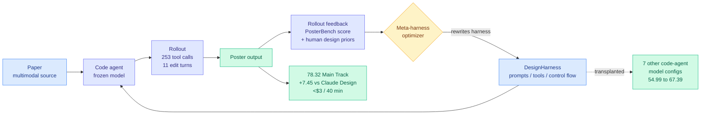

# AutoDesign: Meta-Harness Optimization for Long-Horizon Agentic Design

**Source:** [arXiv 2608.13560](https://arxiv.org/abs/2608.13560) · [HuggingFace](https://huggingface.co/papers/2608.13560) · [raw](../../raw/huggingface/2026-08-14-autodesign-meta-harness-optimization-for-long-horizon-agenti.md)

## TL;DR

AutoDesign takes the harness-as-trainable-object idea and adds the number the rest of the cluster keeps omitting: **$3, 253 tool calls, 11 editing turns, 40 minutes, fully autonomous, producing average conference-poster quality in human evaluation.** The task is academic paper-to-poster generation, chosen because it is a genuinely long-horizon design problem where the output is judged by taste rather than by a unit test. The framework is a **meta-harness optimizer**: an outer loop that reads rollout feedback and rewrites the harness a code agent runs inside, rather than rewriting the agent's prompt or fine-tuning the model.

The empirical claim has two parts. On the new **PosterBench** Main Track (100 papers across five disciplines, plus a shared 10-paper PosterBench-mini for controlled comparisons), AutoDesign scores **78.32, beating the closed-source commercial system Claude Design by 7.45 points**. More interestingly, the harness it learns is *portable*: dropping the learned **DesignHarness** into seven different code-agent-model configurations lifts the average PosterBench score from **54.99 to 67.39 (+12.4%)** across all seven. A system-blind human study puts it first on preference.

That portability result is the one worth keeping. It says the thing being learned is not a model-specific prompt trick but a reusable artifact that improves whatever agent you attach it to.

---

---

## Key findings

- **78.32 on PosterBench Main Track, 7.45 points above Claude Design**, a closed commercial product. Beating a shipped product rather than an academic baseline is the stronger comparison.
- **The learned harness transfers across seven code-agent-model configurations**, lifting the average score 54.99 → 67.39. The harness, not the model, carries the gain.
- **Full cost disclosure: under $3 for 253 tool calls and 11 editing turns in 40 minutes**, in a fully autonomous loop with no human in it. This is the number the harness literature has been missing.
- **PosterBench is a design benchmark, not an engineering one.** Five disciplines, 100 papers, plus a 10-paper mini split for controlled ablations. The output is graded on human design preference, which means the verifier is soft. That is both the novelty and the weakness.
- **The framing is "align with human design priors, then accumulate reusable experience."** The optimizer is not searching freely; it is searching inside a space shaped by what designers already know.

## How this relates to prior wiki pages

**It is the cost half of the result [DarwinX (08-14)](2026-08-14-darwinx-harness-population-selection.md) reports without cost.** DarwinX evolves a population of harnesses over hard-verified benchmarks (Terminal-Bench, SWE-bench) and reports about 17 points of average gain with the model frozen, and no dollar figure anywhere. AutoDesign runs a single meta-optimizer over a soft-verified design task and reports the full bill. Read together they bound the practice: harness optimization moves frontier-tier accuracy by several points and costs single-digit dollars per rollout, so the [08-13 Looking Ahead](../daily-digest/2026-08/2026-08-13.md) prediction that someone would price harness-versus-fine-tuning substitution within 90 days is now partly answered from the harness side. The fine-tuning side of the comparison still has no number.

**It extends the "harness wins by taking decisions away from the model" mechanism claim on the [harness engineering concept page](agent-harness-engineering.md)** into a domain where that claim should have failed. [AI4AI at Test-Time (08-13)](../inference-efficiency/2026-08-13-ai4ai-test-time-harness-transfer.md) found its gains came from offloading unstable reasoning into deterministic code, routing per question type, and enforcing answer format, all of which reduce model discretion. [Spark-to-Paper (08-13)](2026-08-13-spark-to-paper-composable-research-skills.md) reached the same conclusion in research writing, separating model judgment from deterministic checkable operations and taking fabrication detection from 14% to 92%. Poster design is the case where you would expect *more* model discretion to help, since the output is aesthetic. AutoDesign's transferable DesignHarness suggests the opposite even here: the reusable part is the structure, not the taste.

**It is a soft-verifier counterexample to DarwinX's hard-verifier design.** DarwinX's fitness comes from "each benchmark's own verifier: no gold solutions, no hand-picked winners," which only works where a program can decide pass or fail. AutoDesign optimizes against a rubric score plus human preference. Whether meta-harness optimization degrades when the fitness signal is soft is the open question that separates these two papers, and neither tests the other's regime.

**Fifth harness-optimization paper in six days.** With [omarsar0's cost benchmark (08-13)](agent-harness-engineering.md), [AI4AI (08-13)](../inference-efficiency/2026-08-13-ai4ai-test-time-harness-transfer.md), [LongHorizon-Harness (08-13)](agent-harness-engineering.md), DarwinX and AutoDesign, the wiki's three-paper threshold for declaring a pattern is comfortably crossed. The pattern: **the harness is now optimized, not written.**

## Gaps

The benchmark grades posters, and posters are one of the least consequential long-horizon design tasks anyone could have picked. The paper's own framing ("transforming multimodal sources into condensed and structured media outputs") is much broader than what it evaluates. Whether DesignHarness transfers to slide decks, technical reports, or dashboards is untested, and those are the outputs that would make this commercially interesting.

The 78.32-versus-70.87 comparison against Claude Design is scored by PosterBench, which the same authors built. A benchmark introduced in the same paper that reports a win on it is a structural conflict, mitigated but not removed by the system-blind human study. The human study's size and rater pool are not stated in the abstract.

And the transfer result reports an *average* across seven configurations. A +12.4% average could be a uniform lift or one configuration moving 40 points while six move two, and those imply completely different things about what the harness encodes.

## Industrial implication

The commercially interesting artifact here is not the poster generator, it is the shape of the deliverable: a **learned harness as a distributable file** that improves any agent it is attached to. That is a product category. It behaves like a model adapter (portable, composable, cheap to ship) without touching weights, so it sidesteps licensing, hosting, and inference-cost questions entirely. If the transfer result holds beyond posters, expect a marketplace for task-specific harnesses within two quarters, and expect the first movers to be the agent-framework vendors rather than the labs, because the harness is their layer of the stack. The $3-per-rollout figure also sets a practical ceiling: at that price, running the meta-optimizer is cheaper than an hour of a designer's time, which is the comparison a buyer will actually make.

## Related pages

- [Agent harness engineering (loop, harness, graph)](agent-harness-engineering.md)
- [DarwinX: evolving harnesses by population selection (08-14)](2026-08-14-darwinx-harness-population-selection.md)
- [Self-evolving agents](self-evolving-agents.md)
- [Agent benchmarks](agent-benchmarks.md)
- [AI4AI at Test-Time (08-13)](../inference-efficiency/2026-08-13-ai4ai-test-time-harness-transfer.md)
