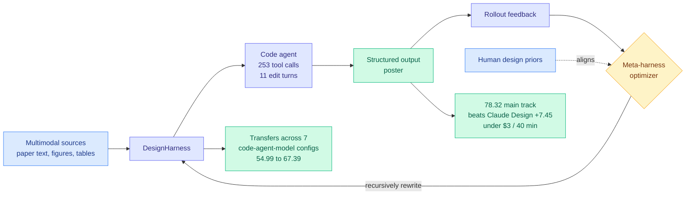

# AutoDesign: Meta-Harness Optimization for Long-Horizon Agentic Design

**arXiv:** [2608.13560](https://arxiv.org/abs/2608.13560) · **HF:** [paper page](https://huggingface.co/papers/2608.13560) · [raw](../../raw/huggingface/2026-08-14-autodesign-meta-harness-optimization-for-long-horizon-agenti.md)

## TL;DR

AutoDesign reframes "turn a messy pile of multimodal sources into a clean structured output" as a long-horizon agentic problem where the thing being optimized is the **harness**, not the model. Its structure is one level up from a self-improving agent: a **meta-harness optimizer** watches rollout feedback and guides a code agent to recursively rewrite the harness, with the optimizer explicitly aligned to human design priors rather than to a raw score.

The instantiation is academic paper-to-poster generation, evaluated on a new benchmark, **PosterBench** (100 papers across five disciplines, plus a 10-paper PosterBench-mini for controlled comparison). AutoDesign scores **78.32** on the main track, beating the closed-source commercial system Claude Design by **7.45 points**. The more interesting number is the transfer result: dropping the learned **DesignHarness** into seven different code-agent-model configurations lifts the average PosterBench score from **54.99 to 67.39**, a 12.4-point gain that holds across all seven. In a fully autonomous run it executes **253 tool calls and 11 editing turns in 40 minutes for under $3**, reaching average conference-poster quality in a system-blind human study where it also wins the highest human preference.

---

---

## Key findings

- **78.32 on PosterBench main track, 7.45 points above Claude Design**, a closed commercial system. Open harness optimization beating a commercial product on its own task.
- **The learned DesignHarness transfers across seven code-agent-model configurations**, lifting the average from 54.99 to 67.39. Consistency across all seven is what makes this a harness result rather than a tuning result.
- **Under $3 and 40 minutes for a full autonomous run** of 253 tool calls and 11 editing turns. The cost figure is the one to remember, because it makes the economics of "just re-run the harness" trivially favorable.
- **Highest human preference in a system-blind study.** Automated design scores and human preference agree here, which is not always the case in generation benchmarks.
- **The meta-level is the contribution.** A self-improving agent edits its harness; AutoDesign has a separate optimizer that decides how the harness should be edited, aligned to human design priors rather than to score alone.

## How this relates to prior wiki pages

**AutoDesign and [DarwinX (08-14)](2026-08-14-darwinx-harness-population-evolution.md) are the same insight applied at different levels, published the same day.** DarwinX evolves a population of harnesses under a preserve-and-extend contract with fitness from a benchmark's own verifier, and shows the result transfers unchanged from Terminal-Bench to SWE-bench. AutoDesign runs a meta-optimizer that guides a code agent to rewrite one harness, aligned to human design priors, and shows the result transfers across seven model-agent configurations. Both keep the model fixed, both make the harness the optimized object, and both prove their point by transfer rather than by benchmark score. Two independent groups converging on harness-as-optimization-target on the same day is a meaningful signal about where the field has moved.

**Together with [AI4AI (08-13)](../inference-efficiency/2026-08-13-ai4ai-test-time-harness-transfer.md), that is three papers in two days establishing the pattern.** AI4AI: a strong builder writes a harness for a weak target and nearly doubles accuracy with weights frozen. DarwinX: evolve a population of harnesses, transfers across benchmarks. AutoDesign: meta-optimize one harness, transfers across model configs. The wiki's threshold for declaring a pattern is three papers making the same core architectural choice, and it is crossed. The claim they jointly establish: **the harness is a transferable, optimizable artifact whose value is largely independent of the model it wraps.**

**It also gives the [harness evolution cluster (08-11)](2026-08-11-harness-evolution-cluster.md) its human-priors variant.** That cluster catalogued self-editing harness systems but all optimized against automated scores. AutoDesign's explicit alignment to human design priors is the first in this wiki to put a human-derived objective at the meta level, and the human-preference win suggests it matters.

## Gaps

Poster generation is a narrow and unusually forgiving task: it is visual, subjective, and has no correctness criterion that a bad output can violate catastrophically. The DesignHarness transfer result is across model configurations, not across *tasks*, which is the weaker of the two transfer claims and notably weaker than DarwinX's cross-benchmark transfer. PosterBench is introduced by the same authors who top it, and the abstract does not describe how the 78.32 score is composed or how much of the margin over Claude Design comes from dimensions a commercial system was not optimizing for. There is also no ablation separating the meta-optimizer's contribution from the code agent's raw capability.

## Industrial implication

The $3 / 40-minute figure is the practical headline: at that cost, harness optimization is cheap enough to run per-task rather than per-product. The plausible near-term productization is document and deck generation, where the harness-transfers-across-models result means a vendor can learn a harness once and keep swapping in cheaper models underneath as they appear, which is exactly the cost-optimization move that [today's routing and cost-per-task thread](../ai-industry/2026-08-14-alphasense-token-price-vs-task-cost.md) points at from the other direction.

## Source

`raw/huggingface/2026-08-14-autodesign-meta-harness-optimization-for-long-horizon-agenti.md`

## Related pages

- [Agent Harness Engineering](agent-harness-engineering.md)
- [DarwinX (08-14)](2026-08-14-darwinx-harness-population-evolution.md)
- [AI4AI at Test-Time (08-13)](../inference-efficiency/2026-08-13-ai4ai-test-time-harness-transfer.md)
