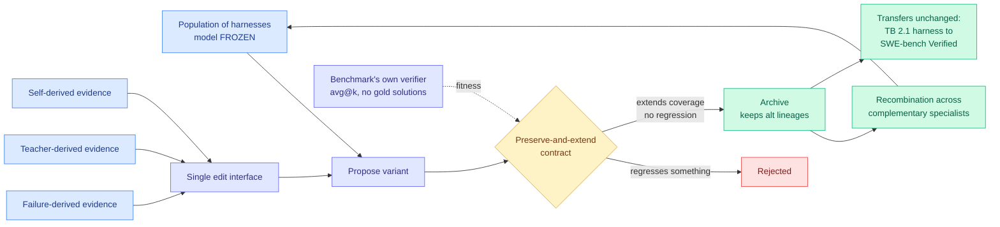

# DarwinX: Evolving Agent Harnesses Through Natural Selection

**arXiv:** [2608.07545](https://arxiv.org/abs/2608.07545) · **HF:** [paper page](https://huggingface.co/papers/2608.07545) · [raw](../../raw/huggingface/2026-08-14-darwinx-evolving-agent-harnesses-through-natural-selection.md)

## TL;DR

Self-improving agents already edit their own harnesses (the prompts, tools, skills, and control flow wrapped around a frozen model). Almost all of them do it as a **single lineage**: run rollouts, reflect on failures, propose an edit, gate it against a regression check, repeat. DarwinX (Salesforce AI Research and Agentforce) argues that shape has two structural problems. It is **path-dependent**, so an early edit that looks locally good can lock the agent onto a plateau. And it suffers **cross-task interference**, where an edit that helps one task family quietly regresses another, which is what makes single-lineage search stall as soon as the task distribution gets diverse.

DarwinX replaces the lineage with a **population under selection, model frozen throughout**. Three pieces do the work. A **preserve-and-extend contract** admits a variant only if it extends coverage *without regressing* anything already solved, which directly targets the interference problem. An **archive keeps alternative lineages alive** so complementary specialists can be recombined instead of one being discarded, which targets path dependence. And failure-derived, teacher-derived, and self-derived evidence all flow through **one shared edit interface**, so the system does not need three different improvement mechanisms. Fitness is measured by **each benchmark's own verifier**: no gold solutions, no hand-picked winners.

One evolution loop adds about **17 points on average** across four benchmarks chosen to progressively separate the evolution signal from the test. Terminal-Bench 2.1 rises +7.7 to **83.2%** on a matched base and to **84.7%** on a stronger one. TerminalWorld's held-out split reaches **68.3%**, ahead of every off-the-shelf agent. WebArena-Infinity real-task pass@1 goes from **43.5% to 93.0%** audit-clean. And a harness evolved on Terminal-Bench 2.1 **transfers unchanged to SWE-bench Verified**.

---

---

## Key findings

- **About +17 points on average from one evolution loop**, across four benchmarks designed so that the evolution signal is progressively separated from the test set. The benchmark design is the credibility move here.
- **Terminal-Bench 2.1: +7.7 to 83.2%** on a matched base, **84.7%** on a stronger base, reaching the verified frontier.
- **WebArena-Infinity pass@1: 43.5% to 93.0%**, described as audit-clean. This is a very large jump and the audit qualifier is doing important work.
- **A Terminal-Bench harness transfers unchanged to SWE-bench Verified.** This is the load-bearing result. It is the difference between evolving general agent competence and evolving benchmark-specific patches, and it is the claim single-lineage self-improvement systems have historically failed.
- **The model never changes.** All capability gain is in the scaffold. The paper's framing line: a frozen model need not be a fixed agent, and harness selection converts evaluation compute into durable capability.
- **The preserve-and-extend contract is the mechanism to steal.** It is a simple admission rule, and it is what turns a population search from "drift" into "monotone coverage growth."

## How this relates to prior wiki pages

**This is the population-based answer to a question the wiki asked one day ago.** [AI4AI at Test-Time (08-13)](../inference-efficiency/2026-08-13-ai4ai-test-time-harness-transfer.md) showed a strong builder model writing an inference-time harness for a weak target, taking Theory-of-Mind accuracy from 0.49 to 0.91 with the target's weights frozen, and its mechanism analysis found the gains came from offloading unstable steps into deterministic code, routing by question type, and enforcing answer format. AI4AI's harness was built by a single strong model in a single lineage against a 5% validation split. DarwinX asks what happens when you run that search as a population with an anti-regression admission rule instead, and the answer is that the resulting harness survives a change of task, verifier, *and* base model. AI4AI proved harness transfer works; DarwinX shows how to make it not overfit.

**It resolves, at least partially, the tension the [harness evolution cluster (08-11)](2026-08-11-harness-evolution-cluster.md) left open.** That cluster noted the field had converged on self-editing harnesses but that nobody had shown edits generalize past the benchmark they were evolved against. The cross-benchmark transfer to SWE-bench Verified is the first clean evidence in this wiki that they can. It also gives [SIA (06-08)](2026-06-08-sia-self-improving-harness-weights.md), which improves a harness through weight-like updates, and [HarnessForge (06-08)](2026-06-08-harnessforge-harness-policy-coevolution.md), which co-evolves harness and policy together, a shared diagnosis for why their single-lineage searches plateau.

**It resolves, one day early, the isolation experiment [yesterday's Looking Ahead](../daily-digest/2026-08/2026-08-13.md) asked for.** That bullet predicted someone would hold a single model fixed across multiple harnesses on Terminal-Bench within 60 days, because the public Terminal-Bench 3.0 leaderboard reports every row as a model-harness pair with tokens and dollars but **no model appears under two harnesses in the top ten**, so it demonstrates harness variation exists without measuring it. DarwinX runs that isolation on Terminal-Bench 2.1 rather than 3.0, and the isolated harness effect on a matched base is **+7.7 points**, roughly a third of the remaining error removed by scaffold changes alone. The prediction's falsification threshold was a spread under 2x meaning the harness discipline was oversold; on a relative-error reading this clears it, so the confound the prediction warned about in every model-versus-model leaderboard is now measured rather than hypothesized.

**It is the research twin of what industry shipped the same week.** [DeepSeek open-sourced Harness v0.1 (08-14)](../inference-efficiency/2026-08-14-deepseek-harness-kv-cache-economics.md) under MIT with multiple swappable harness modes and an append-only history discipline built to protect the KV cache, and [Grok 4.6 (08-13)](../ai-industry/2026-08-13-grok-4-6-step-efficiency.md) cut agent workflows from 103 steps to 53 after tuning its own harness. Research is now evolving harnesses automatically while industry is shipping them as products, in the same seven-day window.

**The frozen-model framing connects it to the distillation corpus.** Every on-policy distillation paper this wiki has tracked since April moves capability by changing weights. DarwinX and AI4AI move it by changing the program around the weights. Nobody has yet measured the two against each other at matched cost, which remains the most valuable unrun experiment in this area.

## Gaps

The 43.5% to 93.0% jump on WebArena-Infinity is large enough to deserve scrutiny that the abstract's "audit-clean" label does not fully supply. Population search is also expensive by construction: the paper reports capability gains but the abstract gives no evolution-compute budget, so the honest comparison against simply using a stronger base model is unavailable. "One loop adds about 17 points" leaves open whether loops compound or saturate immediately, which determines whether this is a one-time upgrade or a continuous improvement process. And the preserve-and-extend contract admits only non-regressing variants, which is a conservative rule that should in principle prevent the search from ever crossing a valley to reach a better basin; the paper does not discuss what that costs.

## Industrial implication

The deployable claim is that evaluation compute converts into durable capability without touching weights. For anyone serving a frozen open-weight model, this is a capability lever that does not require training infrastructure, does not require a GPU fleet, and produces an artifact (a harness) that is inspectable and version-controllable in a way a fine-tune is not. Combined with the transfer result, it suggests harnesses will become shipped, shared, and eventually traded artifacts. Ken Huang's [Harness Engineering (08-13)](agent-harness-engineering.md) argues the harness is the product boundary; DarwinX makes it an *optimizable* product boundary.

## Research angle

- **Harness evolution versus fine-tuning at matched compute.** The unrun experiment. Both produce a capability delta on a frozen-ish system; nobody has put them on the same cost axis.
- **Do loops compound?** Run five evolution loops and report the curve. If gains compound, this is a very different result from a one-shot +17.
- **Does the anti-regression contract trap the search?** A variant admission rule allowing temporary regression with a longer-horizon fitness check would test whether the conservative contract is leaving performance on the table.

## Source

`raw/huggingface/2026-08-14-darwinx-evolving-agent-harnesses-through-natural-selection.md`

## Related pages

- [Agent Harness Engineering](agent-harness-engineering.md)
- [AI4AI at Test-Time (08-13)](../inference-efficiency/2026-08-13-ai4ai-test-time-harness-transfer.md)
- [Harness evolution cluster (08-11)](2026-08-11-harness-evolution-cluster.md)
- [AutoDesign: meta-harness optimization (08-14)](2026-08-14-autodesign-meta-harness-optimization.md)
