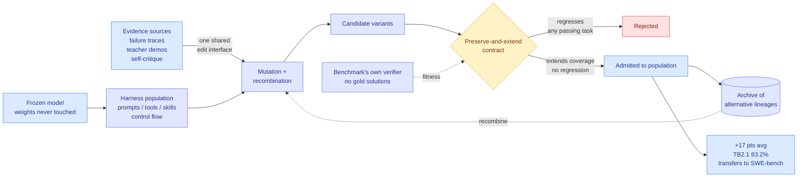

# DarwinX: Evolving Agent Harnesses Through Natural Selection

**Source:** [arXiv 2608.07545](https://arxiv.org/abs/2608.07545) · [HuggingFace](https://huggingface.co/papers/2608.07545) · [raw](../../raw/huggingface/2026-08-14-darwinx-evolving-agent-harnesses-through-natural-selection.md)

## TL;DR

DarwinX is the experiment [yesterday's Looking Ahead](../daily-digest/2026-08/2026-08-13.md) asked for, arriving one day later and from a different direction. It **freezes the model weights and evolves only the harness** (the prompts, tools, skills, and control flow wrapped around the model), then reports what that buys: about **17 points of average gain across four benchmarks** from a single evolution loop. Terminal-Bench 2.1 rises 7.7 points to 83.2% on a matched base model and to 84.7% on a stronger one. TerminalWorld's held-out split reaches 68.3%, ahead of every off-the-shelf agent tested. WebArena-Infinity real-task pass@1 goes from 43.5% to 93.0%. And a harness evolved on Terminal-Bench 2.1 **transfers unchanged to SWE-bench Verified**, which is the result that separates "general agent competence" from "benchmark-specific patches."

The mechanism is the interesting part. Prior self-improvement loops edit one harness in place, which DarwinX calls **single-lineage search**: path-dependent, and prone to local wins that quietly regress other tasks. DarwinX replaces that with **selection over a population**. Three pieces do the work. A **preserve-and-extend contract** admits a variant only if it extends coverage without regressing anything already passing, which turns the loop from hill-climbing into ratcheting. An **archive** keeps alternative lineages alive so they can be recombined later instead of being discarded the moment they lose a round. And **failure-derived, teacher-derived, and self-derived evidence all share one edit interface**, so a bug report, a stronger model's demonstration, and the agent's own introspection are the same kind of input to the same mutation operator.

Fitness comes from **each benchmark's own verifier**. No gold solutions, no human picks the winner. The paper's own summary of the implication is the sharpest line in it: *a frozen model need not be a fixed agent*. Harness selection converts evaluation compute into durable capability.

---

---

## Key findings

- **About 17 points of average gain across four benchmarks from one evolution loop**, with the model frozen throughout. Terminal-Bench 2.1: +7.7 to 83.2% on a matched base, 84.7% on a stronger base (the verified frontier at time of writing).
- **WebArena-Infinity pass@1 goes 43.5% → 93.0%, audit-clean.** The audit qualifier matters: web benchmarks are notoriously easy to game through environment side effects, and the paper claims the runs survived inspection.
- **A Terminal-Bench 2.1 harness transfers unchanged to SWE-bench Verified.** Different task family, different verifier, no re-evolution. This is the load-bearing generalization claim.
- **The four benchmarks progressively separate the evolution signal from the test**, which is the right experimental design for a self-improvement paper and the one most of them skip. If the harness were memorizing the benchmark, the held-out splits would collapse.
- **Population beats lineage.** The contribution is not "mutate the prompt" (everyone does that) but the archive plus the non-regression gate, which together stop the loop from trading one capability for another.

## How this relates to prior wiki pages

**This is a partial resolution of a prediction made one day earlier.** The [08-13 Looking Ahead](../daily-digest/2026-08/2026-08-13.md) predicted that within 60 days someone would hold a single model fixed and vary only the harness on Terminal-Bench, because the public Terminal-Bench 3.0 leaderboard reports every row as a model-harness pair with tokens and dollars but **no model appears under two harnesses in the top ten**, so it shows harness variation exists without isolating it. DarwinX runs exactly that isolation, one day later, on Terminal-Bench 2.1 rather than 3.0, and the isolated harness effect is **+7.7 points on a fixed base**. That is well above the 2x-spread threshold the prediction set for "the harness discipline is real rather than oversold" when read as a relative error reduction, and it means the confound the prediction warned about is now measured rather than hypothesized.

**It is the third measurement of the same quantity in two days, and the three agree.** [The omarsar0 harness benchmark (08-13, arXiv 2608.01347)](agent-harness-engineering.md), which measured cost-per-success swinging 5x to 30x across harnesses on a fixed model, established the cost face. [AI4AI at Test-Time (08-13)](../inference-efficiency/2026-08-13-ai4ai-test-time-harness-transfer.md), in which a strong builder model writes an inference-time harness for a weaker target and average Theory-of-Mind accuracy goes 0.49 → 0.91 with the target's weights untouched, established the accuracy face at the small-model tier. DarwinX establishes the accuracy face at the **frontier** tier, where headroom is thin and a 7.7-point move is much harder to buy. Three independent measurements, two days, one conclusion: the harness moves both axes by more than the model does at the margin.

**It contradicts the standard self-improvement setup rather than extending it.** [HarnessOpt-Bench (08-07)](../daily-digest/2026-08/2026-08-08.md) made "can a model optimize its own harness" measurable, and [AutoWorldModel-Bench (08-13)](2026-08-13-autoworldmodel-bench.md) showed frontier coding agents improving a starter artifact in 63 of 64 sessions with the winning edit being a new objective or architecture in 91% of cases. Both are single-lineage. DarwinX's diagnosis is that single-lineage is the flaw: local wins regress other tasks and nobody notices because nobody was checking coverage. The preserve-and-extend contract is a direct answer to open problem 3 on the [harness engineering concept page](agent-harness-engineering.md) ("where self-simulation of the loop diverges from reality"): you do not trust the agent's self-assessment, you gate on the verifier.

**It also lands next to [AutoDesign (08-14)](2026-08-14-autodesign-meta-harness-optimization.md), same day, same idea, different layer.** AutoDesign runs a meta-harness optimizer over a code agent for poster generation and reports a full cost figure ($3 for 253 tool calls across 40 minutes). DarwinX runs population selection over general agent harnesses and reports no cost anywhere. Together they are the fourth and fifth papers in six days treating the harness as the trainable object, which crosses the wiki's three-paper threshold for declaring a pattern: **harness optimization has become its own subfield, with benchmarks, ablations, and competing search strategies, in about three weeks.**

## Gaps

The paper reports no compute cost. "Harness selection turns evaluation compute into durable capability" is a claim about a *conversion rate*, and the conversion rate is exactly what is missing: how many verifier runs per admitted variant, how many candidate harnesses in the population, how many dollars for the 17 points. This is the same omission the [08-13 Looking Ahead](../daily-digest/2026-08/2026-08-13.md) flagged for AI4AI, and it now applies to two papers in two days. Without it, a reader cannot tell whether harness evolution is cheaper or more expensive than fine-tuning for the same gain, which is the only comparison that decides where a team should spend.

Second, the preserve-and-extend contract is only as good as the coverage set it checks against. A variant that regresses something *not in the benchmark suite* passes the gate cleanly. The paper's transfer result (Terminal-Bench 2.1 → SWE-bench Verified) is evidence against severe overfitting but it is one transfer pair, and the failure mode of a ratcheting search is silent narrowing along axes nobody measured.

Third, "one loop" is doing a lot of work in the headline number. Whether gains compound across loops or saturate after the first is the difference between a technique and a trend, and the abstract does not say.

## Industrial implication

Every lab currently choosing between "fine-tune a smaller model" and "pay for the bigger model" now has a third option with a frontier-tier data point behind it: keep the model, evolve the scaffold, and pay in verifier runs instead of gradient steps. The economics favor this wherever a cheap automated verifier exists, which is precisely the coding, terminal, and web-navigation domains where agent spend is concentrated. Expect two things within a quarter. First, harness archives become a shipped artifact: vendors will distribute evolved harnesses the way they currently distribute system prompts, and the archive (not the best single harness) becomes the asset because it is what allows recombination. Second, the agent-benchmark leaderboards get harder to read, because a reported score will increasingly be a score for a *co-evolved* model-harness pair, and the base model contribution will be unrecoverable from the number.

## Related pages

- [Agent harness engineering (loop, harness, graph)](agent-harness-engineering.md)
- [Self-evolving agents](self-evolving-agents.md)
- [AutoDesign: meta-harness optimization (08-14)](2026-08-14-autodesign-meta-harness-optimization.md)
- [AI4AI at Test-Time: strong-to-weak harness transfer (08-13)](../inference-efficiency/2026-08-13-ai4ai-test-time-harness-transfer.md)
- [AutoWorldModel-Bench (08-13)](2026-08-13-autoworldmodel-bench.md)
- [Agent benchmarks](agent-benchmarks.md)
