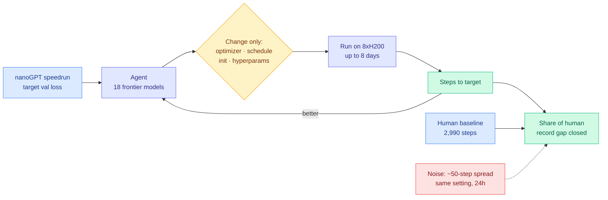

# Measuring Autonomous AI Research (Prime Intellect)

**Source:** Prime Intellect blog, via [@eliebakouch](https://x.com/eliebakouch/status/2088736971250090393) · [Blog](https://www.primeintellect.ai/blog/measuring-autonomous-research) · [Leaderboard](https://www.primeintellect.ai/research/nanogpt-speedrun) · [Prior run](https://www.primeintellect.ai/auto-nanogpt)
**Raw:** [raw/twitter/2026-08-16-morning.md](../../raw/twitter/2026-08-16-morning.md)
**Topic:** autonomous research agents, agent harness, optimizer search, compute allocation

## TL;DR

Claims about recursive self-improvement have outrun the evidence for them, and Prime Intellect built the largest public measurement of the gap. They ran **153 autonomous runs across 18 frontier models** on the nanoGPT optimizer speedrun: an agent is given a training script and told to lower the number of steps needed to reach a target validation loss, changing only the optimizer, schedules, initialization, and hyperparameters. Runs last up to **eight days on 8xH200s each**. The comparison points make the scale legible: Anthropic's internal automated AI R&D evaluation optimizes a model on a CPU node, and OpenAI's GPT-5.6 Sol system card reports nanoGPT Track 1 on a single H100 for under a day. Every scratchpad, run log, script, and config is published.

The headline result is a ranking by *share of the human record gap closed*. **Fable 5 closed 81.7%** and set the best absolute mark at 2,726 steps over 8.7 days. **Opus 5 closed 53.6%** (2,920 steps, 2.9 days), **Kimi K3 52.2%** (2,930 steps, 3.6 days), **Opus 4.8 39.4%**, **GPT-5.6 Sol 35.9%**. The earlier two-week run, where Codex and Claude Code did roughly 10,000 runs burning about 14,000 H200-hours, found the durable qualitative result: **agents are excellent at optimizer search, hyperparameter sweeps, and stacking known methods, and poor at inventing new ideas.** They need upstream human records to keep improving.

## What the measurement is

## Key findings

- **Fable 5 closed 81.7% of the human record gap, at 2,726 steps over 8.7 agent-days.** The next best, Opus 5, closed 53.6% at 2,920 in 2.9 days. The spread between first and second is larger than the spread across the next six models.
- **Agents beat the human baseline but do not out-think it.** Both agents in the prior two-week experiment beat the human baseline of 2,990 steps and set new records every session, yet the failure mode is consistent: they stack and tune known methods and rarely originate new ones, so **progress is gated on upstream human records**.
- **Run-to-run noise is large enough to matter for any published claim.** One run in the same setting shows roughly a **50-step spread after 24 hours**. Any ranking of two models within 50 steps of each other is not a ranking.
- **Behavioural divergence between agents is a harness property, not a capability one.** In the earlier experiment, Opus repeatedly stopped and refused to stay in the autonomous loop, while Codex never stopped but got stuck grinding the same direction. Two opposite failure modes on the same task.
- **Everything is published**: scratchpads (where agents write their reasoning), ~10k run logs, scripts, configs. That is the part that makes this a measurement instrument rather than a press release.

## Relation to prior wiki pages

**This is the empirical study the [agent-harness-engineering page](agent-harness-engineering.md) has been asking for, and it lands on the harness side of the model/harness split.** That page's spine is a preregistered benchmark (arXiv 2608.01347, surfaced 08-13) showing that moving the *same* model between two harnesses swings cost-per-success **5x to 30x**. Prime Intellect holds the task fixed and varies the model, and finds a 46-point spread in gap-closed between the best and the fifth-place model. Read together, these give the two axes of the same question, and neither paper crosses them: nobody has run a **model x harness grid** on one task with cost recorded. The Opus-refuses-to-continue versus Codex-grinds-forever contrast is exactly a harness artifact, and it is reported as a behavioural anecdote rather than measured.

**It resolves part of a standing thread on recursive self-improvement.** The [08-14 digest](../daily-digest/2026-08/2026-08-14.md) recorded IAPS fellow Severin Field's interviews with 25 researchers at OpenAI, Anthropic, Google DeepMind and Meta on recursive self-improvement, reporting that several of their named milestones had already fallen. Prime Intellect supplies the counterweight: on the one task where autonomous improvement is cleanly measurable, agents beat the human record while remaining **dependent on human records to improve**. The loop is not closed. It is assisted.

**And it confirms the "the model is a search engine, not an idea generator" reading.** [Sara Hooker's AutoScientist talk (08-12)](../inference-efficiency/2026-08-16-autoscientist-hooker-data-in-the-loop.md) reports the same shape from the other direction: their automated search beats their own research staff precisely because it sweeps dense and MoE architectures, many sizes, and many hyperparameters at once in ways humans are too cautious to try. Breadth of search, not depth of insight. Two independent groups, two months apart, same finding, opposite framing (Hooker treats it as the product's strength, Prime Intellect treats it as the ceiling).

## Gaps

The task is an optimizer speedrun, which is the most search-friendly research activity there is: cheap feedback, scalar objective, well-defined action space. The authors say directly that they lack strong conviction that methods developed this way are scalable or would be used in real model training. Nothing here transfers automatically to research that requires reframing a problem. Cost is reported in agent-days and H200-hours but not in dollars per point of gap closed, which is the number that would let this be compared against a human researcher or against harness search.

## Related pages

- [agent-harness-engineering.md](agent-harness-engineering.md)
- [self-evolving-agents.md](self-evolving-agents.md)
- [agent-benchmarks.md](agent-benchmarks.md)
- [../hardware/compute-economics.md](../hardware/compute-economics.md)
